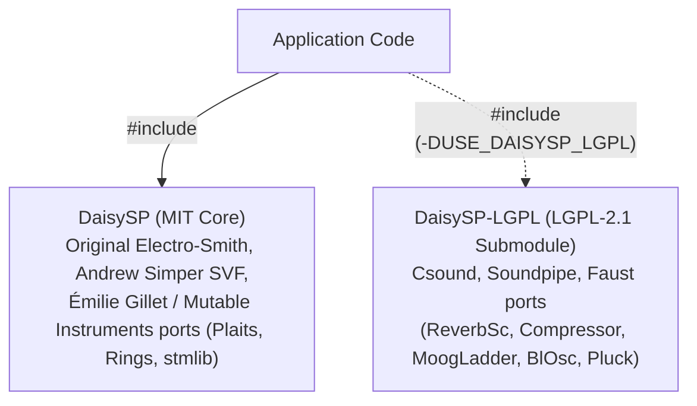

# DaisySP Developer Guide & DSP Module Reference

This skill provides an operational guide, architecture breakdown, and implementation reference for developing audio synthesis, sound design, and signal processing applications using **`DaisySP`**, the official DSP library for the **Electro-Smith Daisy** platform and general-purpose C++ audio software.

---

## 1. Core Architectural Tenets & Contracts

DaisySP is designed for deterministic execution in real-time interrupt contexts:

| Principle | Engineering Contract | Implementation Detail |
| :--- | :--- | :--- |
| **Zero Dynamic Allocation** | **Strictly static memory.** No `malloc`, `free`, `new`, or `delete` in audio pathways. | Memory is statically pre-allocated within the class, parameterized via templates (e.g. `DelayLine<float, 48000>`), or injected as pointers (`GranularPlayer::Init(buf, len, sr)`). |
| **Single-Sample Standard** | **Sample-by-sample evaluation (`Process`).** | Allows arbitrary feedback loops, sample-accurate modulation, and cross-synthesis. Block processing is provided where SIMD/hardware-accelerated (`Limiter`, `FIR`, `LadderFilter`). |
| **Normalized Float Range** | **IEEE 754 32-bit `float` audio standard.** | Audio nominal range: $[-1.0\text{f}, +1.0\text{f}]$ ($0\text{ dBFS}$). Control voltages: $[0.0\text{f}, 1.0\text{f}]$ or $[-1.0\text{f}, +1.0\text{f}]$. |
| **Hardware Decoupling** | **Zero silicon register dependencies.** | Pure C++14. Runs identically on embedded ARM Cortex-M7, desktop JUCE plug-ins, VCV Rack, iOS/Android, and WebAssembly. |
| **Universal Lifecycle** | **`Init(sr)` $\to$ `Set*()` $\to$ `Process()`** | Default constructor creates safe uninitialized state. `.Init(sample_rate)` computes sample-rate-dependent coefficients and clears history buffers. |

---

## 2. Dual-License Architecture (DaisySP vs. DaisySP-LGPL)

DaisySP is partitioned into two repositories to preserve an unencumbered **MIT** core while providing optional **LGPL-2.1** modules derived from Csound, Soundpipe, and Faust:



* **Core MIT (`Source/daisysp.h`)**: Freely usable in closed-source and commercial products without relinking requirements.
* **LGPL Submodule (`DaisySP-LGPL/Source/daisysp-lgpl.h`)**: Enabled via `USE_DAISYSP_LGPL = 1` in Makefiles. Commercial hardware distribution requires providing relinkable object code (automated via `DaisySP-LGPL/distribution/gather_lgpl.sh`).

---

## 3. Complete 60+ Module Catalog by Domain

### 3.1 Synthesis Modules

| Class | Master Header | License | Primary Capabilities & Parameters |
| :--- | :--- | :--- | :--- |
| [`Oscillator`](file:///Users/brett/Documents/GitHub/reverse-engineering-gamma/DaisySP/Source/Synthesis/oscillator.h) | `Synthesis/oscillator.h` | MIT | Multi-waveform oscillator (Sine, Triangle, Saw, Ramp, Square, PolyBLEP bandlimited Tri/Saw/Square). Pulse-width modulation (`SetPw`), end-of-cycle trigger (`IsEOR`). |
| [`Fm2`](file:///Users/brett/Documents/GitHub/reverse-engineering-gamma/DaisySP/Source/Synthesis/fm2.h) | `Synthesis/fm2.h` | MIT | 2-operator Phase Modulation / FM synthesis voice. Carrier frequency (`SetFrequency`), frequency ratio (`SetRatio`), modulation index (`SetIndex`). |
| [`VariableShapeOscillator`](file:///Users/brett/Documents/GitHub/reverse-engineering-gamma/DaisySP/Source/Synthesis/variableshapeosc.h) | `Synthesis/variableshapeosc.h` | MIT | Morphing oscillator from Mutable Instruments Plaits. Continuously morphs saw/ramp/triangle into square with wavefolding and hard sync (`SetWaveshape`, `SetPW`, `SetSync`). |
| [`VariableSawOscillator`](file:///Users/brett/Documents/GitHub/reverse-engineering-gamma/DaisySP/Source/Synthesis/variablesawosc.h) | `Synthesis/variablesawosc.h` | MIT | Variable slope saw/ramp/notch oscillator ported from Plaits. |
| [`FormantOscillator`](file:///Users/brett/Documents/GitHub/reverse-engineering-gamma/DaisySP/Source/Synthesis/formantosc.h) | `Synthesis/formantosc.h` | MIT | Dual-formant vocal synthesis engine from Plaits simulating vocal tract formants. |
| [`HarmonicOscillator`](file:///Users/brett/Documents/GitHub/reverse-engineering-gamma/DaisySP/Source/Synthesis/harmonic_osc.h) | `Synthesis/harmonic_osc.h` | MIT | Additive sinusoidal synthesis generating up to $N$ harmonic partials with amplitude array control (`SetAmplitudes`). |
| [`OscillatorBank`](file:///Users/brett/Documents/GitHub/reverse-engineering-gamma/DaisySP/Source/Synthesis/oscillatorbank.h) | `Synthesis/oscillatorbank.h` | MIT | Bank of parallel detuned oscillators for supersaw, swarm, and unison textures. |
| [`VosimOscillator`](file:///Users/brett/Documents/GitHub/reverse-engineering-gamma/DaisySP/Source/Synthesis/vosim.h) | `Synthesis/vosim.h` | MIT | Voice Simulation pulse-train generator for vintage digital vocal/organ timbres. |
| [`ZOscillator`](file:///Users/brett/Documents/GitHub/reverse-engineering-gamma/DaisySP/Source/Synthesis/zoscillator.h) | `Synthesis/zoscillator.h` | MIT | Phase-distortion and sync oscillator inspired by CZ-style synthesis. |
| [`BlOsc`](file:///Users/brett/Documents/GitHub/reverse-engineering-gamma/DaisySP/DaisySP-LGPL/Source/Synthesis/blosc.h) | `daisysp-lgpl.h` / `blosc.h` | LGPL | Band-limited impulse, saw, and square wave oscillator from Soundpipe/Faust. |

---

### 3.2 Filter Modules

| Class | Master Header | License | Primary Capabilities & Parameters |
| :--- | :--- | :--- | :--- |
| [`Svf`](file:///Users/brett/Documents/GitHub/reverse-engineering-gamma/DaisySP/Source/Filters/svf.h) | `Filters/svf.h` | MIT | Andrew Simper's double-sampled, stable State Variable Filter. Simultaneous outputs: `Low()`, `High()`, `Band()`, `Notch()`, `Peak()`. Non-linear drive compensation (`SetDrive`). Cutoff valid $0$ to $f_s/3$. |
| [`LadderFilter`](file:///Users/brett/Documents/GitHub/reverse-engineering-gamma/DaisySP/Source/Filters/ladder.h) | `Filters/ladder.h` | MIT | Huovilainen New Moog 4-pole ladder filter with 4x oversampling, tanh saturation, passband gain compensation (`SetPassbandGain`), and self-oscillation. Modes: `LP24`, `LP12`, `BP24`, `BP12`, `HP24`, `HP12`. Both `Process(in)` and `ProcessBlock(buf, size)`. |
| [`OnePole`](file:///Users/brett/Documents/GitHub/reverse-engineering-gamma/DaisySP/Source/Filters/onepole.h) | `Filters/onepole.h` | MIT | Ultra-fast 6 dB/octave first-order filter (`FILTER_MODE_LOW_PASS`, `FILTER_MODE_HIGH_PASS`). |
| [`FIR`](file:///Users/brett/Documents/GitHub/reverse-engineering-gamma/DaisySP/Source/Filters/fir.h) | `Filters/fir.h` | MIT | Finite Impulse Response filter template: `FIR<max_size, max_block>`. Uses CMSIS-DSP SIMD hardware acceleration on ARM (`FIRFilterImplARM`), falls back to generic C++ on native targets. |
| [`Soap`](file:///Users/brett/Documents/GitHub/reverse-engineering-gamma/DaisySP/Source/Filters/soap.h) | `Filters/soap.h` | MIT | Tom Erbe's Second Order All-Pass filter. Outputs: `Bandpass()`, `Bandreject()`. |
| [`MoogLadder`](file:///Users/brett/Documents/GitHub/reverse-engineering-gamma/DaisySP/DaisySP-LGPL/Source/Filters/moogladder.h)| `daisysp-lgpl.h` | LGPL | Classic Csound Moog ladder model with warm resonant characteristics. |
| [`Biquad`](file:///Users/brett/Documents/GitHub/reverse-engineering-gamma/DaisySP/DaisySP-LGPL/Source/Filters/biquad.h) | `daisysp-lgpl.h` | LGPL | Standard 2nd-order Direct Form I/II biquad IIR filter. |
| [`Tone`](file:///Users/brett/Documents/GitHub/reverse-engineering-gamma/DaisySP/DaisySP-LGPL/Source/Filters/tone.h) / [`ATone`](file:///Users/brett/Documents/GitHub/reverse-engineering-gamma/DaisySP/DaisySP-LGPL/Source/Filters/atone.h) | `daisysp-lgpl.h` | LGPL | Csound 1-pole Lowpass (`Tone`) and Highpass (`ATone`) recursive filters. |
| [`Comb`](file:///Users/brett/Documents/GitHub/reverse-engineering-gamma/DaisySP/DaisySP-LGPL/Source/Filters/comb.h) / [`Allpass`](file:///Users/brett/Documents/GitHub/reverse-engineering-gamma/DaisySP/DaisySP-LGPL/Source/Filters/allpass.h) | `daisysp-lgpl.h` | LGPL | Delay-based comb and allpass filters with external buffer memory. |
| [`Mode`](file:///Users/brett/Documents/GitHub/reverse-engineering-gamma/DaisySP/DaisySP-LGPL/Source/Filters/mode.h) / [`NlFilt`](file:///Users/brett/Documents/GitHub/reverse-engineering-gamma/DaisySP/DaisySP-LGPL/Source/Filters/nlfilt.h) | `daisysp-lgpl.h` | LGPL | Resonant 2nd-order modal filter (`Mode`) and chaotic nonlinear feedback filter (`NlFilt`). |

---

### 3.3 Effects Processors

| Class | Master Header | License | Primary Capabilities & Parameters |
| :--- | :--- | :--- | :--- |
| [`Chorus`](file:///Users/brett/Documents/GitHub/reverse-engineering-gamma/DaisySP/Source/Effects/chorus.h) | `Effects/chorus.h` | MIT | Multi-tap stereo chorus with independent LFO depths (`SetLfoDepth`), rates (`SetLfoFreq`), stereo panning (`SetPan`), and delay offset (`SetDelayMs`). Returns left channel from `Process(in)`, with `GetLeft()` / `GetRight()`. |
| [`Flanger`](file:///Users/brett/Documents/GitHub/reverse-engineering-gamma/DaisySP/Source/Effects/flanger.h) | `Effects/flanger.h` | MIT | Comb flanger with feedback control (`SetFeedback`), modulation depth (`SetLfoDepth`), and LFO frequency (`SetLfoFreq`). |
| [`Phaser`](file:///Users/brett/Documents/GitHub/reverse-engineering-gamma/DaisySP/Source/Effects/phaser.h) | `Effects/phaser.h` | MIT | Multi-stage allpass phaser with internal LFO modulation and feedback control. |
| [`PitchShifter`](file:///Users/brett/Documents/GitHub/reverse-engineering-gamma/DaisySP/Source/Effects/pitchshifter.h)| `Effects/pitchshifter.h` | MIT | Granular time-domain pitch shifter. Transposition in semitones (`SetTransposition`), buffer sizing (`SetDelSize`), random window slew (`SetFun`). *Footprint: ~128 KB.* |
| [`Overdrive`](file:///Users/brett/Documents/GitHub/reverse-engineering-gamma/DaisySP/Source/Effects/overdrive.h) | `Effects/overdrive.h` | MIT | Non-linear saturation and soft-clipping distortion (`SetDrive`). |
| [`Wavefolder`](file:///Users/brett/Documents/GitHub/reverse-engineering-gamma/DaisySP/Source/Effects/wavefolder.h) | `Effects/wavefolder.h` | MIT | Buchla-style wavefolding distortion folding peaks exceeding threshold (`SetGain`, `SetOffset`). |
| [`Decimator`](file:///Users/brett/Documents/GitHub/reverse-engineering-gamma/DaisySP/Source/Effects/decimator.h) | `Effects/decimator.h` | MIT | Bit-depth reduction ($1-32$ bits via `SetBitcrushFactor`) and downsampling ($0.0-1.0$ via `SetDownsampleFactor`). |
| [`SampleRateReducer`](file:///Users/brett/Documents/GitHub/reverse-engineering-gamma/DaisySP/Source/Effects/sampleratereducer.h) | `Effects/sampleratereducer.h` | MIT | Variable sample-and-hold downsampler (`SetFreq`). |
| [`Tremolo`](file:///Users/brett/Documents/GitHub/reverse-engineering-gamma/DaisySP/Source/Effects/tremolo.h) | `Effects/tremolo.h` | MIT | Amplitude modulation with selectable waveform shape (`SetWaveform`), depth (`SetDepth`), and rate (`SetFreq`). |
| [`Autowah`](file:///Users/brett/Documents/GitHub/reverse-engineering-gamma/DaisySP/Source/Effects/autowah.h) | `Effects/autowah.h` | MIT | Envelope-follower-modulated resonant bandpass wah filter (`SetWah`, `SetLevel`). |
| [`ReverbSc`](file:///Users/brett/Documents/GitHub/reverse-engineering-gamma/DaisySP/DaisySP-LGPL/Source/Effects/reverbsc.h) | `daisysp-lgpl.h` / `reverbsc.h` | LGPL | Sean Costello 8-delay feedback matrix stereo algorithmic reverb. Feedback decay (`SetFeedback`), LP damping (`SetLpFreq`). *Footprint: ~395 KB (Use `DSY_SDRAM_BSS`).* |
| [`Bitcrush`](file:///Users/brett/Documents/GitHub/reverse-engineering-gamma/DaisySP/DaisySP-LGPL/Source/Effects/bitcrush.h) / [`Fold`](file:///Users/brett/Documents/GitHub/reverse-engineering-gamma/DaisySP/DaisySP-LGPL/Source/Effects/fold.h) | `daisysp-lgpl.h` | LGPL | Alternative Csound bitcrusher and hyperbolic soft-clipping wavefolder. |

---

### 3.4 Drum & Percussion Synthesis

Ported from Émilie Gillet's Mutable Instruments Plaits drum engines; self-contained voices requiring only a trigger:

| Class | Master Header | License | Primary Capabilities & Parameters |
| :--- | :--- | :--- | :--- |
| [`AnalogBassDrum`](file:///Users/brett/Documents/GitHub/reverse-engineering-gamma/DaisySP/Source/Drums/analogbassdrum.h) | `Drums/analogbassdrum.h` | MIT | TR-808 kick drum model. Bridged-T resonator network excited by narrow pulses. Pitch (`SetFreq`), decay (`SetDecay`), attack click (`SetTone`), accent (`SetAccent`), sustain (`SetSustain`). |
| [`AnalogSnareDrum`](file:///Users/brett/Documents/GitHub/reverse-engineering-gamma/DaisySP/Source/Drums/analogsnaredrum.h)| `Drums/analogsnaredrum.h`| MIT | TR-808/909 snare model. Dual bridged-T resonators + shaped noise burst. Frequency (`SetFreq`), wire snappy ratio (`SetSnappy`), tone (`SetTone`), accent (`SetAccent`). |
| [`HiHat`](file:///Users/brett/Documents/GitHub/reverse-engineering-gamma/DaisySP/Source/Drums/hihat.h) | `Drums/hihat.h` | MIT | TR-808 metallic percussion model. 6 square-wave oscillators (`SquareNoise`) or ring-mod pairs (`RingModNoise`) routed into a bandpass SVF and dual-slope VCA. Tone (`SetTone`), decay (`SetDecay`), noisiness (`SetNoisiness`). |
| [`SyntheticBassDrum`](file:///Users/brett/Documents/GitHub/reverse-engineering-gamma/DaisySP/Source/Drums/synthbassdrum.h)| `Drums/synthbassdrum.h` | MIT | Digital EDM kick with FM pitch ramps, digital clicks, and attack noise bursts. |
| [`SyntheticSnareDrum`](file:///Users/brett/Documents/GitHub/reverse-engineering-gamma/DaisySP/Source/Drums/synthsnaredrum.h)| `Drums/synthsnaredrum.h`| MIT | Digital dual-sinusoid snare model with shaped noise burst. |

---

### 3.5 Physical Modeling Synthesis

| Class | Master Header | License | Primary Capabilities & Parameters |
| :--- | :--- | :--- | :--- |
| [`String`](file:///Users/brett/Documents/GitHub/reverse-engineering-gamma/DaisySP/Source/PhysicalModeling/KarplusString.h) | `PhysicalModeling/KarplusString.h` | MIT | Karplus-Strong plucked string with non-linear string dispersion and lowpass damping. |
| [`StringVoice`](file:///Users/brett/Documents/GitHub/reverse-engineering-gamma/DaisySP/Source/PhysicalModeling/stringvoice.h) | `PhysicalModeling/stringvoice.h` | MIT | Complete string voice from Mutable Instruments Rings/Plaits. Mallet excitation, sustain noise, dual-stage non-linear bridge interaction (`SetStructure`), brightness (`SetBrightness`), damping (`SetDamping`). |
| [`ModalVoice`](file:///Users/brett/Documents/GitHub/reverse-engineering-gamma/DaisySP/Source/PhysicalModeling/modalvoice.h) | `PhysicalModeling/modalvoice.h` | MIT | Modal synthesis voice from Rings/Plaits. Simulates struck metallic plates, bells, and wooden bars via impulse-excited resonator banks (`SetStructure`, `SetBrightness`, `SetDamping`). |
| [`Resonator`](file:///Users/brett/Documents/GitHub/reverse-engineering-gamma/DaisySP/Source/PhysicalModeling/resonator.h) | `PhysicalModeling/resonator.h` | MIT | Multi-band resonant filter bank simulating acoustic instrument bodies and cavities. |
| [`Drip`](file:///Users/brett/Documents/GitHub/reverse-engineering-gamma/DaisySP/Source/PhysicalModeling/drip.h) | `PhysicalModeling/drip.h` | MIT | Perry Cook's physical model of water dripping into a resonant cavity (STK). |
| [`Pluck`](file:///Users/brett/Documents/GitHub/reverse-engineering-gamma/DaisySP/DaisySP-LGPL/Source/PhysicalModeling/pluck.h) / [`PolyPluck`](file:///Users/brett/Documents/GitHub/reverse-engineering-gamma/DaisySP/DaisySP-LGPL/Source/PhysicalModeling/PolyPluck.h) | `daisysp-lgpl.h` | LGPL | Csound Karplus-Strong string algorithm with external memory and polyphonic voice manager (`PolyPluck`). |

---

### 3.6 Dynamics & Sampling

| Class | Master Header | License | Primary Capabilities & Parameters |
| :--- | :--- | :--- | :--- |
| [`Limiter`](file:///Users/brett/Documents/GitHub/reverse-engineering-gamma/DaisySP/Source/Dynamics/limiter.h) | `Dynamics/limiter.h` | MIT | Lookahead peak limiter from Mutable Instruments `stmlib` to prevent clipping. Operates in-place on blocks: `ProcessBlock(float *in, size_t size, float pre_gain)`. |
| [`CrossFade`](file:///Users/brett/Documents/GitHub/reverse-engineering-gamma/DaisySP/Source/Dynamics/crossfade.h) | `Dynamics/crossfade.h` | MIT | Dual-channel crossfader with selectable curves: `CROSSFADE_LIN` (linear), `CROSSFADE_CPOW` (constant power), `CROSSFADE_LOG`, `CROSSFADE_EXP`. |
| [`GranularPlayer`](file:///Users/brett/Documents/GitHub/reverse-engineering-gamma/DaisySP/Source/Sampling/granularplayer.h) | `Sampling/granularplayer.h` | MIT | Real-time granular lookup table player. Ingests external float buffer (`Init(sample, size, sr)`). Independent playback speed (including reverse via negative speeds), transposition in cents, and grain size ($1-1000\text{ ms}$). |
| [`Compressor`](file:///Users/brett/Documents/GitHub/reverse-engineering-gamma/DaisySP/DaisySP-LGPL/Source/Dynamics/compressor.h) | `daisysp-lgpl.h` / `compressor.h`| LGPL | Dynamic range compressor from Faust/Soundpipe. Threshold, ratio, attack, release, makeup gain, and **sidechain key input** (`Process(in, key)`). |
| [`Balance`](file:///Users/brett/Documents/GitHub/reverse-engineering-gamma/DaisySP/DaisySP-LGPL/Source/Dynamics/balance.h) | `daisysp-lgpl.h` / `balance.h` | LGPL | RMS signal level comparator and tracker from Csound. Dynamically scales input amplitude to match reference comparator signal energy. |

---

### 3.7 Noise, Control, and Utilities

| Class | Master Header | License | Primary Capabilities & Parameters |
| :--- | :--- | :--- | :--- |
| [`WhiteNoise`](file:///Users/brett/Documents/GitHub/reverse-engineering-gamma/DaisySP/Source/Noise/whitenoise.h) / [`ClockedNoise`](file:///Users/brett/Documents/GitHub/reverse-engineering-gamma/DaisySP/Source/Noise/clockednoise.h) | `Noise/` | MIT | Uniform pseudo-random noise (`WhiteNoise`) and clocked/quantized sample-and-hold random noise (`ClockedNoise`). |
| [`Dust`](file:///Users/brett/Documents/GitHub/reverse-engineering-gamma/DaisySP/Source/Noise/dust.h) / [`FractalRandomGenerator`](file:///Users/brett/Documents/GitHub/reverse-engineering-gamma/DaisySP/Source/Noise/fractal_noise.h) | `Noise/` | MIT | Poisson-distributed sparse impulses for vinyl crackle/rain (`Dust`) and $1/f$ pink/fractal noise (`FractalRandomGenerator`). |
| [`Adsr`](file:///Users/brett/Documents/GitHub/reverse-engineering-gamma/DaisySP/Source/Control/adsr.h) | `Control/adsr.h` | MIT | Attack-Decay-Sustain-Release envelope with curve shaping, retriggering, and multi-sample block increment support (`Init(sr, blockSize)`). |
| [`AdEnv`](file:///Users/brett/Documents/GitHub/reverse-engineering-gamma/DaisySP/Source/Control/adenv.h) / [`Phasor`](file:///Users/brett/Documents/GitHub/reverse-engineering-gamma/DaisySP/Source/Control/phasor.h) | `Control/` | MIT | Attack-Decay percussion envelope (`AdEnv`) and normalized $0.0-1.0$ ramp generator (`Phasor`). |
| [`DelayLine`](file:///Users/brett/Documents/GitHub/reverse-engineering-gamma/DaisySP/Source/Utility/delayline.h) | `Utility/delayline.h` | MIT | Templated circular buffer: `DelayLine<typename T, size_t max_size>`. Fractional delay with linear interpolation (`Read`) and **Hermite cubic interpolation** (`ReadHermite`). |
| [`Looper`](file:///Users/brett/Documents/GitHub/reverse-engineering-gamma/DaisySP/Source/Utility/looper.h) | `Utility/looper.h` | MIT | Phrase looper with external memory injection. Modes: `NORMAL`, `ONETIME_DUB`, `REPLACE`, `FRIPPERTRONICS` (tape-delay decay). Half-speed, reverse, punch-in. |
| [`DcBlock`](file:///Users/brett/Documents/GitHub/reverse-engineering-gamma/DaisySP/Source/Utility/dcblock.h) | `Utility/dcblock.h` | MIT | First-order highpass DC blocking filter. |
| [`Metro`](file:///Users/brett/Documents/GitHub/reverse-engineering-gamma/DaisySP/Source/Utility/metro.h) / [`Maytrig`](file:///Users/brett/Documents/GitHub/reverse-engineering-gamma/DaisySP/Source/Utility/maytrig.h) | `Utility/` | MIT | Metronome pulse generator (`Metro`, returns `1` on clock tick) and probabilistic trigger gate (`Maytrig`). |
| [`SampleHold`](file:///Users/brett/Documents/GitHub/reverse-engineering-gamma/DaisySP/Source/Utility/samplehold.h) | `Utility/samplehold.h` | MIT | Dual-mode Sample & Hold / Track & Hold circuit. |
| [`Port`](file:///Users/brett/Documents/GitHub/reverse-engineering-gamma/DaisySP/DaisySP-LGPL/Source/Utility/port.h) / [`Line`](file:///Users/brett/Documents/GitHub/reverse-engineering-gamma/DaisySP/DaisySP-LGPL/Source/Control/line.h) | `daisysp-lgpl.h` | LGPL | Exponential portamento glide slewer (`Port`) and linear ramp generator (`Line`). |

---

## 4. Master Math Engine & Conversions (`Utility/dsp.h`)

[`Utility/dsp.h`](file:///Users/brett/Documents/GitHub/reverse-engineering-gamma/DaisySP/Source/Utility/dsp.h) contains optimized inline approximations and math primitives:

```cpp
#include "Utility/dsp.h"
using namespace daisysp;

// 1. Musical & Pitch Conversions
float hz  = mtof(60.0f); // 261.63 Hz (Middle C)
float rat = pow10f(db / 20.0f); // Fast 10^x (90% faster than powf)

// 2. Fast Clamping & Min/Max (uses ARM assembly vmaxnm/vminnm when on __arm__)
float val = fclamp(input, -1.0f, 1.0f);
float mx  = fmax(a, b);

// 3. Response Curve Mapping (LINEAR, EXP, LOG)
float freq = fmap(pot_val, 20.0f, 20000.0f, Mapping::EXP);

// 4. Analog Saturation & Limiting (stmlib ports)
float soft = SoftClip(sample);   // Polynomial soft saturation
float hard = SoftLimit(sample);  // Symmetrical cubic limiter

// 5. Anti-Aliasing (PolyBLEP)
float blep_now  = ThisBlepSample(t);
float blep_next = NextBlepSample(t);
```

---

## 5. Memory Management & Embedded Hazards

On the STM32H750 (Daisy Seed), internal data RAM is partitioned into **DTCM** (128 KB, zero-wait, no DMA), **AXI SRAM** (512 KB), and **External SDRAM** (64 MB):

| Class | Internal Memory Size | Storage Recommendation |
| :--- | :--- | :--- |
| **`ReverbSc`** | **~395 KB** (`98,936` floats) | **Must be placed in SDRAM** via `DSY_SDRAM_BSS` or static global memory. Instantiating in local function stack or DTCM will trigger an immediate HardFault. |
| **`PitchShifter`** | **~128 KB** (Two 16K float delay lines) | Statically allocate in global BSS or map to SDRAM (`DSY_SDRAM_BSS`). |
| **`DelayLine<T, N>`** | $N \times 4\text{ bytes}$ | If $N > 4000$ samples, place in SDRAM (`static DelayLine<float, 48000> DSY_SDRAM_BSS del;`). |
| **`GranularPlayer` / `Looper`** | External buffer | Pass pointers to buffers allocated in SDRAM (`float DSY_SDRAM_BSS my_buffer[SIZE];`). |

---

## 6. Implementation Recipes

### 6.1 Subtractive Synth Voice (`Oscillator` + `LadderFilter` + `Adsr`)

```cpp
#include "daisy_seed.h"
#include "daisysp.h"

using namespace daisy;
using namespace daisysp;

static DaisySeed    hw;
static Oscillator   osc;
static LadderFilter flt;
static Adsr         env;

void AudioCallback(AudioHandle::InputBuffer in, AudioHandle::OutputBuffer out, size_t size)
{
    for (size_t i = 0; i < size; i++)
    {
        float e = env.Process(true);
        flt.SetFreq(150.0f + e * 3500.0f);

        float sig = osc.Process();
        sig = flt.Process(sig);

        out[0][i] = sig * e;
        out[1][i] = sig * e;
    }
}

int main(void)
{
    hw.Init();
    float sr = hw.AudioSampleRate();

    osc.Init(sr);
    osc.SetWaveform(Oscillator::WAVE_POLYBLEP_SAW);
    osc.SetFreq(mtof(36)); // C2

    flt.Init(sr);
    flt.SetFilterMode(LadderFilter::FilterMode::LP24);
    flt.SetRes(0.6f);
    flt.SetPassbandGain(0.3f);

    env.Init(sr);
    env.SetAttackTime(0.01f);
    env.SetDecayTime(0.25f);
    env.SetSustainLevel(0.2f);
    env.SetReleaseTime(0.3f);

    hw.StartAudio(AudioCallback);
    while (1) {}
}
```

---

### 6.2 Ambient Stereo FX Chain (`Chorus` + `DelayLine` + `ReverbSc`)

```cpp
#include "daisy_seed.h"
#include "daisysp.h"

#ifdef USE_DAISYSP_LGPL
#include "daisysp-lgpl.h"
#endif

using namespace daisy;
using namespace daisysp;

static DaisySeed hw;
static Chorus    chorus;
static DelayLine<float, 48000> DSY_SDRAM_BSS delay_line;

#ifdef USE_DAISYSP_LGPL
static ReverbSc DSY_SDRAM_BSS reverb;
#endif

void AudioCallback(AudioHandle::InputBuffer in, AudioHandle::OutputBuffer out, size_t size)
{
    for (size_t i = 0; i < size; i++)
    {
        chorus.Process(in[0][i]);
        float chl = chorus.GetLeft();
        float chr = chorus.GetRight();

        float del_sig = delay_line.ReadHermite(24000.0f); // 500 ms
        delay_line.Write(chl + del_sig * 0.4f);

        float dry_l = chl + del_sig * 0.5f;
        float dry_r = chr + del_sig * 0.5f;

#ifdef USE_DAISYSP_LGPL
        float vl, vr;
        reverb.Process(dry_l, dry_r, &vl, &vr);
        out[0][i] = dry_l * 0.7f + vl * 0.3f;
        out[1][i] = dry_r * 0.7f + vr * 0.3f;
#else
        out[0][i] = dry_l;
        out[1][i] = dry_r;
#endif
    }
}
```

---

## 7. Common Pitfalls & Diagnostics

| Problem | Root Cause | Solution |
| :--- | :--- | :--- |
| **Instant HardFault on boot** | `ReverbSc` or huge `DelayLine` allocated on stack or DTCM | Add `DSY_SDRAM_BSS` or move to static global memory outside of DTCM. |
| **Severe audio distortion / crackling** | Denormal floating point underflow stalls FPU pipeline | Enable Flush-To-Zero (FTZ) on ARM Cortex-M7: `__set_FPSCR(__get_FPSCR() \| (1 << 24));`. |
| **Silence from filter** | Calling `flt.Process(in)` on `Svf` and ignoring output getters | `Svf::Process` returns `void`. Read outputs via `flt.Low()`, `flt.High()`, or `flt.Band()`. |
| **Undefined symbols for `ReverbSc` or `Compressor`** | LGPL submodule not compiled or linked | Add `USE_DAISYSP_LGPL = 1` to project `Makefile` or define `-DUSE_DAISYSP_LGPL`. |
| **Detuned pitch or wrong delay times** | Passing mismatched sample rate to `.Init()` | Always pass `hw.AudioSampleRate()` (not a hardcoded $48000$) to `.Init()`. |

---

## 8. Cross-Reference Documentation

* Detailed Architecture Guide: [`docs/DAISYSP_GUIDE.md`](file:///Users/brett/Documents/GitHub/reverse-engineering-gamma/docs/DAISYSP_GUIDE.md)
* libDaisy Developer Guide: [`.agents/skills/libdaisy-guide/SKILL.md`](file:///Users/brett/Documents/GitHub/reverse-engineering-gamma/.agents/skills/libdaisy-guide/SKILL.md)
* DaisySP Source Tree: [`DaisySP/Source/`](file:///Users/brett/Documents/GitHub/reverse-engineering-gamma/DaisySP/Source/)
* DaisySP LGPL Modules: [`DaisySP/DaisySP-LGPL/Source/`](file:///Users/brett/Documents/GitHub/reverse-engineering-gamma/DaisySP/DaisySP-LGPL/Source/)
