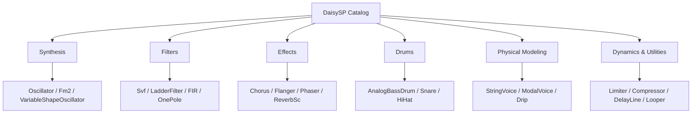
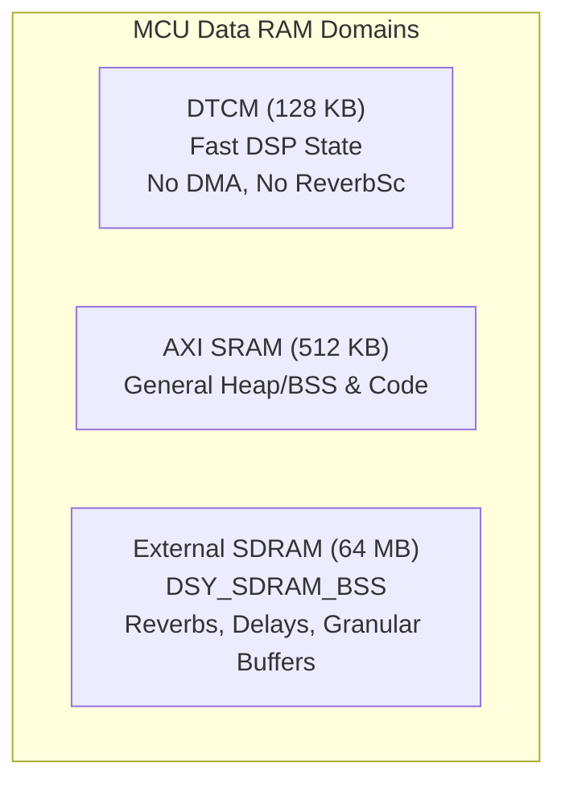

# DaisySP Developer Guide & DSP Runbook

This skill provides an operational runbook, architectural rules, and quick-lookup cheatsheet for developing real-time audio synthesis and signal processing applications using **`DaisySP`**.

---

## 1. Core Architectural Tenets

All code using DaisySP must strictly adhere to the following real-time audio constraints:

| Tenet | Rule | Engineering Contract |
| :--- | :--- | :--- |
| **Static Memory** | **No runtime allocation.** | Never call `malloc`, `new`, or standard dynamic containers in audio callbacks. Pre-allocate in BSS, template parameters, or SDRAM (`DSY_SDRAM_BSS`). |
| **Evaluation Pattern** | **Single-sample `Process()` standard.** | Evaluate sample-by-sample for feedback stability. Use block processing (`ProcessBlock`) only where hardware SIMD-accelerated (`FIR`, `Limiter`, `LadderFilter`). |
| **Signal Ranges** | **Normalized floats.** | Audio signals: nominal $[-1.0\text{f}, +1.0\text{f}]$ ($0\text{ dBFS}$). Control voltages: $[0.0\text{f}, 1.0\text{f}]$. |
| **Rate Separation** | **Decouple control from audio rate.** | Evaluate envelopes (`Adsr`), LFOs, and UI parameter mappings once per audio block (or with `blockSize` parameter) rather than per-sample to save MCU cycles. |
| **Lifecycle** | **Instantiation $\to$ `Init(sr)` $\to$ `Process()`.** | Default constructors initialize safe state; `.Init(sample_rate)` configures sample-rate-dependent filter coefficients and clears delay lines. |

---

## 2. Licensing & Submodule Inclusions

| Tier | Include Header | Build Flag | Notes |
| :--- | :--- | :--- | :--- |
| **MIT Core** | `#include "daisysp.h"` | Default | Electro-Smith core, Andrew Simper SVF, Mutable Instruments ports (Plaits, Rings, stmlib). Safe for proprietary commercial firmware. |
| **LGPL Submodule** | `#include "daisysp-lgpl.h"` | `USE_DAISYSP_LGPL = 1` | Csound, Soundpipe, Faust ports (`ReverbSc`, `Compressor`, `MoogLadder`, `BlOsc`, `Pluck`). Commercial distribution requires relinking capability (`gather_lgpl.sh`). |

---

## 3. Fast Module Selection Index

For detailed class methods and parameter limits, see [Module Catalog Reference](references/module_catalog.md).



| Functional Domain | Recommended Modules | Master Header Path |
| :--- | :--- | :--- |
| **Subtractive Synthesis** | [`Oscillator`](file:///Users/brett/Documents/GitHub/reverse-engineering-gamma/DaisySP/Source/Synthesis/oscillator.h) (PolyBLEP), [`VariableShapeOscillator`](file:///Users/brett/Documents/GitHub/reverse-engineering-gamma/DaisySP/Source/Synthesis/variableshapeosc.h), [`OscillatorBank`](file:///Users/brett/Documents/GitHub/reverse-engineering-gamma/DaisySP/Source/Synthesis/oscillatorbank.h) | `Synthesis/` |
| **FM & Complex Osc** | [`Fm2`](file:///Users/brett/Documents/GitHub/reverse-engineering-gamma/DaisySP/Source/Synthesis/fm2.h) (2-Op FM), [`FormantOscillator`](file:///Users/brett/Documents/GitHub/reverse-engineering-gamma/DaisySP/Source/Synthesis/formantosc.h), [`ZOscillator`](file:///Users/brett/Documents/GitHub/reverse-engineering-gamma/DaisySP/Source/Synthesis/zoscillator.h), [`BlOsc`](file:///Users/brett/Documents/GitHub/reverse-engineering-gamma/DaisySP/DaisySP-LGPL/Source/Synthesis/blosc.h) [LGPL] | `Synthesis/` |
| **Filters** | [`Svf`](file:///Users/brett/Documents/GitHub/reverse-engineering-gamma/DaisySP/Source/Filters/svf.h) (Simper stable SVF), [`LadderFilter`](file:///Users/brett/Documents/GitHub/reverse-engineering-gamma/DaisySP/Source/Filters/ladder.h) (Moog 4-pole), [`FIR`](file:///Users/brett/Documents/GitHub/reverse-engineering-gamma/DaisySP/Source/Filters/fir.h) (ARM CMSIS accelerated), [`OnePole`](file:///Users/brett/Documents/GitHub/reverse-engineering-gamma/DaisySP/Source/Filters/onepole.h) | `Filters/` |
| **Time & Modulation FX** | [`Chorus`](file:///Users/brett/Documents/GitHub/reverse-engineering-gamma/DaisySP/Source/Effects/chorus.h), [`Flanger`](file:///Users/brett/Documents/GitHub/reverse-engineering-gamma/DaisySP/Source/Effects/flanger.h), [`Phaser`](file:///Users/brett/Documents/GitHub/reverse-engineering-gamma/DaisySP/Source/Effects/phaser.h), [`Tremolo`](file:///Users/brett/Documents/GitHub/reverse-engineering-gamma/DaisySP/Source/Effects/tremolo.h), [`PitchShifter`](file:///Users/brett/Documents/GitHub/reverse-engineering-gamma/DaisySP/Source/Effects/pitchshifter.h) | `Effects/` |
| **Distortion & Lo-Fi** | [`Overdrive`](file:///Users/brett/Documents/GitHub/reverse-engineering-gamma/DaisySP/Source/Effects/overdrive.h), [`Wavefolder`](file:///Users/brett/Documents/GitHub/reverse-engineering-gamma/DaisySP/Source/Effects/wavefolder.h), [`Decimator`](file:///Users/brett/Documents/GitHub/reverse-engineering-gamma/DaisySP/Source/Effects/decimator.h), [`SampleRateReducer`](file:///Users/brett/Documents/GitHub/reverse-engineering-gamma/DaisySP/Source/Effects/sampleratereducer.h) | `Effects/` |
| **Reverberation** | [`ReverbSc`](file:///Users/brett/Documents/GitHub/reverse-engineering-gamma/DaisySP/DaisySP-LGPL/Source/Effects/reverbsc.h) (Costello 8-delay matrix algorithmic reverb) [LGPL] | `DaisySP-LGPL/Source/Effects/` |
| **Drum Synthesis** | [`AnalogBassDrum`](file:///Users/brett/Documents/GitHub/reverse-engineering-gamma/DaisySP/Source/Drums/analogbassdrum.h) (808 kick), [`AnalogSnareDrum`](file:///Users/brett/Documents/GitHub/reverse-engineering-gamma/DaisySP/Source/Drums/analogsnaredrum.h), [`HiHat`](file:///Users/brett/Documents/GitHub/reverse-engineering-gamma/DaisySP/Source/Drums/hihat.h) (6-osc cluster), `SyntheticBassDrum`, `SyntheticSnareDrum` | `Drums/` |
| **Physical Modeling** | [`StringVoice`](file:///Users/brett/Documents/GitHub/reverse-engineering-gamma/DaisySP/Source/PhysicalModeling/stringvoice.h) (Rings/Plaits string), [`ModalVoice`](file:///Users/brett/Documents/GitHub/reverse-engineering-gamma/DaisySP/Source/PhysicalModeling/modalvoice.h) (bell/plate), [`Resonator`](file:///Users/brett/Documents/GitHub/reverse-engineering-gamma/DaisySP/Source/PhysicalModeling/resonator.h), [`Drip`](file:///Users/brett/Documents/GitHub/reverse-engineering-gamma/DaisySP/Source/PhysicalModeling/drip.h) | `PhysicalModeling/` |
| **Sampling & Loops** | [`GranularPlayer`](file:///Users/brett/Documents/GitHub/reverse-engineering-gamma/DaisySP/Source/Sampling/granularplayer.h) (time-stretch & pitch shift), [`Looper`](file:///Users/brett/Documents/GitHub/reverse-engineering-gamma/DaisySP/Source/Utility/looper.h) (Frippertronics tape loops, overdub) | `Sampling/`, `Utility/` |
| **Dynamics** | [`Limiter`](file:///Users/brett/Documents/GitHub/reverse-engineering-gamma/DaisySP/Source/Dynamics/limiter.h) (peak block limiter), [`CrossFade`](file:///Users/brett/Documents/GitHub/reverse-engineering-gamma/DaisySP/Source/Dynamics/crossfade.h), [`Compressor`](file:///Users/brett/Documents/GitHub/reverse-engineering-gamma/DaisySP/DaisySP-LGPL/Source/Dynamics/compressor.h) (sidechain capable) [LGPL] | `Dynamics/` |
| **Noise Generators** | [`WhiteNoise`](file:///Users/brett/Documents/GitHub/reverse-engineering-gamma/DaisySP/Source/Noise/whitenoise.h), [`ClockedNoise`](file:///Users/brett/Documents/GitHub/reverse-engineering-gamma/DaisySP/Source/Noise/clockednoise.h), [`Dust`](file:///Users/brett/Documents/GitHub/reverse-engineering-gamma/DaisySP/Source/Noise/dust.h) (vinyl crackle), [`FractalRandomGenerator`](file:///Users/brett/Documents/GitHub/reverse-engineering-gamma/DaisySP/Source/Noise/fractal_noise.h) (1/f) | `Noise/` |
| **Control & Envelopes**| [`Adsr`](file:///Users/brett/Documents/GitHub/reverse-engineering-gamma/DaisySP/Source/Control/adsr.h) (curve shaping, block-update support), [`AdEnv`](file:///Users/brett/Documents/GitHub/reverse-engineering-gamma/DaisySP/Source/Control/adenv.h), [`Phasor`](file:///Users/brett/Documents/GitHub/reverse-engineering-gamma/DaisySP/Source/Control/phasor.h) (0.0–1.0 ramp) | `Control/` |
| **Utilities & Buffers**| [`DelayLine`](file:///Users/brett/Documents/GitHub/reverse-engineering-gamma/DaisySP/Source/Utility/delayline.h) (Hermite cubic interpolation), [`DcBlock`](file:///Users/brett/Documents/GitHub/reverse-engineering-gamma/DaisySP/Source/Utility/dcblock.h), [`Metro`](file:///Users/brett/Documents/GitHub/reverse-engineering-gamma/DaisySP/Source/Utility/metro.h), [`Maytrig`](file:///Users/brett/Documents/GitHub/reverse-engineering-gamma/DaisySP/Source/Utility/maytrig.h), [`SampleHold`](file:///Users/brett/Documents/GitHub/reverse-engineering-gamma/DaisySP/Source/Utility/samplehold.h) | `Utility/` |

---

## 4. Memory Layout Rules for Embedded Targets (Daisy Seed / STM32H750)



* **Large Footprint Danger:**
  * [`ReverbSc`](file:///Users/brett/Documents/GitHub/reverse-engineering-gamma/DaisySP/DaisySP-LGPL/Source/Effects/reverbsc.h) allocates `98,936` floats (**~395 KB**).
  * [`PitchShifter`](file:///Users/brett/Documents/GitHub/reverse-engineering-gamma/DaisySP/Source/Effects/pitchshifter.h) allocates two 16K float delay lines (**~128 KB**).
  * `DelayLine<float, 48000>` allocates **192 KB**.
* **Storage Directive:**
  Never allocate these classes locally on the function stack or in DTCM. Place them in static external SDRAM:
  ```cpp
  static ReverbSc DSY_SDRAM_BSS reverb;
  static DelayLine<float, 48000 * 2> DSY_SDRAM_BSS delay_line;
  ```

---

## 5. Master Math Cheatsheet (`Utility/dsp.h`)

[`Utility/dsp.h`](file:///Users/brett/Documents/GitHub/reverse-engineering-gamma/DaisySP/Source/Utility/dsp.h) contains high-performance audio math approximations:

```cpp
#include "Utility/dsp.h"
using namespace daisysp;

float hz  = mtof(midi_note);                       // MIDI note to Hz (69 -> 440 Hz)
float gain = pow10f(db / 20.0f);                   // Fast 10^x (90% faster than powf)
float val  = fclamp(raw_input, -1.0f, 1.0f);       // Single-instruction ARM clamp
float freq = fmap(norm_pot, 20.f, 20000.f, Mapping::EXP); // Exponential mapping
float soft = SoftClip(sample);                     // Polynomial soft-clipping
float hard = SoftLimit(sample);                    // Cubic limiter
float blep = ThisBlepSample(t);                    // PolyBLEP anti-aliasing step
```

---

## 6. Common Pitfalls & Diagnostics

| Problem | Probable Cause | Verification & Corrective Action |
| :--- | :--- | :--- |
| **Instant HardFault on boot** | Large module on function stack or DTCM | Check `.bss` section size with `arm-none-eabi-size`. Decorate `ReverbSc`, `PitchShifter`, or large `DelayLine` with `DSY_SDRAM_BSS`. |
| **Audio crackle / stutter** | Denormal floating-point underflow stalls FPU | Enable Flush-to-Zero (FTZ) on Cortex-M7: `__set_FPSCR(__get_FPSCR() \| (1 << 24));`. |
| **Filter outputs silence** | `Svf::Process(in)` returns `void` | Multi-output filters require querying getter methods: `float out = flt.Low();`. |
| **Linker error: undefined reference to `ReverbSc`** | Missing LGPL submodule build configuration | Add `USE_DAISYSP_LGPL = 1` to project `Makefile`, or pass `-DUSE_DAISYSP_LGPL`. |
| **Wrong pitch or modulation rate** | Passing hardcoded sample rate (e.g. `48000`) | Always query the running hardware sample rate: `module.Init(hw.AudioSampleRate());`. |
| **Synth freezes / controls drop out after drum hit** | `AnalogBassDrum` runaway resonance starving control ISRs | `AnalogBassDrum` scales SVF resonance by frequency ($\text{res} = 0.4 \times q \times f$). Above $\approx 90\text{ Hz}$, resonance clamps to $1.0$ (damping $= 0.0$), causing perpetual self-oscillation. Coupled with per-sample `powf`/`sinf` calls, the audio ISR saturates the CPU, starving the 1 kHz timer/main loop. Keep `AnalogBassDrum` $\le 90\text{ Hz}$ or use a pitch-swept sine + envelope for higher drums (toms). Always backstop voice activity gates with a maximum lifetime ceiling. |

---

## 7. Verification Workflows

### 7.1 Verify Build & Memory Footprint
Run from the firmware project directory:
```bash
make clean && make -j
arm-none-eabi-size build/*.elf
```
*Verify that `.data` and `.bss` allocated to DTCM (`0x20000000`) do not exceed 128 KB.*

---

## 8. Detailed References

* **[Exhaustive Module Catalog](references/module_catalog.md)**: Class-by-class methods, parameters, and origins.
* **[Production Audio Recipes](references/audio_recipes.md)**: Monophonic synth, guitar multi-FX, and drum sequencer callbacks.
* **[Comprehensive Architecture Guide](../../../docs/DAISYSP_GUIDE.md)**: Full ecosystem deep dive.
