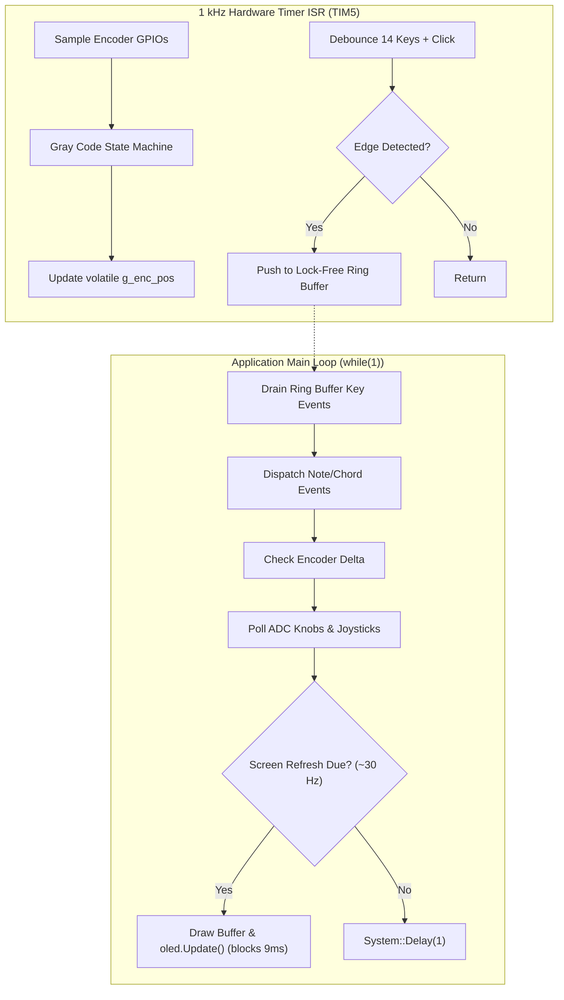

# Complete Integration Architecture & Main Loop Blueprint

This blueprint demonstrates how to combine the OLED display, 14 tactile keypad switches, rotary encoder, potentiometers, and joysticks into a responsive, non-blocking firmware architecture.

---

## 1. System Threading & Timing Model



---

## 2. Integrated Implementation Skeleton

```cpp
#include "daisy_seed.h"
#include "dev/oled_ssd130x.h"
#include "util/oled_fonts.h"
#include "gamma_pins.h"
#include <cmath>

using namespace daisy;

DaisySeed hw;

// OLED
using MyOled = OledDisplay<SSD130xI2c128x64Driver>;
static MyOled oled;

// Digital Peripherals
static Switch      g_note_keys[gamma_pins::note_keys::COUNT];
static Switch      g_chord_keys[gamma_pins::chord_keys::COUNT];
static Switch      g_enc_click;
static GPIO        g_enc_gpio_a;
static GPIO        g_enc_gpio_b;
static TimerHandle g_timer;

// Ring Buffer
struct KeyEvent { uint8_t id; bool pressed; };
static constexpr size_t kEventQueueSize = 32;
static KeyEvent         g_event_queue[kEventQueueSize];
static volatile size_t  g_eq_head = 0;
static volatile size_t  g_eq_tail = 0;

static volatile int32_t g_enc_pos  = 0;
static volatile int     g_last_inc = 0;

// Analog State
static float g_knobs[gamma_pins::knobs::COUNT]       = {0.0f};
static float g_sticks[gamma_pins::joysticks::COUNT] = {0.5f, 0.5f, 0.5f, 0.5f};

static inline void EnqueueEvent(uint8_t id, bool pressed)
{
    size_t next = (g_eq_head + 1) % kEventQueueSize;
    if(next != g_eq_tail)
    {
        g_event_queue[g_eq_head].id      = id;
        g_event_queue[g_eq_head].pressed = pressed;
        g_eq_head                        = next;
    }
}

// 1 kHz Timer ISR
void TimerCallback(void* data)
{
    // Encoder decoding
    uint8_t a = g_enc_gpio_a.Read();
    uint8_t b = g_enc_gpio_b.Read();
    static uint8_t s_prev_quad = 0x03;
    uint8_t curr_quad = (a << 1) | b;
    if(curr_quad != s_prev_quad)
    {
        static const int8_t kQuadTable[16] = {
             0, -1,  1,  0,
             1,  0,  0, -1,
            -1,  0,  0,  1,
             0,  1, -1,  0
        };
        int8_t step = kQuadTable[(s_prev_quad << 2) | curr_quad];
        if(step != 0)
        {
            static int8_t s_sub = 0;
            s_sub += step;
            if(s_sub >= 4)       { g_enc_pos++; g_last_inc = 1;  s_sub = 0; }
            else if(s_sub <= -4) { g_enc_pos--; g_last_inc = -1; s_sub = 0; }
        }
        s_prev_quad = curr_quad;
    }

    // Encoder Click
    g_enc_click.Debounce();
    if(g_enc_click.RisingEdge())       EnqueueEvent(14, true);
    else if(g_enc_click.FallingEdge()) EnqueueEvent(14, false);

    // Note Keys
    for(size_t i = 0; i < gamma_pins::note_keys::COUNT; i++)
    {
        g_note_keys[i].Debounce();
        if(g_note_keys[i].RisingEdge())       EnqueueEvent(i, true);
        else if(g_note_keys[i].FallingEdge()) EnqueueEvent(i, false);
    }

    // Chord Keys
    for(size_t i = 0; i < gamma_pins::chord_keys::COUNT; i++)
    {
        g_chord_keys[i].Debounce();
        if(g_chord_keys[i].RisingEdge())       EnqueueEvent(7 + i, true);
        else if(g_chord_keys[i].FallingEdge()) EnqueueEvent(7 + i, false);
    }
}

int main(void)
{
    hw.Init();

    // 1. Auxiliary low rail
    GPIO rail_low;
    rail_low.Init(gamma_pins::system_pins::pin_rail_low, GPIO::Mode::OUTPUT, GPIO::Pull::NOPULL);
    rail_low.Write(false);

    // 2. Display Init (with bus reset)
    __HAL_RCC_I2C1_FORCE_RESET();
    System::Delay(2);
    __HAL_RCC_I2C1_RELEASE_RESET();

    __HAL_RCC_GPIOB_CLK_ENABLE();
    GPIO_InitTypeDef gpio_init;
    gpio_init.Mode      = GPIO_MODE_AF_OD;
    gpio_init.Pull      = GPIO_PULLUP;
    gpio_init.Speed     = GPIO_SPEED_FREQ_HIGH;
    gpio_init.Alternate = GPIO_AF4_I2C1;
    gpio_init.Pin       = (1U << gamma_pins::display::pin_scl.pin) | (1U << gamma_pins::display::pin_sda.pin);
    HAL_GPIO_Init(GPIOB, &gpio_init);

    MyOled::Config disp_cfg;
    disp_cfg.driver_config.transport_config.i2c_address               = gamma_pins::display::i2c_address;
    disp_cfg.driver_config.transport_config.i2c_config.periph         = I2CHandle::Config::Peripheral::I2C_1;
    disp_cfg.driver_config.transport_config.i2c_config.speed          = I2CHandle::Config::Speed::I2C_1MHZ;
    disp_cfg.driver_config.transport_config.i2c_config.mode           = I2CHandle::Config::Mode::I2C_MASTER;
    disp_cfg.driver_config.transport_config.i2c_config.pin_config.scl = gamma_pins::display::pin_scl;
    disp_cfg.driver_config.transport_config.i2c_config.pin_config.sda = gamma_pins::display::pin_sda;
    oled.Init(disp_cfg);

    // 3. ADC Init
    constexpr size_t num_adc = gamma_pins::knobs::COUNT + gamma_pins::joysticks::COUNT + 1;
    AdcChannelConfig adc_cfg[num_adc];
    for(size_t i = 0; i < gamma_pins::knobs::COUNT; i++)
        adc_cfg[i].InitSingle(gamma_pins::knobs::pins[i]);
    for(size_t i = 0; i < gamma_pins::joysticks::COUNT; i++)
        adc_cfg[gamma_pins::knobs::COUNT + i].InitSingle(gamma_pins::joysticks::pins[i]);
    adc_cfg[gamma_pins::knobs::COUNT + gamma_pins::joysticks::COUNT].InitSingle(gamma_pins::aux_adc::pin);
    hw.adc.Init(adc_cfg, num_adc);
    hw.adc.Start();

    // 4. Keys, Encoder & Timer Init
    for(size_t i = 0; i < gamma_pins::note_keys::COUNT; i++)
        g_note_keys[i].Init(gamma_pins::note_keys::pins[i], 1000.0f);
    for(size_t i = 0; i < gamma_pins::chord_keys::COUNT; i++)
        g_chord_keys[i].Init(gamma_pins::chord_keys::pins[i], 1000.0f);
    g_enc_click.Init(gamma_pins::encoder::pin_click, 1000.0f);
    g_enc_gpio_a.Init(gamma_pins::encoder::pin_a, GPIO::Mode::INPUT, GPIO::Pull::PULLUP);
    g_enc_gpio_b.Init(gamma_pins::encoder::pin_b, GPIO::Mode::INPUT, GPIO::Pull::PULLUP);

    TimerHandle::Config tim_cfg;
    tim_cfg.periph     = TimerHandle::Config::Peripheral::TIM_5;
    tim_cfg.dir        = TimerHandle::Config::CounterDir::UP;
    tim_cfg.enable_irq = true;
    tim_cfg.period     = 1000;
    g_timer.Init(tim_cfg);
    g_timer.SetPrescaler(240 - 1);
    g_timer.SetCallback(TimerCallback, nullptr);
    g_timer.Start();

    uint32_t last_screen_time = System::GetNow();
    int32_t  last_enc_pos     = 0;

    while(1)
    {
        uint32_t now = System::GetNow();

        // Drain key events
        while(g_eq_tail != g_eq_head)
        {
            KeyEvent ev = g_event_queue[g_eq_tail];
            g_eq_tail   = (g_eq_tail + 1) % kEventQueueSize;
            // Handle ev.id (0..6 note, 7..13 chord, 14 enc click) and ev.pressed
        }

        // Encoder delta
        int32_t cur_pos = g_enc_pos;
        if(cur_pos != last_enc_pos)
        {
            int32_t delta = cur_pos - last_enc_pos;
            last_enc_pos = cur_pos;
            // Handle delta (+1 CW, -1 CCW)
        }

        // Read Knobs
        for(size_t i = 0; i < gamma_pins::knobs::COUNT; i++)
        {
            float raw = hw.adc.GetFloat(i);
            if(gamma_pins::knobs::invert[i]) raw = 1.0f - raw;
            raw = fmaxf(0.0f, fminf(1.0f, raw));
            if(fabsf(raw - g_knobs[i]) > 0.005f) g_knobs[i] = raw;
        }

        // Read Joysticks
        for(size_t i = 0; i < gamma_pins::joysticks::COUNT; i++)
        {
            float raw = hw.adc.GetFloat(gamma_pins::knobs::COUNT + i);
            if(gamma_pins::joysticks::invert[i]) raw = 1.0f - raw;
            raw = fmaxf(0.0f, fminf(1.0f, raw));
            g_sticks[i] += gamma_pins::joysticks::iir_coefficient * (raw - g_sticks[i]);
        }

        // Display refresh (~33 Hz)
        if(now - last_screen_time >= 30)
        {
            last_screen_time = now;
            oled.Fill(false);
            oled.SetCursor(0, 0);
            oled.WriteString("GAMMA SYNTH", Font_6x8, true);
            oled.Update();
        }

        System::Delay(1);
    }
}
```
