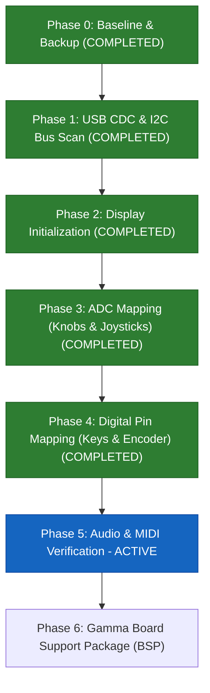

# Gamma Mini Synth Pinout Reverse-Engineering Plan

This document outlines the step-by-step strategy for reverse-engineering the hardware pinout and peripherals of the **this.is.Noise Inc Gamma** synthesizer. The device is powered by an **Electro-Smith Daisy Seed 2 DFM** (ARM Cortex-M7 @ 480 MHz, STM32H750, PCM3060 audio codec).

---

## 1. Required Software & Toolchain Setup

To build, flash, and interact with diagnostic firmware over USB-C, you will need the following tools installed on your host machine (macOS):

### A. ARM Embedded Toolchain (`arm-none-eabi-*`)
Compiles C/C++ firmware targeting the ARM Cortex-M7 microcontroller.
* **Option 1 (Homebrew - Recommended):**
  ```bash
  brew install --cask gcc-arm-embedded
  ```
* **Option 2 (Official Arm Developer Site):**
  Download the macOS `.pkg` or `.tar.xz` from [Arm GNU Toolchain Downloads](https://developer.arm.com/downloads/-/arm-gnu-toolchain-downloads).
* **Verify:**
  ```bash
  arm-none-eabi-gcc --version
  ```

### B. DFU Utility (`dfu-util`)
Sends compiled `.bin` firmware files directly to the Daisy Seed bootloader over the USB-C connection without requiring an external debugger.
* **Installation (Homebrew):**
  ```bash
  brew install dfu-util
  ```
* **Verify:**
  ```bash
  dfu-util --version
  ```

### C. Build Tools (`make` / Xcode Command Line Tools)
Used by `libDaisy` to build projects.
* **Installation:**
  ```bash
  xcode-select --install
  ```
* **Verify:**
  ```bash
  make --version
  ```

### D. Serial Terminal Monitor
Reads real-time diagnostic output transmitted from the Daisy over USB CDC (Virtual COM Port).
* **Terminal tools:**
  - Built-in `screen`:
    ```bash
    screen /dev/cu.usbmodem* 115200
    ```
    *(Exit screen using `Ctrl-A` then `Ctrl-\`)*
  - Alternatively: `minicom` (`brew install minicom`), `tio` (`brew install tio`), or Python `pyserial`:
    ```bash
    python3 -m pip install pyserial
    python3 -m serial.tools.miniterm /dev/cu.usbmodem* 115200
    ```

### E. Electro-Smith Daisy Repositories
The core HAL and DSP libraries for the Daisy Seed 2 DFM:

  - `libDaisy`: [libDaisy/](file:///Users/brett/Documents/GitHub/reverse-engineering-gamma/libDaisy) (Hardware abstraction layer; builds `build/libdaisy.a`)
  - `DaisySP`: [DaisySP/](file:///Users/brett/Documents/GitHub/reverse-engineering-gamma/DaisySP) (DSP synthesis library; builds `build/libdaisysp.a`)

---

## 2. Hardware Inventory & Daisy Seed 2 DFM Target

| Component | Description | Confirmed Hardware Interface / Pinout | Status |
| :--- | :--- | :--- | :--- |
| **OLED Display** | 1.3" display (SSD1306 controller, 128x64) | **I2C1** (SCL: `seed::D11` / `PB8`, SDA: `seed::D12` / `PB9`) @ **`0x3D`** | **Verified on Hardware** |
| **Potentiometers** | 4 rotary knobs (Chords Vol/Filter, Notes Vol/Filter) | 4 ADC channels (active high w/ `1.0 - raw` software inversion):<br>• Knob 0 (Chord Vol): `seed::D18` (`PA7` / `A3`)<br>• Knob 1 (Chord Filter): `seed::D17` (`PB1` / `A2`)<br>• Knob 2 (Notes Vol): `seed::D19` (`PA6` / `A4`)<br>• Knob 3 (Notes Filter): `seed::D20` (`PC1` / `A5`) | **Verified on Hardware** |
| **Thumbsticks** | 2 analog joysticks (Left X/Y, Right X/Y) | 4 ADC channels:<br>• **Left Stick X (LX):** `seed::D22` (`PA5` / `A7`) — Left=0%, Right=100%<br>• **Left Stick Y (LY):** `seed::D21` (`PC4` / `A6`) — Down=0%, Up=100% (`1.0 - raw`)<br>• **Right Stick X (RX):** `seed::D24` (`PA1` / `A9`) — Left=0%, Right=100% (`1.0 - raw`)<br>• **Right Stick Y (RY):** `seed::D23` (`PA4` / `A8`) — Down=0%, Up=100% (`1.0 - raw`) | **Verified on Hardware** |
| **Aux ADC** | Internal / Battery / Aux sensor | 1 ADC channel: `seed::D31` (`PC2`/`A12`) | **Confirmed via Disassembly** |
| **14 Keys** | 14 tactile low-profile switches (7 chord, 7 note) | 14 discrete GPIO inputs w/ internal pullups:<br>• Chord keys: `D8` (`PG11`), `D9` (`PB4`), `D10` (`PB5`), `D13` (`PB6`), `D14` (`PB7`), `D26` (`PD11`), `D27` (`PG9`)<br>• Note keys: `D1` (`PC11`), `D2` (`PC10`), `D3` (`PC9`), `D4` (`PC8`), `D5` (`PD2`), `D6` (`PC12`), `D7` (`PG10`) | **Confirmed via Disassembly** |
| **Rotary Encoder** | 1 rotary dial w/ push switch (scale/key selection) | • Phase A: `seed::D15` (`PC0`)<br>• Phase B: `seed::D16` (`PA3`)<br>• Push Switch: `seed::D28` (`PA2`, active low w/ pullup) | **Confirmed via Disassembly** |
| **Board Rail / Aux** | Grounding rail & auxiliary input | • `PC3`: Output LOW (`0`)<br>• `seed::D0` (`PB12`): Input Pullup | **Confirmed via Disassembly** |
| **Audio Output** | 3.5mm stereo headphone jack | On-board PCM3060 codec via SAI | Internal Daisy routing |
| **MIDI Output** | 3.5mm TRS MIDI Out | Hardware UART TX @ 31,250 baud | In progress |
| **USB-C** | Power, flashing (DFU), USB Serial/MIDI | STM32 USB OTG FS (`vbus_sensing_enable = DISABLE`) | **Verified on Hardware** |

---

## 3. Reverse-Engineering Roadmap



---

### Phase 0: Baseline Verification & Firmware Backup (COMPLETED)
**Goal:** Verify communication over USB-C, understand the bootloader runtime model, and secure a verifiable factory restore path.

1. **Boot into DFU Mode:**
   - Put the Daisy into system bootloader mode (hold `BOOT`, tap `RESET`, release `BOOT`).
   - Query USB DFU status:
     ```bash
     dfu-util -l
     ```
   - **Result (Verified):** The Gamma was successfully detected:
     ```text
     Found DFU: [0483:df11] ver=0200, devnum=1, cfg=1, intf=0, path="1-1", alt=0, name="@Flash /0x90000000/64*4Kg/0x90040000/60*64Kg/0x90400000/60*64Kg", serial="3067366D3433"
     Product: "Daisy Bootloader" (Electrosmith)
     ```

2. **Bootloader Runtime & Memory Architecture Findings:**
   - **Storage vs. Execution:** Programs are stored in external QSPI flash starting at `0x90040000`. However, the Daisy Bootloader on this device is configured to load binaries into **AXI SRAM (`0x24000000`)** before branching to them (`APP_TYPE = BOOT_SRAM`).
   - **Boot Window:** On power-up or hardware reset, the bootloader listens for DFU for ~2 to 2.5 seconds (USER LED pulses). If no connection is made, it jumps to the SRAM application.
   - **Display Persistence:** The 1.3" OLED panel retains its internal display RAM (GDDRAM) as long as 3.3V logic power is present. An unbooted MCU or bootloader halt leaves the previous image (`this.is.NOISE inc`) on screen.
   - **Factory Firmware Recovery:** Acquired official production binaries hosted by the web update tool (`https://gammaupdatetool.netlify.app/`):
     - [`backups/gamma-v2.0.3.bin`](backups/gamma-v2.0.3.bin) (v2.0.3, 360,740 bytes)
     - [`backups/gamma1_1.bin`](backups/gamma1_1.bin) (v1.1, 269,764 bytes)
   - **Vector Table Analysis of Factory Binary:**
     - Initial SP: `0x20020000` (top of DTCMRAM, 128 KB)
     - Reset Handler: `0x240047ED` (AXI SRAM at `0x24000000`)
     - Confirms `APP_TYPE = BOOT_SRAM` is mandatory.
     - Strings analysis shows the factory firmware is developed in embedded **Rust** (`src/display/`, `src/midi/`, `src/looper/`).
   - **Bootloader Modes & DFU Entry Points:**
     - **Hardware ROM Bootloader (Hold BOOT + Tap RESET):** Pulls the MCU's `BOOT0` pin HIGH and boots into STMicroelectronics' factory system ROM. Bypasses the Daisy Bootloader entirely; does not initialize the Seed 2 DFM High-Speed USB PHY (USER LED stays OFF, host cannot communicate). **Do not use this mode for flashing.**
     - **Daisy Bootloader Grace Period (Tap RESET alone or Power-Cycle):** Microcontroller boots into internal flash (`0x08000000`), pulses/breathes USER LED, and listens for DFU on USB-C for ~2.5 seconds before jumping to the application at `0x90040000`. This is the primary interactive flashing workflow.
     - **Daisy Bootloader Infinite Timeout (Gamma Menu `System -> Info -> Enter Boot`):** Sets `DAISY_INFINITE_TIMEOUT` in Backup SRAM (`0x38800000`) and soft-resets into the Daisy Bootloader, holding DFU mode indefinitely without timing out.
   - **Clock Initialization Traps:**
     - The Daisy Bootloader initializes the system PLL to 480 MHz before jumping to SRAM. In `daisy_seed.cpp`, `syscfg.skip_clocks` must remain `true` for SRAM builds. Re-configuring the active PLL in application code traps in `Error_Handler()` and freezes SysTick.
   - **USB CDC Enumeration & VBUS Sensing Discovery:**
     - Disassembly of official production firmware (`gamma-v2.0.3.bin` at `0x24029c78`) revealed that `hpcd_USB_OTG_FS.Init.vbus_sensing_enable` is set to **`DISABLE` (`0`)**.
     - Upstream `libDaisy` defaults `vbus_sensing_enable` to `ENABLE` (`1`), requiring 5V on pin `PA9` to activate the internal D+ pullup resistor. Because Gamma does not route 5V VBUS to `PA9`, STM32 detects "cable disconnected" and never pulls up D+.
     - Patched [`libDaisy/src/usbd/usbd_conf.c`](libDaisy/src/usbd/usbd_conf.c) to set `vbus_sensing_enable = DISABLE`.
     - When launching from the bootloader, `syscfg.skip_clocks` is set, which leaves `HSI48` and `RCC_USBCLKSOURCE_HSI48` uninitialized unless explicitly enabled in application code.
   - **I2C Bus Recovery:**
     - Explicit bus reset (`__HAL_RCC_I2C1_FORCE_RESET()` / `RELEASE_RESET()`) and clean GPIO alternate function pin muxing (`GPIO_AF4_I2C1`) with pullups ensures reliable OLED communication without hanging on bus transitions.

---

### Dual-Track Strategy: Static Analysis & Dynamic Hardware Probing

Having official production firmware (`gamma-v2.0.3.bin`) enabled static reverse-engineering alongside dynamic probing:

1. **Static Analysis Results (Verified from Disassembly):**
   - **Display Hardware Peripheral:** Disassembly of the hardware initialization routine (`0x24007f1c` - `0x24007f3e` and `0x240077b0`) revealed the exact configuration passed to `I2CHandle::Init`:
     - **Peripheral:** `I2C1` (`0x40005400`)
     - **SCL Pin:** `seed::D11` (`PB8`, GPIO Port B pin 8)
     - **SDA Pin:** `seed::D12` (`PB9`, GPIO Port B pin 9)
     - **Bus Speed:** `I2C_1MHZ` (Fast Mode Plus)
     - **I2C Device Address:** **`0x3D`** (`movs r3, #61` at `0x24007f2a`)
     - **Display Controller:** **SSD1306** (128x64).
   - **Analog ADC Configuration (Knobs & Joysticks):** Disassembly of the ADC setup routine (`0x24007d4c` - `0x24007f18` and `0x240261f8` `AdcChannelConfig::InitSingle`):
     - **9 Total ADC Channels** configured with `AdcHandle::Init(&cfg, 9)`:
       - **Joysticks (Channels 0–3, 0.05 fast IIR filter):**
         - Channel 0: `seed::D18` (`PA7` / `ADC1_INP7` / `A3`)
         - Channel 1: `seed::D17` (`PB1` / `ADC1_INP5` / `A2`)
         - Channel 2: `seed::D19` (`PA6` / `ADC1_INP3` / `A4`)
         - Channel 3: `seed::D20` (`PC1` / `ADC1_INP11` / `A5`)
       - **Potentiometers (Channels 4–7, 0.002 heavy IIR filter):**
         - Channel 4: `seed::D24` (`PA1` / `ADC1_INP17` / `A9`)
         - Channel 5: `seed::D23` (`PA4` / `ADC1_INP18` / `A8`)
         - Channel 6: `seed::D22` (`PA5` / `ADC1_INP19` / `A7`)
         - Channel 7: `seed::D21` (`PC4` / `ADC1_INP4` / `A6`)
       - **Auxiliary / Battery ADC (Channel 8):**
         - Channel 8: `seed::D31` (`PC2` / `ADC1_INP12`)
   - **14 Discrete Key Switches:** Disassembly of key initialization at `0x24007ab8` - `0x24007bd6` (`Switch::Init` at `0x24025de0`):
     - Each switch is directly connected to a dedicated MCU GPIO with internal pull-up resistor (active low):
       - **Chord Keys (7 switches):** `D8` (`PG11`), `D9` (`PB4`), `D10` (`PB5`), `D13` (`PB6`), `D14` (`PB7`), `D26` (`PD11`), `D27` (`PG9`)
       - **Note Keys (7 switches):** `D1` (`PC11`), `D2` (`PC10`), `D3` (`PC9`), `D4` (`PC8`), `D5` (`PD2`), `D6` (`PC12`), `D7` (`PG10`)
   - **Rotary Encoder with Push Switch:** Disassembly of encoder initialization at `0x24007c22` - `0x24007d22` (`Encoder::Init` at `0x24025b84`):
     - **Phase A Pin:** `seed::D15` (`PC0`)
     - **Phase B Pin:** `seed::D16` (`PA3`)
     - **Push Switch Pin:** `seed::D28` (`PA2`, active low w/ internal pull-up)
   - **Board Rail & Auxiliary GPIOs:**
     - `PC3`: Initialized as GPIO output and held LOW (`0`) at `0x24007bfc`
     - `seed::D0` (`PB12`): Initialized as GPIO input with internal pull-up at `0x24007c1c`
   - **Daisy Hal Integration:** The firmware statically links libDaisy peripheral abstractions (`I2CHandle`, `AdcHandle`, `Switch`, `Encoder`).

2. **Dynamic Probing & On-Screen UI (Diagnostic Builds):**
   - Flash targeted C++ diagnostic builds using `libDaisy` to interactively verify pin behaviors, readout analog voltages, and drive the OLED display.

---

### Phase 1: USB CDC Diagnostic Console & I2C Bus Scanning (COMPLETED)
**Goal:** Establish serial communication over USB-C, probe for peripherals, and render live diagnostics on the 1.3" OLED display.

1. **Diagnostic Firmware Setup:**
   - Source: [`firmware/phase1_i2c_scan/main.cpp`](firmware/phase1_i2c_scan/main.cpp)
   - Compiled with **`APP_TYPE = BOOT_SRAM`** (vectors at `0x24000000`, validated entry point `0x24000795`).
   - Integrated HSI48 oscillator activation and routing for USB clock domain.
   - Non-blocking USB CDC virtual COM port logging with receive commands (`'s'` scan, `'b'` DFU bootloader, `'h'` help).
   - Integrated SSD1306 128x64 OLED display driver (`I2C1`, `D11`/`D12` @ `0x3D`) to render scan results and live uptime directly on the device.
   - LED heartbeat at 2 Hz (250ms toggle).

2. **Automated Flashing Workflow:**
   - Runbook: [`.agents/skills/gamma-firmware-flash/SKILL.md`](.agents/skills/gamma-firmware-flash/SKILL.md)
   - Script: `python3 .agents/skills/gamma-firmware-flash/scripts/flash_firmware.py`
   - Automatically polls for DFU every 100ms, validates SRAM vector layout, and flashes to `0x90040000:leave`.

3. **I2C Scanner Implementation & HAL Hardware Fix:**
   - Multi-candidate hardware bus scanner:
     - **Bus 1 (Hardware Verified):** `I2C1` on `D11` (`PB8` / SCL) & `D12` (`PB9` / SDA)
     - **Bus 2:** `I2C1` on `D13` (`PB6` / SCL) & `D14` (`PB7` / SDA)
     - **Bus 3:** `I2C4` on `D11` (`PB8` / SCL) & `D12` (`PB9` / SDA)
     - **Bus 4:** `I2C4` on `D13` (`PB6` / SCL) & `D14` (`PB7` / SDA)
   - **STM32 HAL Pin-Muxing Fix:** Explicitly re-initializes and de-initializes GPIO alternate function pin muxing between candidate sweeps.
   - **Target Detection & On-Screen Output:** Live results displayed on both USB CDC serial and on the OLED dashboard.

4. **Hardware Verification Results:**
   - Successfully flashed custom `BOOT_SRAM` firmware over USB DFU via the Daisy Bootloader.
   - Live hardware execution confirmed on device:
     - Scanned all candidate I2C peripherals and discovered the display responding at **`0x3D`**.
     - Initialized the SSD1306 OLED display driver over `I2C1` (`seed::D11` / `seed::D12`).
     - Real-time diagnostic UI actively running and rendering on the Gamma's physical display with ticking uptime counter.

---

### Phase 2: OLED Display Initialization & Local UI (COMPLETED)
**Goal:** Drive the display directly to show live diagnostics on the device.

1. **Hardware Verification Results:**
   - **Controller:** SSD1306 (128x64 monochrome).
   - **Interface:** `I2C1` via `seed::D11` (PB8 / SCL) & `seed::D12` (PB9 / SDA) at 7-bit address **`0x3D`**.
   - **Status:** **Fully verified on hardware**. Live graphics buffer rendering text and status frames reliably.
2. **On-Screen Dashboard:**
   - Rendered diagnostic screen showing:
     - Header: `GAMMA I2C SCANNER`
     - Bus: `I2C1 (D11/D12)`
     - Discovered Devices: `0x3D`
     - Status: `OLED @ 0x3D: Active`
     - Live counter: `Uptime: Xs` updating continuously.

---

### Phase 3: Analog Pin Mapping (Potentiometers & Joysticks) - IN PROGRESS
**Goal:** Verify and calibrate the 4 knobs and 2 joysticks (4 axes) using live on-screen visual bargraphs and USB serial.

1. **Hardware Pin Mapping (Hardware Verified):**
   - **4 Rotary Potentiometers (Across the Top, Left-to-Right):**
     - **Knob 0 (Chord Vol):** `seed::D18` (`PA7` / `ADC1_INP7` / `A3`) — **Hardware Verified**
     - **Knob 1 (Chord Filter):** `seed::D17` (`PB1` / `ADC1_INP5` / `A2`) — **Hardware Verified**
     - **Knob 2 (Notes Vol):** `seed::D19` (`PA6` / `ADC1_INP3` / `A4`) — **Hardware Verified**
     - **Knob 3 (Notes Filter):** `seed::D20` (`PC1` / `ADC1_INP11` / `A5`) — **Hardware Verified**
     - *Polarity note:* Potentiometer wipers sweep 3.3V (CCW) to 0V (CW). Inverted in software (`1.0 - raw`) so 0% = full CCW and 100% = full CW.
   - **2 Dual-Axis Joysticks (4 Axes) — Hardware Verified:**
     - **Left Stick X (LX):** `seed::D22` (`PA5` / `ADC1_INP19` / `A7`) $\rightarrow$ Left = 0%, Right = 100% (Standard)
     - **Left Stick Y (LY):** `seed::D21` (`PC4` / `ADC1_INP4` / `A6`) $\rightarrow$ Down = 0%, Up = 100% (Inverted via `1.0 - raw`)
     - **Right Stick X (RX):** `seed::D24` (`PA1` / `ADC1_INP17` / `A9`) $\rightarrow$ Left = 0%, Right = 100% (Inverted via `1.0 - raw`)
     - **Right Stick Y (RY):** `seed::D23` (`PA4` / `ADC1_INP18` / `A8`) $\rightarrow$ Down = 0%, Up = 100% (Inverted via `1.0 - raw`)
     - *Hardware Polarity Rationale:* Both joystick gimbals share identical Y-axis orientation relative to VCC/GND. However, the X-axis on the Right stick is electrically reversed relative to the Left stick. This is standard PCB design practice on dual-joystick layouts: reversing 3.3V and GND on one potentiometer simplifies PCB trace fanout and ground plane continuity without adding via hops, as inversion is handled in software.
   - **Auxiliary ADC:**
     - `AUX`: `seed::D31` (`PC2` / `ADC1_INP12`)

2. **Phase 3 Diagnostic Firmware:**
   - Source: [`firmware/phase3_adc/main.cpp`](firmware/phase3_adc/main.cpp)
   - Binary: `firmware/phase3_adc/build/phase3_adc.bin`
   - Compiled with **`APP_TYPE = BOOT_SRAM`** (verified vectors: SP `0x20020000`, Reset `0x24000795`).
   - Features 3 interactive OLED display modes (toggled by pressing the Rotary Encoder dial or sending `'m'` over USB serial):
     - **Mode 0: Analog Overview:** Dual-column 0%–100% and centered bargraphs for all 4 knobs (`K0`–`K3`) and 4 joystick axes (`J0`–`J3`).
     - **Mode 1: 2D Joystick Crosshairs:** Two real-time 2D Cartesian boxes (`L` and `R`) displaying joystick deflection with moving target dots.
     - **Mode 2: 14 Keys & Encoder Dashboard:** Interactive visual keypress grid (`C1`–`C7` and `N1`–`N7`) with encoder position and click status.
   - Non-blocking USB CDC logging of real-time deltas and key events.

3. **Interactive Hardware Calibration Protocol:**
   - Turn each knob (Chord Vol, Chord Filter, Notes Vol, Notes Filter) $\rightarrow$ Confirm physical-to-logical channel mapping (`K0`–`K3`).
   - Deflect Left and Right thumbsticks along X and Y axes $\rightarrow$ Confirm physical-to-logical channel mapping (`J0`–`J3`).
   - Record ADC zero-points, center deadbands, and maximum endpoints.

---

### Phase 4: Digital Pin Mapping (14 Keys & Rotary Encoder) (COMPLETED)
**Goal:** Confirm physical key layout and rotary encoder quadrature behavior.

1. **Hardware Pin Mapping & Physical Layout (100% Hardware Verified):**
   - **Left Keypad (7 Note Keys, Active-Low with Pull-up):**
     - Top row (left-to-right):
       - `N1`: `seed::D1` (`PC11`)
       - `N2`: `seed::D2` (`PC10`)
       - `N3`: `seed::D3` (`PC9`)
       - `N4`: `seed::D4` (`PC8`)
     - Bottom row (left-to-right):
       - `N5`: `seed::D5` (`PD2`)
       - `N6`: `seed::D6` (`PC12`)
       - `N7`: `seed::D7` (`PG10`)
   - **Right Keypad (7 Chord Keys, Active-Low with Pull-up):**
     - Top row (left-to-right):
       - `C1`: `seed::D8` (`PG11`)
       - `C2`: `seed::D9` (`PB4`)
       - `C3`: `seed::D10` (`PB5`)
       - `C4`: `seed::D13` (`PB6`)
     - Bottom row (left-to-right):
       - `C5`: `seed::D14` (`PB7`)
       - `C6`: `seed::D26` (`PD11`)
       - `C7`: `seed::D27` (`PG9`)
   - **Rotary Encoder with Push Switch (100% Hardware Verified):**
     - **Phase A:** `seed::D15` (`PC0`, input pull-up)
     - **Phase B:** `seed::D16` (`PA3`, input pull-up)
     - **Push Switch:** `seed::D28` (`PA2`, active-low input pull-up) $\rightarrow$ Displays `CLICK`
     - **Quadrature Detent Resolution:** Standard mechanical encoder generating 4 Gray code edge transitions per detent click.
     - **Timing Requirement:** Must be sampled via a high-frequency jitter-free interrupt (e.g., 1 kHz hardware timer `TIM5` or audio DMA callback). Software polling in the main loop misses pulses whenever I2C display updates block execution (~23 ms per frame).
   - **Auxiliary Pins (Factory Initialization):**
     - `PC3`: Configured as Output and driven `LOW` (`0`).
     - `seed::D0` (`PB12`): Configured as Input with pull-up.

2. **Dedicated Diagnostic Firmware:**
   - Source: [`firmware/phase4_keys_encoder/main.cpp`](firmware/phase4_keys_encoder/main.cpp)
   - Binary: `firmware/phase4_keys_encoder/build/phase4_keys_encoder.bin`
   - Features real-time graphical representation of the physical 4+3 left/right keypad, encoder position counter, last direction indicator (`CW`/`CCW`), click indicator, and raw pin diagnostics.

---

### Phase 5: Audio & MIDI Verification (ACTIVE)
**Goal:** Validate audio generation and external MIDI communication.

1. **Stereo Audio Engine (Firmware Implemented & Ready for Hardware Verification):**
   - Source: [`firmware/phase5_audio/main.cpp`](firmware/phase5_audio/main.cpp)
   - Binary: `firmware/phase5_audio/build/phase5_audio.bin`
   - Compiled with **`APP_TYPE = BOOT_SRAM`** (vectors at `0x24000000`, validated entry point `0x24000795`).
   - Links `libDaisy` and `DaisySP` (`Oscillator`, `Svf` filters).
   - Initializes on-board **PCM3060 24-bit stereo codec via SAI1 @ 48 kHz** (Daisy Seed 2 DFM).
   - **Mode 0: Interactive Synthesizer:**
     - **7 Note Keys (N1–N7):** Play C Major scale notes ($C_4$ to $B_4$, 261.63 Hz – 493.88 Hz) through an envelope-smoothed oscillator and dedicated state variable lowpass filter.
     - **7 Chord Keys (C1–C7):** Play full 3-oscillator polyphonic triads ($C\text{ Maj}$, $D\text{ Min}$, $E\text{ Min}$, $F\text{ Maj}$, $G\text{ Maj}$, $A\text{ Min}$, $B\text{ Dim}$) through a dedicated state variable lowpass filter.
     - **Potentiometers (K0–K3):**
       - `K0` (Chord Vol): Chord synthesizer volume (0% to 100%).
       - `K1` (Chord Filter): Chord lowpass filter cutoff (100 Hz to 14,000 Hz).
       - `K2` (Notes Vol): Note synthesizer volume (0% to 100%).
       - `K3` (Notes Filter): Note lowpass filter cutoff (100 Hz to 14,000 Hz).
     - **Joysticks:**
       - `LX` (Pitch Bend): $\pm 2$ semitones bend.
       - `LY` (Resonance): Modulates filter resonance ($Q = 0.05$ to $0.75$).
       - `RX` (Stereo Pan): Pans mix smoothly between Left and Right channels.
     - **Rotary Encoder:**
       - Turn dial: Cycles oscillator waveform (`SINE` $\rightarrow$ `TRI` $\rightarrow$ `SAW` $\rightarrow$ `SQR`).
       - Click dial: Toggles between **SYNTH MODE** and **TEST TONE MODE**.
   - **Mode 1: Diagnostic Test Tone (Stereo Channel Isolation):**
     - Continuous test tone to test 3.5mm stereo headphone output and codec DAC.
     - `K0`: Channel routing selector (**Left Only** / **Stereo Center** / **Right Only**) for channel isolation checks.
     - `K1`: Sweep test frequency (50 Hz to 2,000 Hz).
     - `K2`: Master Volume (0% to 100%).
   - **OLED Dashboard (SSD1306 128x64):**
     - Real-time stereo peak VU meters (`L` and `R`).
     - Real-time active note, chord, frequency, volume %, and filter cutoff display.
     - Waveform indicator and last event log.
   - **USB CDC Diagnostics:** Non-blocking serial logging and commands (`'m'`/`'t'` toggle mode, `'w'` cycle waveform, `'b'` reboot to DFU bootloader).

2. **MIDI TRS Output (Upcoming):**
   - Test potential UART TX pins (e.g. `D14` / `USART1_TX`, `D29` / `USART3_TX`).
   - Transmit continuous MIDI Note On / Note Off messages at 31,250 baud to verify the 3.5mm MIDI Out jack.

---

### Phase 6: Board Support Package (BSP) Synthesis
**Goal:** Bundle all findings into a clean, reusable C++ library for developing custom firmware.

* **`gamma_pins.h`**: Comprehensive pin mapping enum and constant definitions.
* **`gamma_hw.h` / `gamma_hw.cpp`**: Hardware abstraction class:
  - `Gamma::Init()`
  - `Gamma::ProcessInputs()`
  - High-level accessors: `gamma.knob[i]`, `gamma.joystick_left.x`, `gamma.keys[i].Pressed()`, `gamma.encoder.Read()`.
* **Example project**: Simple polyphonic synthesizer demonstrating full hardware utilization.
