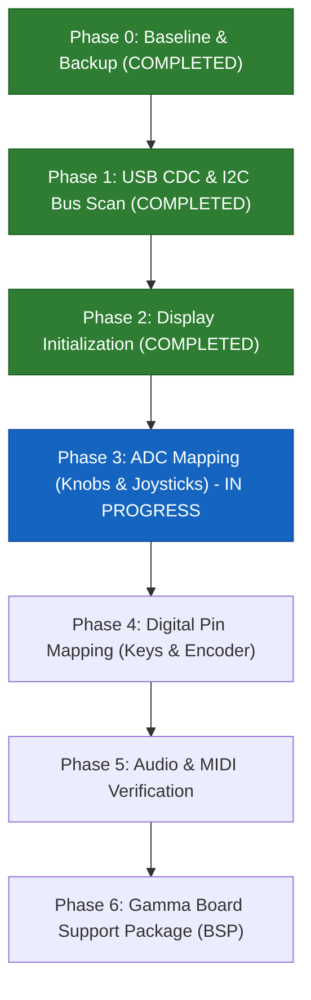

# Gamma Mini Synth Pinout Reverse-Engineering Plan

This document outlines the step-by-step strategy for reverse-engineering the hardware pinout and peripherals of the **this.is.Noise Inc Gamma** synthesizer. The device is powered by an **Electro-Smith Daisy Seed 2 DFM** (ARM Cortex-M7 @ 480 MHz, STM32H750, PCM3060 audio codec).

---

## 1. Required Software & Toolchain Setup

To build, flash, and interact with diagnostic firmware over USB-C, you will need the following tools installed on your host machine (macOS):

### A. ARM Embedded Toolchain (`arm-none-eabi-*`)
Compiles C/C++ firmware targeting the ARM Cortex-M7 microcontroller.
* **Option 1 (Homebrew - Recommended):**
  ```bash
  brew install --cask gcc-arm-embedded
  ```
* **Option 2 (Official Arm Developer Site):**
  Download the macOS `.pkg` or `.tar.xz` from [Arm GNU Toolchain Downloads](https://developer.arm.com/downloads/-/arm-gnu-toolchain-downloads).
* **Verify:**
  ```bash
  arm-none-eabi-gcc --version
  ```

### B. DFU Utility (`dfu-util`)
Sends compiled `.bin` firmware files directly to the Daisy Seed bootloader over the USB-C connection without requiring an external debugger.
* **Installation (Homebrew):**
  ```bash
  brew install dfu-util
  ```
* **Verify:**
  ```bash
  dfu-util --version
  ```

### C. Build Tools (`make` / Xcode Command Line Tools)
Used by `libDaisy` to build projects.
* **Installation:**
  ```bash
  xcode-select --install
  ```
* **Verify:**
  ```bash
  make --version
  ```

### D. Serial Terminal Monitor
Reads real-time diagnostic output transmitted from the Daisy over USB CDC (Virtual COM Port).
* **Terminal tools:**
  - Built-in `screen`:
    ```bash
    screen /dev/cu.usbmodem* 115200
    ```
    *(Exit screen using `Ctrl-A` then `Ctrl-\`)*
  - Alternatively: `minicom` (`brew install minicom`), `tio` (`brew install tio`), or Python `pyserial`:
    ```bash
    python3 -m pip install pyserial
    python3 -m serial.tools.miniterm /dev/cu.usbmodem* 115200
    ```

### E. Electro-Smith Daisy Repositories
The core HAL and DSP libraries for the Daisy Seed 2 DFM:

  - `libDaisy`: [libDaisy/](file:///Users/brett/Documents/GitHub/reverse-engineering-gamma/libDaisy) (Hardware abstraction layer; builds `build/libdaisy.a`)
  - `DaisySP`: [DaisySP/](file:///Users/brett/Documents/GitHub/reverse-engineering-gamma/DaisySP) (DSP synthesis library; builds `build/libdaisysp.a`)

---

## 2. Hardware Inventory & Daisy Seed 2 DFM Target

The Gamma synthesizer exposes the following controls and peripherals to be mapped to the Daisy Seed 2 DFM pins:

| Component | Description | Expected Interface | Estimated Pins |
| :--- | :--- | :--- | :--- |
| **OLED Display** | 1.3" display (SSD1306 controller, 128x64) | **I2C1** (SCL: `D11`/`PB8`, SDA: `D12`/`PB9`) @ **`0x3D`** | 2 (`D11`, `D12`) — **Confirmed** |
| **Potentiometers** | 4 rotary knobs (Chords Vol/Filter, Notes Vol/Filter) | Analog voltage dividers to ADC | 4 ADC channels |
| **Thumbsticks** | 2 analog joysticks (Left X/Y, Right X/Y) | 2 axes each to ADC | 4 ADC channels |
| **Keys** | 14 tactile low-profile switches (7 chord, 7 note) | Digital inputs (active low w/ pull-ups) | 14 GPIO pins (or matrix) |
| **Rotary Encoder** | 1 rotary dial w/ push switch (scale/key selection) | Quadrature A & B + push switch (4-wire harness: GND + 3 GPIOs) | 3 GPIO pins |
| **Audio Output** | 3.5mm stereo headphone jack | On-board PCM3060 codec via SAI | Internal Daisy routing |
| **MIDI Output** | 3.5mm TRS MIDI Out | Hardware UART TX @ 31,250 baud | 1 UART TX pin |
| **USB-C** | Power, flashing (DFU), USB Serial/MIDI | STM32 USB OTG High Speed/Full Speed | Built-in USB D+/D- |

---

## 3. Reverse-Engineering Roadmap



---

### Phase 0: Baseline Verification & Firmware Backup (COMPLETED)
**Goal:** Verify communication over USB-C, understand the bootloader runtime model, and secure a verifiable factory restore path.

1. **Boot into DFU Mode:**
   - Put the Daisy into system bootloader mode (hold `BOOT`, tap `RESET`, release `BOOT`).
   - Query USB DFU status:
     ```bash
     dfu-util -l
     ```
   - **Result (Verified):** The Gamma was successfully detected:
     ```text
     Found DFU: [0483:df11] ver=0200, devnum=1, cfg=1, intf=0, path="1-1", alt=0, name="@Flash /0x90000000/64*4Kg/0x90040000/60*64Kg/0x90400000/60*64Kg", serial="3067366D3433"
     Product: "Daisy Bootloader" (Electrosmith)
     ```

2. **Bootloader Runtime & Memory Architecture Findings:**
   - **Storage vs. Execution:** Programs are stored in external QSPI flash starting at `0x90040000`. However, the Daisy Bootloader on this device is configured to load binaries into **AXI SRAM (`0x24000000`)** before branching to them (`APP_TYPE = BOOT_SRAM`).
   - **Boot Window:** On power-up or hardware reset, the bootloader listens for DFU for ~2 to 2.5 seconds (USER LED pulses). If no connection is made, it jumps to the SRAM application.
   - **Display Persistence:** The 1.3" OLED panel retains its internal display RAM (GDDRAM) as long as 3.3V logic power is present. An unbooted MCU or bootloader halt leaves the previous image (`this.is.NOISE inc`) on screen.
   - **Factory Firmware Recovery:** Acquired official production binaries hosted by the web update tool (`https://gammaupdatetool.netlify.app/`):
     - [`backups/gamma-v2.0.3.bin`](backups/gamma-v2.0.3.bin) (v2.0.3, 360,740 bytes)
     - [`backups/gamma1_1.bin`](backups/gamma1_1.bin) (v1.1, 269,764 bytes)
   - **Vector Table Analysis of Factory Binary:**
     - Initial SP: `0x20020000` (top of DTCMRAM, 128 KB)
     - Reset Handler: `0x240047ED` (AXI SRAM at `0x24000000`)
     - Confirms `APP_TYPE = BOOT_SRAM` is mandatory.
     - Strings analysis shows the factory firmware is developed in embedded **Rust** (`src/display/`, `src/midi/`, `src/looper/`).
   - **Bootloader Modes & DFU Entry Points:**
     - **Hardware ROM Bootloader (Hold BOOT + Tap RESET):** Pulls the MCU's `BOOT0` pin HIGH and boots into STMicroelectronics' factory system ROM. Bypasses the Daisy Bootloader entirely; does not initialize the Seed 2 DFM High-Speed USB PHY (USER LED stays OFF, host cannot communicate). **Do not use this mode for flashing.**
     - **Daisy Bootloader Grace Period (Tap RESET alone or Power-Cycle):** Microcontroller boots into internal flash (`0x08000000`), pulses/breathes USER LED, and listens for DFU on USB-C for ~2.5 seconds before jumping to the application at `0x90040000`. This is the primary interactive flashing workflow.
     - **Daisy Bootloader Infinite Timeout (Gamma Menu `System -> Info -> Enter Boot`):** Sets `DAISY_INFINITE_TIMEOUT` in Backup SRAM (`0x38800000`) and soft-resets into the Daisy Bootloader, holding DFU mode indefinitely without timing out.
   - **Clock Initialization Traps:**
     - The Daisy Bootloader initializes the system PLL to 480 MHz before jumping to SRAM. In `daisy_seed.cpp`, `syscfg.skip_clocks` must remain `true` for SRAM builds. Re-configuring the active PLL in application code traps in `Error_Handler()` and freezes SysTick.
   - **USB CDC Enumeration & VBUS Sensing Discovery:**
     - Disassembly of official production firmware (`gamma-v2.0.3.bin` at `0x24029c78`) revealed that `hpcd_USB_OTG_FS.Init.vbus_sensing_enable` is set to **`DISABLE` (`0`)**.
     - Upstream `libDaisy` defaults `vbus_sensing_enable` to `ENABLE` (`1`), requiring 5V on pin `PA9` to activate the internal D+ pullup resistor. Because Gamma does not route 5V VBUS to `PA9`, STM32 detects "cable disconnected" and never pulls up D+.
     - Patched [`libDaisy/src/usbd/usbd_conf.c`](libDaisy/src/usbd/usbd_conf.c) to set `vbus_sensing_enable = DISABLE`.
     - When launching from the bootloader, `syscfg.skip_clocks` is set, which leaves `HSI48` and `RCC_USBCLKSOURCE_HSI48` uninitialized unless explicitly enabled in application code.
   - **I2C Bus Recovery:**
     - Explicit bus reset (`__HAL_RCC_I2C1_FORCE_RESET()` / `RELEASE_RESET()`) and clean GPIO alternate function pin muxing (`GPIO_AF4_I2C1`) with pullups ensures reliable OLED communication without hanging on bus transitions.

---

### Dual-Track Strategy: Static Analysis & Dynamic Hardware Probing

Having official production firmware (`gamma-v2.0.3.bin`) enabled static reverse-engineering alongside dynamic probing:

1. **Static Analysis Results (Verified from Disassembly):**
   - **Display Hardware Peripheral:** Disassembly of the hardware initialization routine (`0x24007f1c` - `0x24007f3e` and `0x240077b0`) revealed the exact configuration passed to `I2CHandle::Init`:
     - **Peripheral:** `I2C1` (`0x40005400`)
     - **SCL Pin:** `seed::D11` (`PB8`, GPIO Port B pin 8)
     - **SDA Pin:** `seed::D12` (`PB9`, GPIO Port B pin 9)
     - **Bus Speed:** `I2C_1MHZ` (Fast Mode Plus)
     - **I2C Device Address:** **`0x3D`** (`movs r3, #61` at `0x24007f2a`)
     - **Display Controller:** **SSD1306** (128x64). The display command sequence at `0x240077ca` matches standard SSD1306 init: `0xAE` (Display Off), `0xD5, 0x80` (Clock Div), `0xA8, 0x3F` (Multiplex 64), `0xDA, 0x12` (COM pins), `0x8D, 0x14` (Charge Pump).
   - **Daisy Hal Integration:** The firmware statically links libDaisy peripheral abstractions (`I2CHandle::Impl::Init` at `0x240270bc`).

2. **Dynamic Probing & On-Screen UI (Diagnostic Builds):**
   - Flash targeted C++ diagnostic builds using `libDaisy` to interactively verify pin behaviors, readout analog voltages, and drive the OLED display.

---

### Phase 1: USB CDC Diagnostic Console & I2C Bus Scanning (COMPLETED)
**Goal:** Establish serial communication over USB-C, probe for peripherals, and render live diagnostics on the 1.3" OLED display.

1. **Diagnostic Firmware Setup:**
   - Source: [`firmware/phase1_i2c_scan/main.cpp`](firmware/phase1_i2c_scan/main.cpp)
   - Compiled with **`APP_TYPE = BOOT_SRAM`** (vectors at `0x24000000`, validated entry point `0x24000795`).
   - Integrated HSI48 oscillator activation and routing for USB clock domain.
   - Non-blocking USB CDC virtual COM port logging with receive commands (`'s'` scan, `'b'` DFU bootloader, `'h'` help).
   - Integrated SSD1306 128x64 OLED display driver (`I2C1`, `D11`/`D12` @ `0x3D`) to render scan results and live uptime directly on the device.
   - LED heartbeat at 2 Hz (250ms toggle).

2. **Automated Flashing Workflow:**
   - Runbook: [`.agents/skills/gamma-firmware-flash/SKILL.md`](.agents/skills/gamma-firmware-flash/SKILL.md)
   - Script: `python3 .agents/skills/gamma-firmware-flash/scripts/flash_firmware.py`
   - Automatically polls for DFU every 100ms, validates SRAM vector layout, and flashes to `0x90040000:leave`.

3. **I2C Scanner Implementation & HAL Hardware Fix:**
   - Multi-candidate hardware bus scanner:
     - **Bus 1 (Hardware Verified):** `I2C1` on `D11` (`PB8` / SCL) & `D12` (`PB9` / SDA)
     - **Bus 2:** `I2C1` on `D13` (`PB6` / SCL) & `D14` (`PB7` / SDA)
     - **Bus 3:** `I2C4` on `D11` (`PB8` / SCL) & `D12` (`PB9` / SDA)
     - **Bus 4:** `I2C4` on `D13` (`PB6` / SCL) & `D14` (`PB7` / SDA)
   - **STM32 HAL Pin-Muxing Fix:** Explicitly re-initializes and de-initializes GPIO alternate function pin muxing between candidate sweeps.
   - **Target Detection & On-Screen Output:** Live results displayed on both USB CDC serial and on the OLED dashboard.

4. **Hardware Verification Results:**
   - Successfully flashed custom `BOOT_SRAM` firmware over USB DFU via the Daisy Bootloader.
   - Live hardware execution confirmed on device:
     - Scanned all candidate I2C peripherals and discovered the display responding at **`0x3D`**.
     - Initialized the SSD1306 OLED display driver over `I2C1` (`seed::D11` / `seed::D12`).
     - Real-time diagnostic UI actively running and rendering on the Gamma's physical display with ticking uptime counter.

---

### Phase 2: OLED Display Initialization & Local UI (COMPLETED)
**Goal:** Drive the display directly to show live diagnostics on the device.

1. **Hardware Verification Results:**
   - **Controller:** SSD1306 (128x64 monochrome).
   - **Interface:** `I2C1` via `seed::D11` (PB8 / SCL) & `seed::D12` (PB9 / SDA) at 7-bit address **`0x3D`**.
   - **Status:** **Fully verified on hardware**. Live graphics buffer rendering text and status frames reliably.
2. **On-Screen Dashboard:**
   - Rendered diagnostic screen showing:
     - Header: `GAMMA I2C SCANNER`
     - Bus: `I2C1 (D11/D12)`
     - Discovered Devices: `0x3D`
     - Status: `OLED @ 0x3D: Active`
     - Live counter: `Uptime: Xs` updating continuously.

---

### Phase 3: Analog Pin Mapping (Potentiometers & Joysticks) - IN PROGRESS
**Goal:** Map 4 knobs and 2 joysticks (4 axes) across Daisy's ADC-capable pins using live on-screen visual bargraphs and USB serial.

1. **Hardware Architecture & ADC Pin Candidates:**
   - Electro-Smith Daisy Seed 2 DFM exposes 12 ADC channels on pins `A0`–`A11` (`D15`–`D28`), plus additional internal channels.
   - The Gamma features:
     - **4 Rotary Potentiometers:** Chord Volume, Chord Filter, Notes Volume, Notes Filter.
     - **2 Dual-Axis Thumbsticks:** Left Stick (X, Y) and Right Stick (X, Y).
     - Total: Exactly 8 analog ADC channels required.

2. **OLED Visual Calibration Dashboard:**
   - Leverage the operational 128x64 OLED display to render a real-time analog diagnostic interface:
     - Top status bar: Active ADC channel count and frame rate.
     - Split display layout:
       - **Left column:** Channels 0–3 with 32-pixel horizontal bargraphs and hex/percent readouts.
       - **Right column:** Channels 4–7 with 32-pixel horizontal bargraphs and hex/percent readouts.
       - Page toggle or secondary screen for remaining ADC channels (8–11).
     - Auto-highlighting indicator: Flags the channel with the largest delta in the last 500ms, making identification instantaneous without checking serial terminal.

3. **Interactive Identification Protocol:**
   - **Knobs (Single Turn Sweep):**
     1. Turn Knob 1 (Chord Vol) $\rightarrow$ Note highlighted ADC channel sweeping `0%` to `100%`.
     2. Turn Knob 2 (Chord Filter) $\rightarrow$ Note highlighted ADC channel.
     3. Turn Knob 3 (Notes Vol) $\rightarrow$ Note highlighted ADC channel.
     4. Turn Knob 4 (Notes Filter) $\rightarrow$ Note highlighted ADC channel.
   - **Thumbsticks (Spring-Centered):**
     1. Deflect Left Stick Left/Right (X axis) $\rightarrow$ Note channel centered at ~50% moving 0%–100%.
     2. Deflect Left Stick Up/Down (Y axis) $\rightarrow$ Note channel centered at ~50%.
     3. Deflect Right Stick Left/Right (X axis) $\rightarrow$ Note channel centered at ~50%.
     4. Deflect Right Stick Up/Down (Y axis) $\rightarrow$ Note channel centered at ~50%.
   - **Calibration Data:**
     - Record minimum value, center deadband, maximum value, and ADC noise floor / jitter for each channel.

---

### Phase 4: Digital Pin Mapping (14 Keys & Rotary Encoder)
**Goal:** Identify GPIO pins for the 14 keys and the rotary encoder using an on-screen interactive key grid.

1. **Hardware Overview:**
   - 14 low-profile mechanical keyboard switches: 7 chord keys (left side) and 7 note keys (right side).
   - 1 rotary encoder with integrated push switch (4-wire harness: GND + Phase A, Phase B, Switch).
   - Digital inputs configured with internal pull-up resistors (`INPUT_PULLUP`, active low).

2. **OLED Interactive Grid UI:**
   - Render a physical layout map on the 128x64 display:
     - Left box: 7 Chord Key indicators (`C1`–`C7`) that invert when pressed.
     - Right box: 7 Note Key indicators (`N1`–`N7`) that invert when pressed.
     - Bottom row: Encoder rotation counter (`CW`/`CCW`) and Push Switch (`ENC_SW`) indicator.
     - Active Pin Readout: Live banner showing the exact Daisy pin number (`D0`–`D30`) of the most recently triggered input.

3. **Interactive Key Probing Protocol:**
   - Press Chord keys 1 through 7 sequentially $\rightarrow$ Record corresponding GPIO pins.
   - Press Note keys 1 through 7 sequentially $\rightarrow$ Record corresponding GPIO pins.
   - Check thumbsticks for integrated push-button switches (press down on both sticks) $\rightarrow$ Record pins if present.
   - Rotate encoder clockwise/counter-clockwise $\rightarrow$ Identify Phase A and Phase B pins and quadrature sequence.
   - Press encoder dial $\rightarrow$ Identify encoder push-switch pin.

---

### Phase 5: Audio & MIDI Verification
**Goal:** Validate audio generation and external MIDI communication.

1. **Stereo Audio Output:**
   - Initialize Daisy Seed 2 DFM's PCM3060 codec via SAI.
   - Generate a stereo 440 Hz test tone to verify output via the 3.5mm headphone jack.
2. **MIDI TRS Output:**
   - Test potential UART TX pins (e.g. `D14` / `USART1_TX`, `D29` / `USART3_TX`).
   - Transmit continuous MIDI Note On / Note Off messages at 31,250 baud to verify the 3.5mm MIDI Out jack.

---

### Phase 6: Board Support Package (BSP) Synthesis
**Goal:** Bundle all findings into a clean, reusable C++ library for developing custom firmware.

* **`gamma_pins.h`**: Comprehensive pin mapping enum and constant definitions.
* **`gamma_hw.h` / `gamma_hw.cpp`**: Hardware abstraction class:
  - `Gamma::Init()`
  - `Gamma::ProcessInputs()`
  - High-level accessors: `gamma.knob[i]`, `gamma.joystick_left.x`, `gamma.keys[i].Pressed()`, `gamma.encoder.Read()`.
* **Example project**: Simple polyphonic synthesizer demonstrating full hardware utilization.
