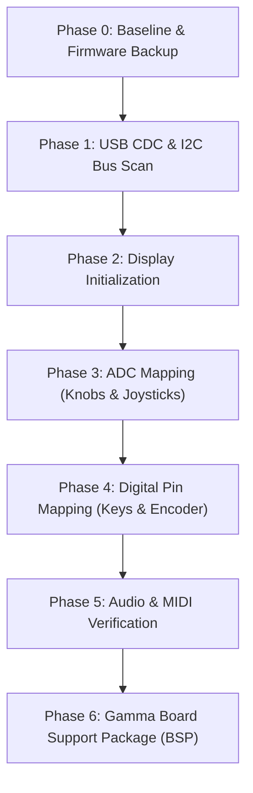

# Gamma Mini Synth Pinout Reverse-Engineering Plan

This document outlines the step-by-step strategy for reverse-engineering the hardware pinout and peripherals of the **this.is.Noise Inc Gamma** synthesizer. The device is powered by an **Electro-Smith Daisy Seed 2 DFM** (ARM Cortex-M7 @ 480 MHz, STM32H750, PCM3060 audio codec).

---

## 1. Required Software & Toolchain Setup

To build, flash, and interact with diagnostic firmware over USB-C, you will need the following tools installed on your host machine (macOS):

### A. ARM Embedded Toolchain (`arm-none-eabi-*`)
Compiles C/C++ firmware targeting the ARM Cortex-M7 microcontroller.
* **Option 1 (Homebrew - Recommended):**
  ```bash
  brew install --cask gcc-arm-embedded
  ```
* **Option 2 (Official Arm Developer Site):**
  Download the macOS `.pkg` or `.tar.xz` from [Arm GNU Toolchain Downloads](https://developer.arm.com/downloads/-/arm-gnu-toolchain-downloads).
* **Verify:**
  ```bash
  arm-none-eabi-gcc --version
  ```

### B. DFU Utility (`dfu-util`)
Sends compiled `.bin` firmware files directly to the Daisy Seed bootloader over the USB-C connection without requiring an external debugger.
* **Installation (Homebrew):**
  ```bash
  brew install dfu-util
  ```
* **Verify:**
  ```bash
  dfu-util --version
  ```

### C. Build Tools (`make` / Xcode Command Line Tools)
Used by `libDaisy` to build projects.
* **Installation:**
  ```bash
  xcode-select --install
  ```
* **Verify:**
  ```bash
  make --version
  ```

### D. Serial Terminal Monitor
Reads real-time diagnostic output transmitted from the Daisy over USB CDC (Virtual COM Port).
* **Terminal tools:**
  - Built-in `screen`:
    ```bash
    screen /dev/cu.usbmodem* 115200
    ```
    *(Exit screen using `Ctrl-A` then `Ctrl-\`)*
  - Alternatively: `minicom` (`brew install minicom`), `tio` (`brew install tio`), or Python `pyserial`:
    ```bash
    python3 -m pip install pyserial
    python3 -m serial.tools.miniterm /dev/cu.usbmodem* 115200
    ```

### E. Electro-Smith Daisy Repositories
The core HAL and DSP libraries for the Daisy Seed 2 DFM:

  - `libDaisy`: [libDaisy/](file:///Users/brett/Documents/GitHub/reverse-engineering-gamma/libDaisy) (Hardware abstraction layer; builds `build/libdaisy.a`)
  - `DaisySP`: [DaisySP/](file:///Users/brett/Documents/GitHub/reverse-engineering-gamma/DaisySP) (DSP synthesis library; builds `build/libdaisysp.a`)

---

## 2. Hardware Inventory & Daisy Seed 2 DFM Target

The Gamma synthesizer exposes the following controls and peripherals to be mapped to the Daisy Seed 2 DFM pins:

| Component | Description | Expected Interface | Estimated Pins |
| :--- | :--- | :--- | :--- |
| **OLED Display** | 1.3" display (SSD1306 or SH1106 controller) | I2C (SCL/SDA) or SPI | 2 (I2C) or 4-5 (SPI) |
| **Potentiometers** | 4 rotary knobs (Chords Vol/Filter, Notes Vol/Filter) | Analog voltage dividers to ADC | 4 ADC channels |
| **Thumbsticks** | 2 analog joysticks (Left X/Y, Right X/Y) | 2 axes each to ADC | 4 ADC channels |
| **Keys** | 14 tactile low-profile switches (7 chord, 7 note) | Digital inputs (active low w/ pull-ups) | 14 GPIO pins (or matrix) |
| **Rotary Encoder** | 1 rotary dial w/ push switch (scale/key selection) | Quadrature A & B + push switch (4-wire harness: GND + 3 GPIOs) | 3 GPIO pins |
| **Audio Output** | 3.5mm stereo headphone jack | On-board PCM3060 codec via SAI | Internal Daisy routing |
| **MIDI Output** | 3.5mm TRS MIDI Out | Hardware UART TX @ 31,250 baud | 1 UART TX pin |
| **USB-C** | Power, flashing (DFU), USB Serial/MIDI | STM32 USB OTG High Speed/Full Speed | Built-in USB D+/D- |

---

## 3. Reverse-Engineering Roadmap



---

### Phase 0: Baseline Verification & Firmware Backup
**Goal:** Verify communication over USB-C, understand the bootloader runtime model, and secure a verifiable factory restore path.

1. **Boot into DFU Mode:**
   - Put the Daisy into system bootloader mode (hold `BOOT`, tap `RESET`, release `BOOT`).
   - Query USB DFU status:
     ```bash
     dfu-util -l
     ```
   - **Result (Verified):** The Gamma was successfully detected:
     ```text
     Found DFU: [0483:df11] ver=0200, devnum=1, cfg=1, intf=0, path="1-1", alt=0, name="@Flash /0x90000000/64*4Kg/0x90040000/60*64Kg/0x90400000/60*64Kg", serial="3067366D3433"
     Product: "Daisy Bootloader" (Electrosmith)
     ```

2. **Bootloader Runtime & Memory Architecture Findings:**
   - **Storage vs. Execution:** Programs are stored in external QSPI flash starting at `0x90040000`. However, the Daisy Bootloader on this device is configured to load binaries into **AXI SRAM (`0x24000000`)** before branching to them (`APP_TYPE = BOOT_SRAM`).
   - **Boot Window:** On power-up or hardware reset, the bootloader listens for DFU for ~2 to 2.5 seconds (USER LED pulses). If no connection is made, it jumps to the SRAM application.
   - **Display Persistence:** The 1.3" OLED panel retains its internal display RAM (GDDRAM) as long as 3.3V logic power is present. An unbooted MCU or bootloader halt leaves the previous image (`this.is.NOISE inc`) on screen.
   - **Factory Firmware Recovery:** Acquired official production binaries hosted by the web update tool (`https://gammaupdatetool.netlify.app/`):
     - [`backups/gamma-v2.0.3.bin`](backups/gamma-v2.0.3.bin) (v2.0.3, 360,740 bytes)
     - [`backups/gamma1_1.bin`](backups/gamma1_1.bin) (v1.1, 269,764 bytes)
   - **Vector Table Analysis of Factory Binary:**
     - Initial SP: `0x20020000` (top of DTCMRAM, 128 KB)
     - Reset Handler: `0x240047ED` (AXI SRAM at `0x24000000`)
     - Confirms `APP_TYPE = BOOT_SRAM` is mandatory.
     - Strings analysis shows the factory firmware is developed in embedded **Rust** (`src/display/`, `src/midi/`, `src/looper/`).
   - **Automated Restore Skill:** Tested and verified unbricking over DFU:
     - Runbook: [`.agents/skills/gamma-firmware-restore/SKILL.md`](.agents/skills/gamma-firmware-restore/SKILL.md)
     - Script: `.agents/skills/gamma-firmware-restore/scripts/restore_firmware.py`
     - Confirmed post-reboot enumeration: Product `Gamma`, Vendor `Electrosmith` (`0x0483:0x5740`).

---

### Dual-Track Strategy: Static Analysis & Dynamic Hardware Probing

Having the official `gamma-v2.0.3.bin` unlocks a powerful dual-track workflow:
1. **Static Analysis (Firmware Disassembly):** Inspect register writes and peripheral initializations directly in the binary (using `arm-none-eabi-objdump` / Ghidra) to identify:
   - GPIO port clocks enabled via `RCC->AHB4ENR`
   - Pin alternate function mappings (`AFR`) and mode registers (`MODER`)
   - Active I2C controller (`I2C1` vs `I2C4`) and pin assignments (PB6/PB7 vs PB8/PB9)
   - ADC channels assigned to potentiometers and joysticks
2. **Dynamic Probing (Diagnostic Builds):** Flash targeted C++ diagnostic builds using `libDaisy` to interactively verify pin behaviors, readout analog voltages, and drive the OLED display.

---

### Phase 1: USB CDC Diagnostic Console & I2C Bus Scanning
**Goal:** Establish serial communication over USB-C and probe for the 1.3" OLED display.

1. **Diagnostic Firmware Setup:**
   - Source: [`firmware/phase1_i2c_scan/main.cpp`](firmware/phase1_i2c_scan/main.cpp)
   - Must be compiled with **`APP_TYPE = BOOT_SRAM`** (generates vectors at `0x24000000`).
   - Initialize Daisy Seed 2 DFM core.
   - Start USB CDC (virtual serial port) so that `printf` logs over USB-C.
   - LED heartbeat and interactive serial commands (`'s'` for manual I2C scan, `'b'` for reboot into DFU bootloader).

2. **Automated Flashing Workflow:**
   - To bypass the 2-second bootloader timeout race, flashing is handled via the workspace skill:
     - Runbook: [`.agents/skills/gamma-firmware-flash/SKILL.md`](.agents/skills/gamma-firmware-flash/SKILL.md)
     - Script: `python3 .agents/skills/gamma-firmware-flash/scripts/flash_firmware.py`
   - Automatically checks that Reset Handler is within `0x24000000` (`BOOT_SRAM`), polls for DFU every 100ms, and flashes to `0x90040000:leave` on reset.

3. **I2C Bus Probing Implementation:**
   - Multi-candidate hardware bus scanner implemented covering:
     - **Bus 1:** `I2C1` on `D11` (`PB8` / SCL) & `D12` (`PB9` / SDA)
     - **Bus 2:** `I2C1` on `D13` (`PB6` / SCL) & `D14` (`PB7` / SDA)
     - **Bus 3:** `I2C4` on `D11` (`PB8` / SCL) & `D12` (`PB9` / SDA)
     - **Bus 4:** `I2C4` on `D13` (`PB6` / SCL) & `D14` (`PB7` / SDA)
   - Sweeps addresses `0x08` through `0x77` in a 16x8 matrix.
   - OLED target detection: alerts on standard addresses `0x3C` and `0x3D`.

4. **Current Status:**
   - `phase1_i2c_scan.bin` compiled and validated for `BOOT_SRAM` (`SP: 0x20020000, Reset: 0x2400041D`).
   - Unit is restored to factory `v2.0.3` and ready for diagnostic flashing.

---

### Phase 2: OLED Display Initialization & Local UI
**Goal:** Drive the display directly to display feedback on the device.

1. **Display Driver Integration:**
   - Use standard SSD1306 / SH1106 128x64 monochrome driver over the identified bus and address.
2. **On-Screen Dashboard:**
   - Render a diagnostic screen showing:
     - Device uptime.
     - Live values for analog channels and digital pin state changes.

---

### Phase 3: Analog Pin Mapping (Potentiometers & Joysticks)
**Goal:** Map 4 knobs and 2 joysticks (4 axes) across Daisy's 14 ADC-capable pins.

1. **Diagnostic Firmware Setup:**
   - Configure all available ADC channels (`A0` through `A11` / pins `D15` through `D28`) with DMA continuous reading and 12/16-bit resolution.
   - Stream raw and normalized values to USB Serial and OLED.
2. **Interactive Mapping Process:**
   - **Knobs:**
     - Turn Knob 1 (Chord Vol) $\rightarrow$ Note which ADC pin sweeps 0.0 to 1.0.
     - Turn Knob 2 (Chord Filter) $\rightarrow$ Identify pin.
     - Turn Knob 3 (Notes Vol) $\rightarrow$ Identify pin.
     - Turn Knob 4 (Notes Filter) $\rightarrow$ Identify pin.
   - **Thumbsticks:**
     - Deflect Left Stick (X axis) $\rightarrow$ Identify pin and rest position (~0.5).
     - Deflect Left Stick (Y axis) $\rightarrow$ Identify pin and rest position.
     - Deflect Right Stick (X axis) $\rightarrow$ Identify pin and rest position.
     - Deflect Right Stick (Y axis) $\rightarrow$ Identify pin and rest position.
3. **Data Recording:**
   - Record exact min/max/center values, jitter, and deadband limits.

---

### Phase 4: Digital Pin Mapping (14 Keys & Rotary Encoder)
**Goal:** Identify GPIO pins for the 14 keys and the rotary encoder.

1. **Diagnostic Firmware Setup:**
   - Set all remaining unallocated GPIO pins as inputs with internal pull-up resistors (`INPUT_PULLUP`).
   - Log any pin transition (`HIGH` $\rightarrow$ `LOW` falling edge) over USB Serial.
2. **Interactive Key Probing:**
   - Press the 7 chord keys (left side) one by one $\rightarrow$ Record matching GPIO pins.
   - Press the 7 note keys (right side) one by one $\rightarrow$ Record matching GPIO pins.
   - Check if thumbsticks have integrated push buttons $\rightarrow$ Record pins if present.
3. **Rotary Encoder Mapping:**
   - **Physical Wiring:** Confirmed 4-wire harness connecting the encoder assembly to the main PCB: 1 shared Ground (GND) + 3 dedicated signal lines (Phase A, Phase B, and Push Switch).
   - **Digital Interface:** Active-low digital inputs using Daisy internal pull-ups (`INPUT_PULLUP`).
   - Turn the encoder slowly clockwise $\rightarrow$ Identify the two quadrature pins (Phase A and Phase B).
   - Press the encoder knob $\rightarrow$ Identify the push switch GPIO pin.

---

### Phase 5: Audio & MIDI Verification
**Goal:** Validate audio generation and external MIDI communication.

1. **Stereo Audio Output:**
   - Initialize Daisy Seed 2 DFM's PCM3060 codec via SAI.
   - Generate a stereo 440 Hz test tone to verify output via the 3.5mm headphone jack.
2. **MIDI TRS Output:**
   - Test potential UART TX pins (e.g. `D14` / `USART1_TX`, `D29` / `USART3_TX`).
   - Transmit continuous MIDI Note On / Note Off messages at 31,250 baud to verify the 3.5mm MIDI Out jack.

---

### Phase 6: Board Support Package (BSP) Synthesis
**Goal:** Bundle all findings into a clean, reusable C++ library for developing custom firmware.

* **`gamma_pins.h`**: Comprehensive pin mapping enum and constant definitions.
* **`gamma_hw.h` / `gamma_hw.cpp`**: Hardware abstraction class:
  - `Gamma::Init()`
  - `Gamma::ProcessInputs()`
  - High-level accessors: `gamma.knob[i]`, `gamma.joystick_left.x`, `gamma.keys[i].Pressed()`, `gamma.encoder.Read()`.
* **Example project**: Simple polyphonic synthesizer demonstrating full hardware utilization.
