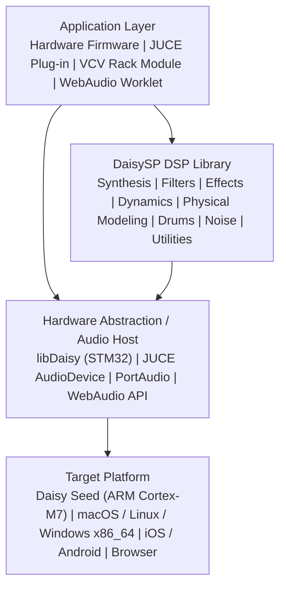
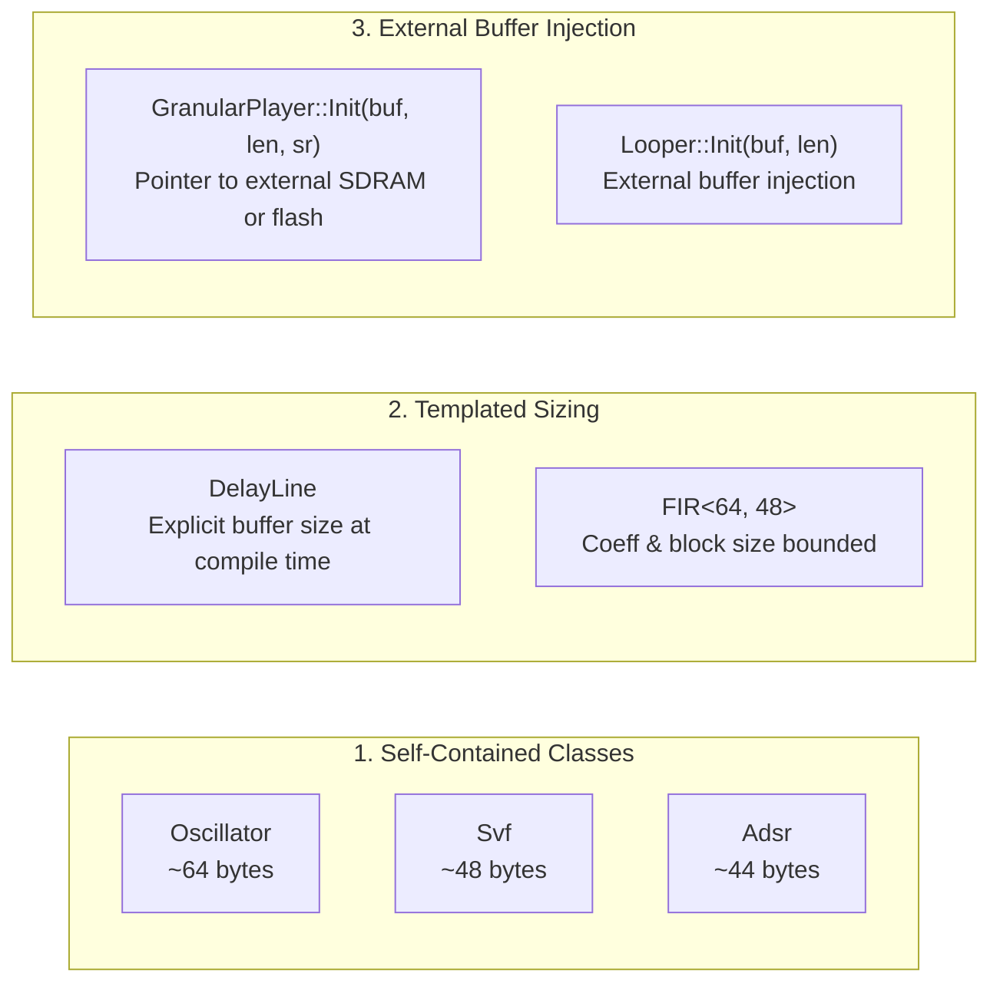
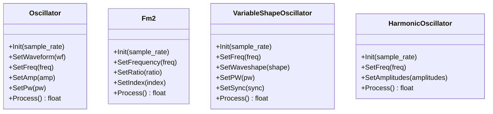
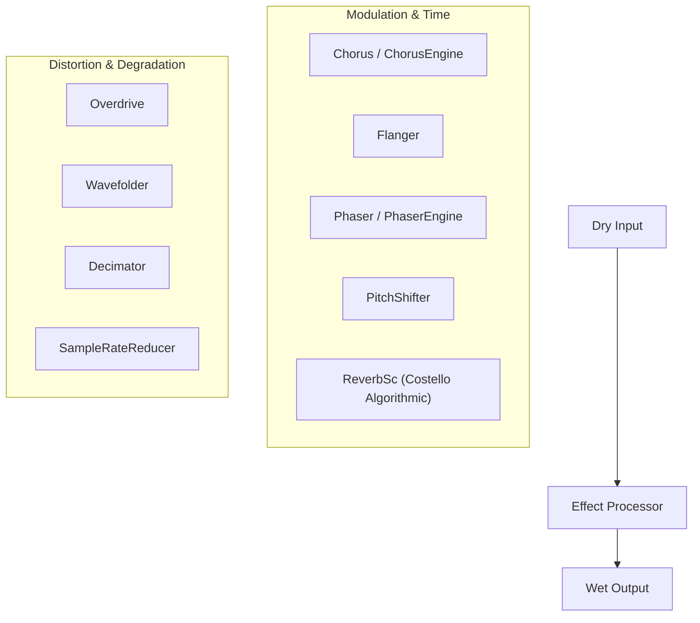
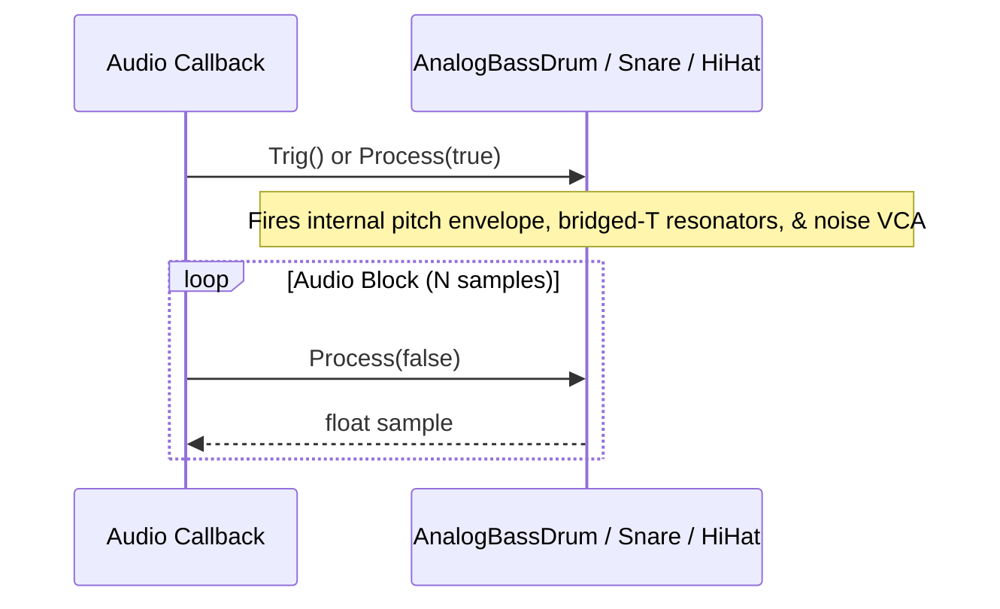
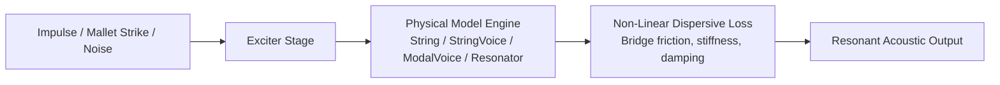
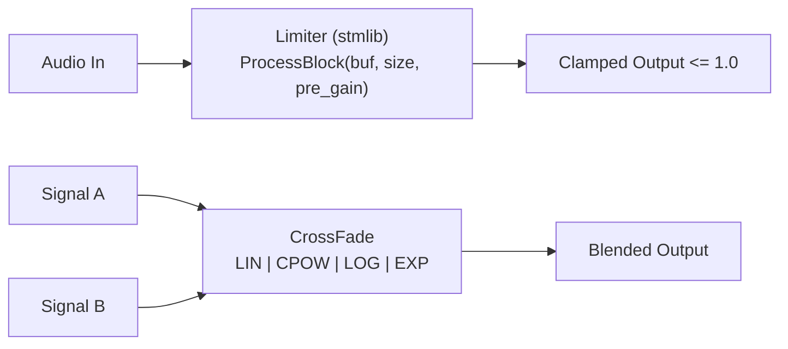
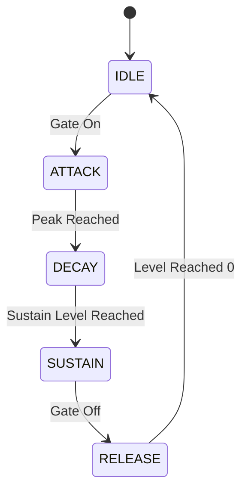

# Comprehensive Guide to DaisySP: Architecture, DSP Modules, and Implementation Reference

> **Target Audience:** Prospective audio developers, firmware engineers, embedded DSP designers, synthesizer builders, and plug-in creators exploring or adopting `DaisySP` for real-time sound synthesis, processing, and musical instrument development.

---

## 1. Executive Summary & Design Philosophy

**`DaisySP`** is an open-source, highly optimized Digital Signal Processing (DSP) library written in modern C++ by **Electro-Smith** and the open-source audio community. While originally engineered as the DSP companion to the **Electro-Smith Daisy embedded audio platform**, DaisySP is intentionally hardware-agnostic and decoupled from silicon drivers. It runs with zero modifications across ARM Cortex-M microcontrollers, desktop operating systems (macOS, Linux, Windows), audio plug-in frameworks (JUCE, VST3, AU, CLAP), modular environments (VCV Rack), mobile apps (iOS, Android), and WebAssembly audio worklets.

DaisySP provides building blocks spanning subtractive, physical modeling, FM, and granular synthesis, alongside studio-grade filters, dynamics processors, modulation sources, noise generators, and time-domain effects.



### 1.1 Core Architectural Tenets

DaisySP adheres to rigorous real-time audio engineering constraints:

1. **Zero Dynamic Allocation (Strictly Static Memory):**
   DaisySP modules **never** invoke `malloc`, `calloc`, `realloc`, `free`, or the C++ operators `new` and `delete` inside runtime processing loops. Memory is either statically reserved within the class instance, passed as a compile-time template parameter (e.g., `DelayLine<float, 48000>`), or injected by pointer at initialization (e.g., `GranularPlayer::Init(buffer, size, sr)`). This guarantees deterministic execution, zero heap fragmentation, and immunity from allocation failures in real-time interrupt contexts.
2. **Single-Sample Processing Standard:**
   Unless explicitly designed for block operations (such as `Limiter::ProcessBlock` or CMSIS-accelerated `FIRFilterImplARM`), all DaisySP modules evaluate audio via a sample-by-sample method:
   ```cpp
   float output = module.Process(input);
   // or
   float output = module.Process();
   ```
   This model allows maximum flexibility for arbitrary feedback loops, sample-accurate frequency modulation, cross-modulation, and dynamic control graphs without requiring fixed block-size scheduling.
3. **Normalized 32-Bit Floating Point Standard:**
   All signal pathways, audio samples, and control voltages use standard IEEE 754 32-bit floating point (`float`). Audio signals are normalized nominally to the range **$[-1.0\text{f}, +1.0\text{f}]$** (corresponding to 0 dBFS), while control signals, envelopes, and modulation depths typically occupy normalized ranges of $[0.0\text{f}, 1.0\text{f}]$ or $[-1.0\text{f}, +1.0\text{f}]$.
4. **Hardware Decoupling:**
   DaisySP has **zero dependencies on peripheral hardware registers, CMSIS register headers, or `libDaisy`**. It relies solely on the C standard library math functions (`<cmath>`, `<cstdint>`, `<cstdlib>`) and optional ARM Cortex-M DSP intrinsics (when compiled with `-DUSE_ARM_DSP`).
5. **Universal Lifecycle Contract:**
   Every class implements a standardized lifecycle:
   * **Instantiation:** Zero-argument default constructor (safe for global/static BSS initialization).
   * **Initialization:** An `.Init(float sample_rate, ...)` method that configures sample-rate-dependent coefficients, clears delay lines, and sets musical defaults.
   * **Processing:** A `.Process(...)` method invoked inside the audio sample loop.

---

## 2. Dual-License Model & Directory Taxonomy

DaisySP is partitioned into two distinct repositories to maintain a permissive **MIT** core while incorporating sophisticated DSP algorithms originally derived from **LGPL** projects (such as Csound, Soundpipe, and Faust).

```
DaisySP/
├── Source/                     # MIT-Licensed Core Modules
│   ├── daisysp.h               # Master include header for all MIT modules
│   ├── Control/                # Envelopes, ramps, phasors
│   ├── Drums/                  # Analog and synthetic percussion models
│   ├── Dynamics/               # Peak limiter, crossfader
│   ├── Effects/                # Chorus, flanger, phaser, pitch shifter, etc.
│   ├── Filters/                # Ladder, SVF, one-pole, FIR, SOAP
│   ├── Noise/                  # White, clocked, dust, fractal, grainlet
│   ├── PhysicalModeling/       # Karplus-Strong string, modal voice, drip
│   ├── Sampling/               # Granular player engine
│   ├── Synthesis/              # Standard & morphing oscillators, FM, VOSIM
│   └── Utility/                # Delay lines, looper, metronome, dsp.h math
│
├── DaisySP-LGPL/               # LGPL-2.1 Licensed Submodule (Optional)
│   ├── Source/
│   │   ├── daisysp-lgpl.h      # Master include header for LGPL modules
│   │   ├── Control/            # Line (linear slewer)
│   │   ├── Dynamics/           # Balance, Compressor
│   │   ├── Effects/            # ReverbSc (Costello reverb), Bitcrush, Fold
│   │   ├── Filters/            # MoogLadder, Biquad, Tone, ATone, Allpass, Comb, Mode, NlFilt
│   │   ├── PhysicalModeling/   # Pluck, PolyPluck
│   │   ├── Synthesis/          # BlOsc (band-limited oscillator)
│   │   └── Utility/            # Port (portamento), Jitter
│   └── distribution/           # Relinking scripts for LGPL compliance
│
├── tests/                      # Unit testing and benchmark harnesses
└── Makefile / CMakeLists.txt   # Dual build systems
```

### 2.1 The Two License Tiers

| Attribute | `DaisySP` (Core) | `DaisySP-LGPL` (Submodule) |
| :--- | :--- | :--- |
| **License** | **MIT License** | **GNU LGPL v2.1** |
| **Inclusion** | Included by default via `#include "daisysp.h"` | Enabled via `-DUSE_DAISYSP_LGPL` and `#include "daisysp-lgpl.h"` |
| **Algorithm Provenance**| Original Electro-Smith code, Andrew Simper SVF, Émilie Gillet / Mutable Instruments (Plaits, Rings, Stmlib) ports | Csound, Soundpipe (Paul Batchelor), Faust (Julius Smith, GRAME), Sean Costello reverb |
| **Commercial Usage** | Permissive in proprietary closed-source firmware and binaries without special relinking requirements. | Commercial products must comply with LGPL: end users must be able to re-link the application with a modified `libdaisysp-lgpl.a`. |
| **Distribution Tool** | Standard compilation (`libdaisysp.a`). | Electro-Smith provides `DaisySP-LGPL/distribution/gather_lgpl.sh` to package relocatable object files for compliance. |

---

## 3. Core Architectural Patterns & API Conventions

### 3.1 Object Lifecycle & Parameter Conventions

All modules follow a deterministic lifecycle:

```cpp
#include "daisysp.h"

// 1. Static instantiation (Zero-allocation, safe in global BSS or DTCM)
static daisysp::Oscillator osc;
static daisysp::Svf        filter;

void SetupAudio(float sample_rate)
{
    // 2. Explicit initialization with audio engine sample rate
    osc.Init(sample_rate);
    osc.SetWaveform(daisysp::Oscillator::WAVE_POLYBLEP_SAW);
    osc.SetFreq(220.0f);
    osc.SetAmp(0.8f);

    filter.Init(sample_rate);
    filter.SetFreq(1200.0f);
    filter.SetRes(0.4f);
}

float ProcessSample()
{
    // 3. Audio computation
    float sig = osc.Process();
    filter.Process(sig);
    return filter.Low();
}
```

### 3.2 Processing Multi-Output Modules

Modules fall into two categories regarding return values:

1. **Direct Return (`float Process(...)`):**
   Single-output processors (`Oscillator`, `LadderFilter`, `Overdrive`, `PitchShifter`, `Adsr`) return the newly evaluated sample directly from `Process()`.
2. **State-Query Pattern (`void Process(float in)`):**
   Multi-output filters like `Svf` (State Variable Filter) and `Soap` (Second Order All-Pass) return `void` from `Process(in)`. The user then extracts the desired filter topology via dedicated getter methods:
   ```cpp
   filter.Process(input);
   float lp = filter.Low();
   float hp = filter.High();
   float bp = filter.Band();
   float notch = filter.Notch();
   float peak = filter.Peak();
   ```

### 3.3 Rate Separation: Audio Rate vs. Control/Block Rate

Calculating modulation signals (envelopes, LFOs, filter coefficient updates) at every single audio sample (e.g. 48,000 times a second) wastes valuable MCU cycles. DaisySP classes like `Adsr` natively support multi-sample block increments:

```cpp
// Adsr allows specifying blockSize in Init:
adsr.Init(sample_rate, 48); // Configured for 48-sample block updates (1 kHz control rate)

// Inside the audio loop:
void AudioCallback(float** in, float** out, size_t size)
{
    // Evaluate envelope ONCE per audio block:
    float env_val = adsr.Process(gate_active);
    filter.SetFreq(base_cutoff + env_val * mod_amount);

    for (size_t i = 0; i < size; i++)
    {
        float sig = osc.Process();
        filter.Process(sig);
        out[0][i] = filter.Low() * env_val;
    }
}
```

### 3.4 Memory Management & Storage Topologies

DaisySP handles memory in three distinct ways depending on the size requirement:



#### Embedded Memory Hazard: DTCM vs. SDRAM
On the STM32H750 (Daisy Seed), internal data RAM is divided into fast **DTCM** (128 KB, zero wait states, **no DMA**) and **AXI SRAM** (512 KB). High-footprint classes **must not** be placed on the stack or in DTCM:
* `ReverbSc`: Allocates an internal array of **98,936 floats** (~395 KB). Instantiating `ReverbSc` as a local stack variable or inside DTCM will immediately overflow memory and hard-fault the CPU. It should be declared in static global memory or mapped to external SDRAM using `DSY_SDRAM_BSS`:
  ```cpp
  // Recommended placement for memory-heavy modules on Daisy Seed:
  static ReverbSc DSY_SDRAM_BSS reverb;
  static DelayLine<float, 48000 * 5> DSY_SDRAM_BSS stereo_delay;
  ```

---

## 4. Comprehensive DSP Module Catalog

### 4.1 Synthesis Modules

DaisySP provides oscillators ranging from PolyBLEP anti-aliased classical waveforms to complex wave-morphing engines and vocal models ported from Mutable Instruments Plaits.



| Module | Header | License | Description & Key Parameters |
| :--- | :--- | :--- | :--- |
| **`Oscillator`** | `Synthesis/oscillator.h` | MIT | Multi-waveform oscillator featuring naive and PolyBLEP bandlimited algorithms. Waveforms: `WAVE_SIN`, `WAVE_TRI`, `WAVE_SAW`, `WAVE_RAMP`, `WAVE_SQUARE`, `WAVE_POLYBLEP_TRI`, `WAVE_POLYBLEP_SAW`, `WAVE_POLYBLEP_SQUARE`. Supports pulse width modulation (`SetPw`) and end-of-cycle triggers (`IsEOR`). |
| **`Fm2`** | `Synthesis/fm2.h` | MIT | Classic 2-operator Phase Modulation / FM synthesis engine. Controls carrier frequency (`SetFrequency`), frequency ratio between operator 1 and 2 (`SetRatio`), and modulation index (`SetIndex`). |
| **`VariableShapeOscillator`** | `Synthesis/variableshapeosc.h` | MIT | Continuously variable morphing oscillator ported from Plaits (`variable_shape_oscillator.h`). Morphs smoothly from triangle/saw/ramp to square with variable wavefolding and hard sync (`SetWaveshape`, `SetPW`, `SetSync`). |
| **`VariableSawOscillator`** | `Synthesis/variablesawosc.h` | MIT | Continuously variable saw oscillator from Plaits. Morphs between variable ramp slopes, triangles, and saws with notch/wavefolding variations. |
| **`FormantOscillator`** | `Synthesis/formantosc.h` | MIT | Dual-formant vocal synthesis engine from Plaits. Simulates vocal tract resonance with independent carrier frequency, formant pitch, and phase alignment. |
| **`HarmonicOscillator`** | `Synthesis/harmonic_osc.h` | MIT | Additive sinusoidal synthesis engine generating up to $N$ harmonic partials with independently controllable amplitude weights (`SetAmplitudes(const float* amplitudes)`). |
| **`OscillatorBank`** | `Synthesis/oscillatorbank.h` | MIT | Bank of parallel detuned oscillators for rich unison, supersaw, and dense swarm chorus textures. |
| **`VosimOscillator`** | `Synthesis/vosim.h` | MIT | Voice Simulation (VOSIM) oscillator. Generates trains of variable sin-squared pulses decaying over a fundamental period, creating vintage digital vocal and organ tones. |
| **`ZOscillator`** | `Synthesis/zoscillator.h` | MIT | Phase-distortion and sync oscillator inspired by Mutable Instruments Braids/Plaits CZ-style synthesis. |
| **`BlOsc`** | `daisysp-lgpl.h` / `blosc.h` | LGPL | Band-limited impulse, saw, and square wave oscillator from Soundpipe and Faust (Julius Smith). |

---

### 4.2 Filter Modules

DaisySP provides filter topologies covering classic analog subtractive synthesis, modern digital state-variable designs, and platform-accelerated FIR filters.

```mermaid
flowchart LR
    In[Audio Input] --> Svf["Svf (Double-Sampled Chamberlin)\nSetFreq() | SetRes() | SetDrive()"]
    Svf --> LP[Low()]
    Svf --> HP[High()]
    Svf --> BP[Band()]
    Svf --> Notch[Notch()]
    Svf --> Peak[Peak()]
```

| Module | Header | License | Description & Key Parameters |
| :--- | :--- | :--- | :--- |
| **`Svf`** | `Filters/svf.h` | MIT | Andrew Simper's double-sampled, unconditionally stable State Variable Filter. Computes simultaneous Lowpass, Highpass, Bandpass, Notch, and Peak responses in a single pass. Cutoff range: $0$ to $f_s/3$. Includes non-linear drive compensation (`SetDrive`). |
| **`LadderFilter`** | `Filters/ladder.h` | MIT | Huovilainen New Moog (HNM) 4-pole ladder filter model with 4x internal oversampling, tanh nonlinear saturation, passband gain compensation (`SetPassbandGain`), and stable self-oscillation. Modes: `LP24`, `LP12`, `BP24`, `BP12`, `HP24`, `HP12`. Supports both single-sample (`Process`) and block (`ProcessBlock`) execution. |
| **`OnePole`** | `Filters/onepole.h` | MIT | Ultra-efficient 6 dB/octave first-order filter. Supports lowpass and highpass modes (`SetMode`) and raw coefficient control (`SetFilterFactor`). |
| **`FIR`** | `Filters/fir.h` | MIT | Finite Impulse Response filter template: `FIR<max_size, max_block>`. When compiled for ARM with `-DUSE_ARM_DSP`, automatically switches to `FIRFilterImplARM` using CMSIS-DSP SIMD hardware acceleration. Falls back to portable generic C++ (`FIRFilterImplGeneric`) on desktop/native targets. |
| **`Soap`** | `Filters/soap.h` | MIT | Tom Erbe's Second Order All-Pass filter with configurable center frequency and bandwidth. Outputs bandpass (`Bandpass()`) and bandreject/notch (`Bandreject()`). |
| **`MoogLadder`**| `daisysp-lgpl.h` / `moogladder.h` | LGPL | Classic Csound 4-pole Moog ladder emulation. Rich resonance with vintage coloration. |
| **`Biquad`** | `daisysp-lgpl.h` / `biquad.h` | LGPL | Standard 2nd-order Direct Form I/II biquad IIR filter with parametric coefficient calculation. |
| **`Tone`** & **`ATone`** | `daisysp-lgpl.h` | LGPL | Classic Csound recursive 1-pole Lowpass (`Tone`) and Highpass (`ATone`) filters. |
| **`Allpass`** | `daisysp-lgpl.h` / `allpass.h` | LGPL | First-order allpass delay filter with user-supplied buffer memory. |
| **`Comb`** | `daisysp-lgpl.h` / `comb.h` | LGPL | Feedback comb filter with adjustable delay length and feedback coefficient for physical resonances and flanging. |
| **`Mode`** | `daisysp-lgpl.h` / `mode.h` | LGPL | Resonant 2nd-order bandpass filter designed for modal synthesis and physical striking sounds. |
| **`NlFilt`** | `daisysp-lgpl.h` / `nlfilt.h` | LGPL | Non-linear recursive filter implementing chaotic, strange-attractor feedback behaviors. |

---

### 4.3 Effects Processors

DaisySP contains a full suite of guitar, studio, and experimental sound-design effects:



| Module | Header | License | Description & Key Parameters |
| :--- | :--- | :--- | :--- |
| **`Chorus`** | `Effects/chorus.h` | MIT | Stereo chorus with independent LFO depths (`SetLfoDepth`), LFO frequencies (`SetLfoFreq`), stereo panning (`SetPan`), and delay offset (`SetDelayMs`). Returns left channel from `Process(in)` and exposes `GetLeft()` / `GetRight()`. |
| **`Flanger`** | `Effects/flanger.h` | MIT | Comb-filtering flanger with feedback modulation (`SetFeedback`), modulation depth (`SetLfoDepth`), LFO rate (`SetLfoFreq`), and dry/wet mix. |
| **`Phaser`** | `Effects/phaser.h` | MIT | Multi-stage allpass phaser with internal LFO, selectable poles, and feedback control (`SetFeedback`, `SetLfoDepth`, `SetLfoFreq`). |
| **`PitchShifter`**| `Effects/pitchshifter.h` | MIT | Real-time dual-delay-line granular pitch shifter. Transposes musical pitch smoothly in semitones (`SetTransposition`), with random window slew controls (`SetFun`) and buffer sizing (`SetDelSize`). **Note:** Allocates internal 16K sample buffers (~128 KB); allocate statically. |
| **`Overdrive`** | `Effects/overdrive.h` | MIT | Non-linear saturation and soft-clipping distortion. Drive parameter ranges from clean ($0.0$) to intense saturated clipping ($1.0$). |
| **`Wavefolder`** | `Effects/wavefolder.h` | MIT | West Coast / Buchla-style wavefolding distortion. Folds audio peaks back inward when exceeding threshold, multiplying harmonic content (`SetGain`, `SetOffset`). |
| **`Decimator`** | `Effects/decimator.h` | MIT | Dual-axis lo-fi digital degradation: bit-depth truncation ($1$ to $32$ bits via `SetBitcrushFactor`) and downsampling ($0.0$ to $1.0$ via `SetDownsampleFactor`). |
| **`SampleRateReducer`** | `Effects/sampleratereducer.h` | MIT | Variable sample-and-hold downsampler for alias distortion and vintage digital textures (`SetFreq`). |
| **`Tremolo`** | `Effects/tremolo.h` | MIT | Amplitude modulation processor with adjustable waveform shape (`SetWaveform`), depth (`SetDepth`), and modulation rate (`SetFreq`). |
| **`Autowah`** | `Effects/autowah.h` | MIT | Envelope follower coupled to a resonant bandpass filter, reproducing classic funk/guitar wah pedals (`SetWah`, `SetLevel`). |
| **`ReverbSc`** | `daisysp-lgpl.h` / `reverbsc.h` | LGPL | Sean Costello's renowned stereo 8-delay-line feedback matrix algorithmic reverb (ported from Csound/Soundpipe). Features pitch modulation, high-frequency damping (`SetLpFreq`), and feedback decay up to infinity (`SetFeedback(1.0f)`). **Memory:** Allocates ~395 KB. |
| **`Bitcrush`** | `daisysp-lgpl.h` / `bitcrush.h` | LGPL | Alternative Csound-based bitcrusher and downsampler. |
| **`Fold`** | `daisysp-lgpl.h` / `fold.h` | LGPL | Soft-clipping hyperbolic wavefolding algorithm from Soundpipe. |

---

### 4.4 Drum & Percussion Synthesis

Ported directly from Émilie Gillet's Mutable Instruments Plaits drum engines, these modules generate complete analog and digital percussion voices without requiring external envelopes.



| Module | Header | License | Description & Key Parameters |
| :--- | :--- | :--- | :--- |
| **`AnalogBassDrum`** | `Drums/analogbassdrum.h` | MIT | TR-808 kick drum model. Emulates bridged-T resonant network excited by narrow pulses. Parameters: base frequency (`SetFreq`), decay envelope (`SetDecay`), attack click punch (`SetTone`), pitch sweep depth, accent (`SetAccent`), and sustain mode (`SetSustain`). |
| **`AnalogSnareDrum`** | `Drums/analogsnaredrum.h` | MIT | TR-808/909 snare drum model. Emulates two tuned bridged-T resonators producing drumhead body resonance mixed with highpass-filtered noise burst. Parameters: `SetFreq`, `SetDecay`, `SetSnappy` (wire ratio), `SetTone`, `SetAccent`. |
| **`HiHat`** | `Drums/hihat.h` | MIT | Roland TR-808 metallic percussion model. Synthesizes a cluster of 6 detuned square-wave Schmitt trigger oscillators (`SquareNoise`) or ring-modulated pairs (`RingModNoise`), routed through a bandpass SVF and dual-slope VCA envelope. Parameters: `SetFreq`, `SetTone`, `SetDecay`, `SetNoisiness`, `SetAccent`. |
| **`SyntheticBassDrum`** | `Drums/synthbassdrum.h` | MIT | Modern digital EDM/dance kick voice. Utilizes fast FM pitch ramps, digital click exciters (`SyntheticBassDrumClick`), and attack noise bursts (`SyntheticBassDrumAttackNoise`). |
| **`SyntheticSnareDrum`**| `Drums/synthsnaredrum.h`| MIT | Modern digital snare synthesizer using dual sinusoids with pitch envelope and shaped noise burst. |

---

### 4.5 Physical Modeling Synthesis

Physical modeling algorithms solve discrete wave equations to simulate vibrating strings, bars, plates, and acoustic resonators.



| Module | Header | License | Description & Key Parameters |
| :--- | :--- | :--- | :--- |
| **`String`** | `PhysicalModeling/KarplusString.h` | MIT | Karplus-Strong plucked string model with feedback delay line, lowpass damping filter, and non-linear string dispersion. |
| **`StringVoice`** | `PhysicalModeling/stringvoice.h` | MIT | Complete string synthesis voice ported from Mutable Instruments Rings / Plaits. Features mallet striking, sustain noise excitation, dual-stage non-linear bridge interactions (`SetStructure`), brightness (`SetBrightness`), and damping (`SetDamping`). |
| **`ModalVoice`** | `PhysicalModeling/modalvoice.h` | MIT | Modal resonator voice ported from Rings / Plaits. Simulates struck metallic plates, bells, wooden bars, and membranes by exciting a bank of tuned resonant modes with an impulse or continuous dust generator (`SetStructure`, `SetBrightness`, `SetDamping`). |
| **`Resonator`** | `PhysicalModeling/resonator.h` | MIT | Multi-band resonant filter bank simulating acoustic instrument bodies and cavities. Supports variable resolution (number of resonant modes) and strike position. |
| **`Drip`** | `PhysicalModeling/drip.h` | MIT | Perry Cook's physical model of water dripping into a resonant cavity (from STK). Simulates drop speed, surface tension, and liquid chamber dimensions. |
| **`Pluck`** / **`PolyPluck`** | `daisysp-lgpl.h` / `pluck.h` | LGPL | Csound Karplus-Strong string algorithm with external buffer management and polyphonic voice wrapping (`PolyPluck`). |

---

### 4.6 Sampling & Granular Synthesis

| Module | Header | License | Description & Key Parameters |
| :--- | :--- | :--- | :--- |
| **`GranularPlayer`** | `Sampling/granularplayer.h` | MIT | Real-time granular lookup table player inspired by Pure Data's `else` library. Ingests an external float sample buffer (`Init(sample, size, sample_rate)`). Provides independent control over playback speed (including reverse playback via negative speeds), transposition in cents ($\pm$ semitones), and grain size in milliseconds ($1\text{ ms} - 1000\text{ ms}$). |

---

### 4.7 Dynamics Processors



| Module | Header | License | Description & Key Parameters |
| :--- | :--- | :--- | :--- |
| **`Limiter`** | `Dynamics/limiter.h` | MIT | Lookahead peak limiter ported from Mutable Instruments `stmlib`. Designed to prevent harsh clipping on master bus outputs. Operates in-place on audio blocks: `ProcessBlock(float *in, size_t size, float pre_gain)`. |
| **`CrossFade`** | `Dynamics/crossfade.h` | MIT | Dual-channel audio crossfader ported from Soundpipe. Supports four distinct curves: `CROSSFADE_LIN` (linear), `CROSSFADE_CPOW` (constant power, recommended for audio signals to maintain perceived loudness), `CROSSFADE_LOG` (logarithmic), and `CROSSFADE_EXP` (exponential). |
| **`Compressor`**| `daisysp-lgpl.h` / `compressor.h` | LGPL | Dynamic range compressor from Faust/Soundpipe. Features adjustable threshold, ratio, attack time, release time, makeup gain, and **sidechain key input** (`Process(in, key)`). |
| **`Balance`** | `daisysp-lgpl.h` / `balance.h` | LGPL | RMS signal level comparator and tracker from Csound. Dynamically scales an audio signal's amplitude to match the perceived loudness energy of a comparator signal. |

---

### 4.8 Noise Generators

| Module | Header | License | Description & Key Parameters |
| :--- | :--- | :--- | :--- |
| **`WhiteNoise`** | `Noise/whitenoise.h` | MIT | Uniform pseudo-random white noise generator. Lightweight and header-only (`SetAmp`). |
| **`ClockedNoise`** | `Noise/clockednoise.h` | MIT | Sample-and-hold noise generator driven by an internal or external clock oscillator. Produces stepped, quantized random voltages (`SetFreq`). |
| **`Dust`** | `Noise/dust.h` | MIT | Generates random, sparse impulses at Poisson-distributed intervals. Simulates vinyl dust/crackle, Geiger counters, and raindrops (`SetDensity`). |
| **`FractalRandomGenerator`** | `Noise/fractal_noise.h` | MIT | Low-frequency $1/f$ fractal/pink noise generator with adjustable color and frequency, ideal for organic pitch drift and analog wow/flutter. |
| **`GrainletOscillator`** | `Noise/grainlet.h` | MIT | Generates noisy granular wavetrains passing through formant filters, producing bubbling noise and chaotic vocal textures. |
| **`Particle`** | `Noise/particle.h` | MIT | High-density random particle generator simulating acoustic grain clouds and bursts. |

---

### 4.9 Control Signal Generators & Modulation



| Module | Header | License | Description & Key Parameters |
| :--- | :--- | :--- | :--- |
| **`Adsr`** | `Control/adsr.h` | MIT | Attack-Decay-Sustain-Release envelope generator. Features configurable segment times in seconds (`SetAttackTime`, `SetDecayTime`, `SetReleaseTime`), sustain level (`SetSustainLevel`), curve shaping, hard re-triggering (`Retrigger(hard)`), and multi-sample block increment support (`Init(sr, blockSize)`). |
| **`AdEnv`** | `Control/adenv.h` | MIT | Attack-Decay percussion envelope. Triggers via `Trigger()` and runs through attack and decay curves with independent minimum/maximum ranges. |
| **`Phasor`** | `Control/phasor.h` | MIT | Normalized ramp generator moving from $0.0\text{f}$ to $1.0\text{f}$ at a target frequency. Ideal for driving custom wavetable lookups, grain windows, and LFO modulators. |
| **`Line`** | `daisysp-lgpl.h` / `line.h` | LGPL | Linear segment / slew rate generator from Csound for smoothing parameter transitions. |

---

### 4.10 Utilities & The DSP Math Engine (`Utility/`)

#### The Master DSP Math Library (`Utility/dsp.h`)
The `dsp.h` header contains accelerated mathematical functions, lookup constants, and anti-aliasing utilities:

```cpp
#include "Utility/dsp.h"
using namespace daisysp;

// Fast conversions
float freq = mtof(69.0f); // 440.0 Hz (MIDI note to frequency)
float val  = fclamp(raw_input, -1.0f, 1.0f); // Fast assembly clamp

// Parameter curve mapping (Linear, Exponential, Logarithmic)
float cutoff = fmap(norm_pot, 20.0f, 20000.0f, Mapping::EXP);

// Fast approximations (No expensive std::pow or std::log calls)
float p10   = pow10f(x);    // 90% faster than powf(10.0f, x)
float log2v = fastlog2f(x); // Fast base-2 log approximation
float frac  = fastmod1f(x); // Fast replacement for fmodf(x, 1.0f)

// Analog saturation and clipping
float sat   = SoftClip(sample);   // Soft saturator from stmlib
float limit = SoftLimit(sample);  // Cubic polynomial limiter
```

#### Utility Classes

| Module | Header | License | Description & Key Parameters |
| :--- | :--- | :--- | :--- |
| **`DelayLine`** | `Utility/delayline.h` | MIT | Templated circular buffer: `DelayLine<typename T, size_t max_size>`. Supports fractional delay with linear interpolation (`Read()`, `Read(delay)`) and **Hermite cubic interpolation** (`ReadHermite(delay)`). Hermite interpolation is vital for pitch shifting and flanging to eliminate interpolation noise. |
| **`DcBlock`** | `Utility/dcblock.h` | MIT | First-order highpass filter designed to remove direct current (DC) offsets and drift from audio and synthesis feedback loops. |
| **`Looper`** | `Utility/looper.h` | MIT | Advanced phrase looper supporting external buffer injection (`Init(float *mem, size_t size)`). Modes: `NORMAL` (infinite sound-on-sound), `ONETIME_DUB`, `REPLACE`, and `FRIPPERTRONICS` (tape-delay style decay on each iteration). Supports half-speed, reverse playback, and punch-in. |
| **`Metro`** | `Utility/metro.h` | MIT | Metronome pulse generator. Returns `1` on the exact sample a tick occurs, and `0` otherwise (`SetFreq`). |
| **`Maytrig`** | `Utility/maytrig.h` | MIT | Probabilistic trigger gate. Pass a probability $0.0 - 1.0$; returns `true` or `false` based on random evaluation. |
| **`SampleHold`** | `Utility/samplehold.h` | MIT | Dual-mode Sample & Hold / Track & Hold circuit (`MODE_SAMPLE_HOLD`, `MODE_TRACK_HOLD`). |
| **`SmoothRandomGenerator`** | `Utility/smooth_random.h` | MIT | Slew-limited random walk generator producing smoothly undulating analog-style control voltages. |
| **`Port`** | `daisysp-lgpl.h` / `port.h` | LGPL | Portamento / exponential glide slewer from Csound. |
| **`Jitter`** | `daisysp-lgpl.h` / `jitter.h` | LGPL | Random frequency and timing jitter generator. |

---

## 5. Practical Implementation Recipes

### Recipe 1: Monophonic Subtractive Synth Voice
*Components: `Oscillator`, `LadderFilter`, `Adsr`, and `Overdrive`.*

```cpp
#include "daisy_seed.h"
#include "daisysp.h"

using namespace daisy;
using namespace daisysp;

static DaisySeed    hw;
static Oscillator   osc;
static LadderFilter filter;
static Adsr         amp_env;
static Adsr         filter_env;
static Overdrive    drive;

void AudioCallback(AudioHandle::InputBuffer in, 
                   AudioHandle::OutputBuffer out, 
                   size_t size)
{
    for (size_t i = 0; i < size; i++)
    {
        // 1. Evaluate control envelopes
        float amp_val = amp_env.Process(true);
        float flt_val = filter_env.Process(true);

        // 2. Modulate ladder filter cutoff dynamically
        filter.SetFreq(100.0f + flt_val * 4000.0f);

        // 3. Audio generation and filtering
        float sig = osc.Process();
        sig = filter.Process(sig);
        sig = drive.Process(sig);

        // 4. Output with VCA scaling
        float final_out = sig * amp_val;
        out[0][i] = final_out; // Left
        out[1][i] = final_out; // Right
    }
}

int main(void)
{
    hw.Init();
    float sr = hw.AudioSampleRate();

    osc.Init(sr);
    osc.SetWaveform(Oscillator::WAVE_POLYBLEP_SAW);
    osc.SetFreq(mtof(36)); // C2 bass
    osc.SetAmp(0.9f);

    filter.Init(sr);
    filter.SetFilterMode(LadderFilter::FilterMode::LP24);
    filter.SetRes(0.7f);
    filter.SetPassbandGain(0.3f);

    drive.Init();
    drive.SetDrive(0.3f);

    amp_env.Init(sr);
    amp_env.SetAttackTime(0.01f);
    amp_env.SetDecayTime(0.2f);
    amp_env.SetSustainLevel(0.4f);
    amp_env.SetReleaseTime(0.3f);

    filter_env.Init(sr);
    filter_env.SetAttackTime(0.05f);
    filter_env.SetDecayTime(0.3f);
    filter_env.SetSustainLevel(0.1f);
    filter_env.SetReleaseTime(0.2f);

    hw.StartAudio(AudioCallback);
    while (1) {}
}
```

---

### Recipe 2: Ambient Stereo Guitar Multi-Effects Processor
*Components: `Overdrive`, `Chorus`, `DelayLine`, and `ReverbSc`.*

```cpp
#include "daisy_seed.h"
#include "daisysp.h"

// Note: Requires USE_DAISYSP_LGPL = 1 in Makefile
#ifdef USE_DAISYSP_LGPL
#include "daisysp-lgpl.h"
#endif

using namespace daisy;
using namespace daisysp;

static DaisySeed hw;
static Overdrive drive;
static Chorus    chorus;

// High-capacity delay line and Reverb mapped to SDRAM
#define MAX_DELAY (48000 * 2) // 2 seconds @ 48 kHz
static DelayLine<float, MAX_DELAY> DSY_SDRAM_BSS delay_line;

#ifdef USE_DAISYSP_LGPL
static ReverbSc DSY_SDRAM_BSS reverb;
#endif

void AudioCallback(AudioHandle::InputBuffer in, 
                   AudioHandle::OutputBuffer out, 
                   size_t size)
{
    for (size_t i = 0; i < size; i++)
    {
        float mono_in = in[0][i];

        // 1. Warm saturation
        float sig = drive.Process(mono_in);

        // 2. Stereo chorus
        chorus.Process(sig);
        float ch_left  = chorus.GetLeft();
        float ch_right = chorus.GetRight();

        // 3. Ping-pong delay line with Hermite cubic interpolation
        float del_sig = delay_line.ReadHermite(36000.0f); // 750 ms delay
        delay_line.Write(ch_left + del_sig * 0.45f);

        float wet_l = ch_left + del_sig * 0.5f;
        float wet_r = ch_right + del_sig * 0.5f;

#ifdef USE_DAISYSP_LGPL
        // 4. Algorithmic stereo reverberation
        float verb_l, verb_r;
        reverb.Process(wet_l, wet_r, &verb_l, &verb_r);
        out[0][i] = wet_l * 0.6f + verb_l * 0.4f;
        out[1][i] = wet_r * 0.6f + verb_r * 0.4f;
#else
        out[0][i] = wet_l;
        out[1][i] = wet_r;
#endif
    }
}
```

---

### Recipe 3: Algorithmic Techno Drum Sequencer
*Components: `Metro`, `Maytrig`, `AnalogBassDrum`, `AnalogSnareDrum`, `HiHat`.*

```cpp
#include "daisy_seed.h"
#include "daisysp.h"

using namespace daisy;
using namespace daisysp;

static DaisySeed       hw;
static Metro           clock;
static Maytrig         prob;
static AnalogBassDrum  kick;
static AnalogSnareDrum snare;
static HiHat           hat;
static uint32_t        step = 0;

void AudioCallback(AudioHandle::InputBuffer in, 
                   AudioHandle::OutputBuffer out, 
                   size_t size)
{
    for (size_t i = 0; i < size; i++)
    {
        // 16th-note clock tick
        if (clock.Process())
        {
            // Four-on-the-floor kick
            if (step % 4 == 0)
                kick.Trig();

            // Snare on backbeats (beats 2 and 4)
            if (step % 8 == 4)
                snare.Trig();

            // Offbeat and probabilistic hi-hat
            if (step % 2 != 0 || prob.Process(0.35f))
                hat.Process(true);

            step = (step + 1) % 16;
        }

        // Sum drum voices
        float k = kick.Process(false);
        float s = snare.Process(false);
        float h = hat.Process(false);

        float mix = (k * 0.8f) + (s * 0.6f) + (h * 0.4f);
        out[0][i] = SoftClip(mix);
        out[1][i] = SoftClip(mix);
    }
}

int main(void)
{
    hw.Init();
    float sr = hw.AudioSampleRate();

    clock.Init(8.0f, sr); // 120 BPM 16th notes (120 * 4 / 60 = 8 Hz)
    kick.Init(sr);
    kick.SetFreq(50.0f);
    kick.SetTone(0.6f);
    kick.SetDecay(0.4f);

    snare.Init(sr);
    snare.SetFreq(180.0f);
    snare.SetSnappy(0.7f);

    hat.Init(sr);
    hat.SetTone(0.8f);
    hat.SetDecay(0.2f);

    hw.StartAudio(AudioCallback);
    while (1) {}
}
```

---

## 6. Build System Integration & Cross-Platform Usage

### 6.1 Using DaisySP with `libDaisy` Makefiles

In standard Daisy projects, linking DaisySP requires two variables in your application `Makefile`:

```makefile
# Target firmware binary name
TARGET = MySynthesizer

# Source files
CPP_SOURCES = main.cpp

# Dependency Locations
LIBDAISY_DIR = ../../libDaisy
DAISYSP_DIR = ../../DaisySP

# Optional: Enable LGPL Modules (ReverbSc, Compressor, etc.)
USE_DAISYSP_LGPL = 1

# Include master build infrastructure
include $(LIBDAISY_DIR)/core/Makefile
```

When `USE_DAISYSP_LGPL = 1` is declared:
1. `-I$(DAISYSP_DIR)/DaisySP-LGPL/Source` is added to your include path.
2. `-DUSE_DAISYSP_LGPL` is defined.
3. `-L$(DAISYSP_DIR)/DaisySP-LGPL/build -ldaisysp-lgpl` is added to the linker flags.

### 6.2 Using DaisySP with CMake (Desktop, VCV Rack, JUCE)

DaisySP includes a top-level `CMakeLists.txt` making it simple to link into desktop plug-ins or native test applications:

```cmake
cmake_minimum_required(VERSION 3.14)
project(MyAudioPlugin)

set(CMAKE_CXX_STANDARD 14)
set(CMAKE_CXX_STANDARD_REQUIRED ON)

# Add DaisySP as a static library
add_subdirectory(path/to/DaisySP)

# Create plugin or native target
add_executable(MyPlugin main.cpp)

# Link DaisySP
target_link_libraries(MyPlugin PRIVATE DaisySP)
```

### 6.3 Compiler Flags & Performance Best Practices

To extract peak real-time performance on ARM Cortex-M7 (STM32H750):
* **Optimization:** Always compile release firmware with `-O3` or `-Ofast`.
* **Hardware FPU:** Ensure hardware floating point is active:
  ```bash
  -mcpu=cortex-m7 -mfpu=fpv5-d16 -mfloat-abi=hard
  ```
* **Fast Math:** Pass `-ffast-math` to enable hardware reciprocal approximation and vectorized multiply-accumulate instructions.
* **Denormal Flush-to-Zero:** On ARM Cortex-M7, denormal floating point numbers (underflows below $\approx 10^{-38}$) cause multicycle CPU pipeline stalls. In audio callbacks processing recursive IIR filters or reverbs, enable automatic flush-to-zero in the FPU Control Register (`FPSCR`):
  ```cpp
  // Enable Flush-to-Zero (FTZ) and Default-NaN (DN) on ARM Cortex-M7 FPU
  SCB->CPACR |= (0xF << 20); // Ensure FPU is powered
  __set_FPSCR(__get_FPSCR() | (1 << 24) | (1 << 25));
  ```

---

## 7. Architecture Summary & Quick Reference

| Module Name | Master Header Category | License | Typical Application | Key Methods |
| :--- | :--- | :--- | :--- | :--- |
| **`Oscillator`** | `Synthesis/oscillator.h` | MIT | Subtractive synthesis | `Init`, `SetFreq`, `SetWaveform`, `SetPw`, `Process` |
| **`VariableShapeOscillator`** | `Synthesis/variableshapeosc.h`| MIT | Wavefolding morphing osc | `Init`, `SetFreq`, `SetWaveshape`, `SetPW`, `Process` |
| **`Fm2`** | `Synthesis/fm2.h` | MIT | 2-Operator FM synthesis | `Init`, `SetFrequency`, `SetRatio`, `SetIndex`, `Process` |
| **`Svf`** | `Filters/svf.h` | MIT | State Variable Filter | `Init`, `SetFreq`, `SetRes`, `SetDrive`, `Process`, `Low`, `High`, `Band` |
| **`LadderFilter`** | `Filters/ladder.h` | MIT | 4-pole Moog ladder | `Init`, `SetFreq`, `SetRes`, `SetFilterMode`, `Process`, `ProcessBlock` |
| **`FIR`** | `Filters/fir.h` | MIT | CMSIS-accelerated FIR | `Init`, `SetIR`, `Process`, `ProcessBlock` |
| **`Chorus`** | `Effects/chorus.h` | MIT | Stereo modulation | `Init`, `SetLfoDepth`, `SetLfoFreq`, `Process`, `GetLeft`, `GetRight` |
| **`Flanger`** | `Effects/flanger.h` | MIT | Comb flanger | `Init`, `SetFeedback`, `SetLfoDepth`, `Process` |
| **`PitchShifter`** | `Effects/pitchshifter.h` | MIT | Pitch transposition | `Init`, `SetTransposition`, `Process` |
| **`Overdrive`** | `Effects/overdrive.h` | MIT | Non-linear saturation | `Init`, `SetDrive`, `Process` |
| **`Wavefolder`** | `Effects/wavefolder.h` | MIT | Buchla wavefolder | `Init`, `SetGain`, `SetOffset`, `Process` |
| **`Decimator`** | `Effects/decimator.h` | MIT | Lo-fi bitcrush/downsample | `Init`, `SetBitcrushFactor`, `SetDownsampleFactor`, `Process` |
| **`AnalogBassDrum`** | `Drums/analogbassdrum.h` | MIT | 808-style kick drum | `Init`, `SetFreq`, `SetTone`, `SetDecay`, `Trig`, `Process` |
| **`AnalogSnareDrum`**| `Drums/analogsnaredrum.h`| MIT | 808-style snare drum | `Init`, `SetFreq`, `SetSnappy`, `SetTone`, `Trig`, `Process` |
| **`HiHat`** | `Drums/hihat.h` | MIT | Metallic 808 hats | `Init`, `SetFreq`, `SetTone`, `SetDecay`, `Process` |
| **`StringVoice`** | `PhysicalModeling/stringvoice.h`| MIT | Plucked string acoustic voice| `Init`, `SetFreq`, `SetStructure`, `SetBrightness`, `Trig`, `Process` |
| **`ModalVoice`** | `PhysicalModeling/modalvoice.h` | MIT | Bell/plate physical model | `Init`, `SetFreq`, `SetStructure`, `SetDamping`, `Trig`, `Process` |
| **`GranularPlayer`** | `Sampling/granularplayer.h` | MIT | Time-stretch & pitch shift | `Init`, `Process(speed, transposition, grain_size)` |
| **`Limiter`** | `Dynamics/limiter.h` | MIT | Lookahead peak limiting | `Init`, `ProcessBlock(in, size, pre_gain)` |
| **`CrossFade`** | `Dynamics/crossfade.h` | MIT | Linear & equal power fades | `Init(curve)`, `Process(in1, in2)` |
| **`Adsr`** | `Control/adsr.h` | MIT | ADSR envelope generator | `Init(sr, blockSize)`, `SetAttackTime`, `Process(gate)` |
| **`DelayLine`** | `Utility/delayline.h` | MIT | Delay with Hermite interpolation| `Init`, `Write`, `Read`, `ReadHermite` |
| **`Looper`** | `Utility/looper.h` | MIT | Multi-mode phrase looper | `Init(mem, size)`, `Process`, `SetMode`, `TrigRecord` |
| **`Metro`** | `Utility/metro.h` | MIT | Metronome clock ticks | `Init`, `SetFreq`, `Process` |
| **`ReverbSc`** | `daisysp-lgpl.h` / `reverbsc.h`| LGPL | 8-delay stereo algorithmic reverb| `Init`, `SetFeedback`, `SetLpFreq`, `Process(in1, in2, *out1, *out2)` |
| **`Compressor`** | `daisysp-lgpl.h` / `compressor.h`| LGPL | Dynamic range compressor | `Init`, `Process(in)`, `Process(in, key)` |
| **`BlOsc`** | `daisysp-lgpl.h` / `blosc.h` | LGPL | Band-limited osc (Faust) | `Init`, `SetFreq`, `SetAmp`, `Process` |
