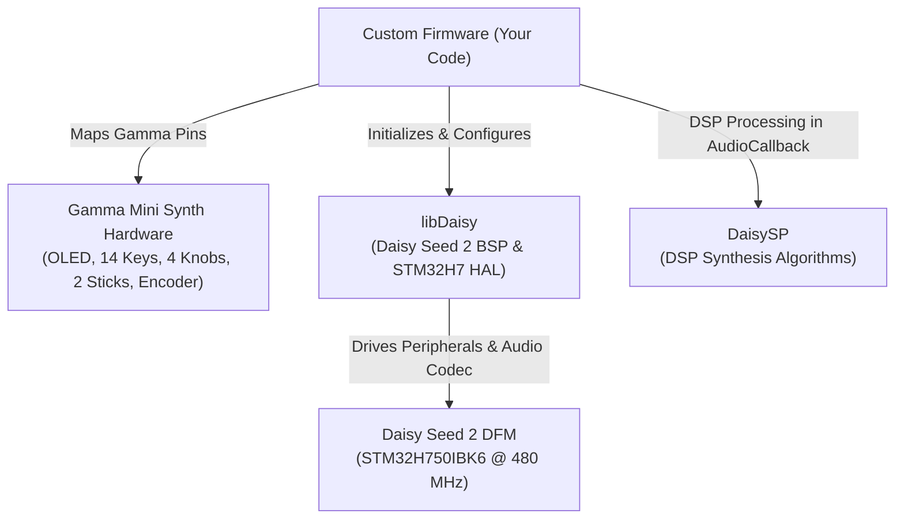

# Getting Started with Gamma Firmware Development

This guide covers how to set up a new Git repository and build environment from scratch for developing custom C++ firmware for the **this.is.NOISE Gamma Mini Synth**.

---

## 1. Architecture & Library Overview

Before writing code, it is important to understand how the hardware and software libraries fit together:



### Do `libDaisy` or `DaisySP` know about the Gamma synth?

**No.** Neither library has built-in knowledge of the Gamma synth:

* **[`DaisySP`](https://github.com/electro-smith/DaisySP)**: A pure DSP audio synthesis and processing library (oscillators, filters, envelopes, delays, reverbs). It is mathematical C++ code and completely board-agnostic.
* **[`libDaisy`](https://github.com/electro-smith/libDaisy)**: Hardware Abstraction Layer (HAL) and Board Support Package (BSP) created by Electro-Smith. It only knows about the **Daisy Seed** board (`daisy_seed.h`) and standard STM32H7 peripherals.
* **Gamma Mini Synth**: A commercial instrument engineered by *this.is.NOISE inc.* containing an embedded **Electro-Smith Daisy Seed 2 DFM** (ARM Cortex-M7 @ 480 MHz, PCM3060 audio codec).

Your firmware code is responsible for mapping Gamma's specific front-panel hardware to the Daisy Seed pins (e.g., the SSD1306 OLED display on I2C1 `PB8`/`PB9`, 14 tactile switches on digital GPIO pins, 4 potentiometers and 2 joysticks on ADC channels, and the rotary encoder on `D13`/`D14`).

---

## 2. Prerequisites & Host Toolchain

Install the following tools on your development machine:

1. **ARM Embedded Toolchain**:
   * macOS (Homebrew): `brew install arm-none-eabi-gcc`
   * Linux (Ubuntu/Debian): `sudo apt-get install gcc-arm-none-eabi binutils-arm-none-eabi`
2. **Build System**: `make`
3. **Flashing Tool**: `dfu-util`
   * macOS: `brew install dfu-util`
   * Linux: `sudo apt-get install dfu-util`
4. **Python 3**: For USB DFU flashing and serial monitoring utilities.

Verify the installations:
```bash
arm-none-eabi-gcc --version
dfu-util --version
make --version
```

---

## 3. Creating the Git Repository & Pulling Libraries

Set up a new repository and add `libDaisy` and `DaisySP` as Git submodules:

```bash
# 1. Create and initialize project repository
mkdir gamma-firmware
cd gamma-firmware
git init

# 2. Add official Electro-Smith libraries as Git submodules
git submodule add https://github.com/electro-smith/libDaisy.git libDaisy
git submodule add https://github.com/electro-smith/DaisySP.git DaisySP

# 3. Pull submodule contents
git submodule update --init --recursive

# 4. Precompile the static libraries
make -C libDaisy
make -C DaisySP
```

---

## 4. Recommended Project Layout

A clean structure organizes submodules, source code, and shared hardware pin definitions:

```text
gamma-firmware/
├── .gitignore
├── .gitmodules
├── libDaisy/             # Git submodule (libDaisy BSP & core Makefile)
├── DaisySP/              # Git submodule (DSP algorithm library)
└── src/
    ├── Makefile          # Project build configuration
    └── main.cpp          # Application entrypoint & audio callback
```

---

## 5. Configuring `.gitignore`

Create a `.gitignore` file in your repository root to ignore compiler artifacts and system files:

```gitignore
# Compiled binaries and object files
build/
*.bin
*.hex
*.elf
*.map
*.o
*.d

# OS / Editor files
.DS_Store
Thumbs.db
.vscode/
.idea/
```

---

## 6. Configuring the `Makefile`

Create `src/Makefile` with the following configuration:

```makefile
# Target Name: Output base name for compiled binaries
TARGET = gamma_firmware

# App Type: Run from internal SRAM via Daisy Bootloader
APP_TYPE = BOOT_SRAM

# Source files
CPP_SOURCES = main.cpp

# Compiler optimization
OPT = -O2

# Library locations relative to this Makefile
LIBDAISY_DIR = ../libDaisy
DAISYSP_DIR = ../DaisySP

# Core libDaisy build rules
SYSTEM_FILES_DIR = $(LIBDAISY_DIR)/core
include $(SYSTEM_FILES_DIR)/Makefile
```

### Explaining Key Makefile Variables

| Variable | Description |
| :--- | :--- |
| `TARGET = gamma_firmware` | Defines the base filename for build artifacts generated in `build/` (`gamma_firmware.elf`, `gamma_firmware.bin`, `gamma_firmware.hex`, `gamma_firmware.map`). This can be customized freely. |
| `APP_TYPE = BOOT_SRAM` | **Critical for Daisy Seed 2 / Gamma.** The Gamma boots via the Daisy Bootloader residing in internal Flash (`0x08000000`). Firmware binaries are flashed to external QSPI flash (`0x90040000`) and copied into AXI SRAM (`0x24000000`) on boot. *Do not use `BOOT_QSPI` or `BOOT_NONE`.* |
| `OPT = -O2` | Standard optimization level for real-time DSP performance. |
| `LIBDAISY_DIR` / `DAISYSP_DIR` | Relative paths pointing to your submodule directories. |
| `include $(SYSTEM_FILES_DIR)/Makefile` | Imports libDaisy's core toolchain rules, flags (`-mcpu=cortex-m7 -mfpu=fpv5-d16 -mfloat-abi=hard`), linker scripts, and DFU flash targets. |

---

## 7. Starter Application (`src/main.cpp`)

Create `src/main.cpp` with a minimal audio passthrough and heartbeat setup:

```cpp
#include "daisy_seed.h"
#include "daisysp.h"

using namespace daisy;
using namespace daisysp;

// Core Daisy Seed hardware object
static DaisySeed hw;

// Real-time audio callback (runs inside SAI DMA interrupt)
void AudioCallback(AudioHandle::InputBuffer in, 
                   AudioHandle::OutputBuffer out, 
                   size_t size) 
{
    for (size_t i = 0; i < size; i++) 
    {
        // Stereo passthrough / DSP processing (normalized float [-1.0f, +1.0f])
        out[0][i] = in[0][i]; // Left
        out[1][i] = in[1][i]; // Right
    }
}

int main(void) 
{
    // Initialize Daisy Seed 2 hardware (clocks, cache, SDRAM, codec)
    hw.Init();
    hw.SetAudioBlockSize(48); // 1 ms latency buffer @ 48 kHz
    hw.SetAudioSampleRate(SaiHandle::Config::SampleRate::SAI_48KHZ);
    hw.StartAudio(AudioCallback);

    // Main non-real-time loop (UI, display rendering, inputs)
    while (1) 
    {
        // Add non-blocking control scans and OLED updates here
        System::Delay(1);
    }
}
```

---

## 8. Building and Flashing

### 1. Build the Firmware
Inside the `src/` directory:

```bash
make clean
make
```

Upon a successful build, you will find:
* `build/gamma_firmware.bin`
* `build/gamma_firmware.elf`

### 2. Enter Bootloader Mode
To flash via USB:
1. Connect the Gamma synth to your computer via USB-C.
2. Put the Daisy Seed into bootloader mode:
   * Hold the **BOOT** button, press and release the **RESET** button, then release **BOOT**.

### 3. Flash over USB DFU
Run the `program-dfu` target provided by libDaisy:

```bash
make program-dfu
```

Or manually invoke `dfu-util` targeting the Daisy Bootloader application slot in QSPI flash:

```bash
dfu-util -a 0 -s 0x90040000:leave -D build/gamma_firmware.bin -d 0483:df11
```

Once flashing finishes, the Daisy Bootloader will automatically copy the firmware into SRAM and begin execution.

---

## 9. Next Steps & Hardware Reference

To integrate Gamma's physical interface components, consult the project skills and guides:

* **Pin Mappings**: [Hardware Pinout Guide](skills/gamma-pinout/index.md)
* **Controls & Display**: [Hardware Controls Guide](skills/gamma-hardware-controls/index.md)
* **USB Logging**: [USB Connectivity Reference](skills/gamma-usb-connectivity/index.md)
* **DSP Recipes**: [DaisySP Audio Recipes](skills/daisysp-guide/references/audio_recipes.md)
