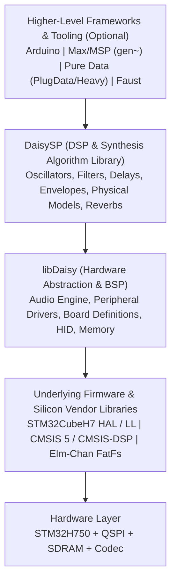

# Comprehensive Guide to libDaisy: Architecture, APIs, and Best Practices

> **Target Audience:** Prospective developers, firmware engineers, embedded DSP designers, and makers exploring or adopting `libDaisy` for audio and hardware project development.

---

## 1. Executive Summary & Ecosystem Overview

**`libDaisy`** is the official C++ Hardware Abstraction Layer (HAL) and Board Support Package (BSP) ecosystem developed by **Electro-Smith** for the **Daisy embedded audio platform**.

At its core, `libDaisy` transforms high-performance ARM Cortex-M7 microcontrollers into accessible, real-time audio development platforms. It abstracts low-level hardware configuration—system clocks, nested interrupt vector controllers, direct memory access (DMA) streams, cache maintenance, peripheral registers, and external memory controllers—into an intuitive, object-oriented modern C++ API tailored for ultra-low-latency digital signal processing (DSP) and musical instrument design.

### 1.1 The Daisy Hardware Ecosystem

`libDaisy` is primarily engineered for the **Electro-Smith Daisy Seed**, a compact System-on-Module (SOM), along with its various derivatives and commercial carrier boards:

| Specification | Details |
| :--- | :--- |
| **Microcontroller** | STMicroelectronics **STM32H750IBK6** (Arm® 32-bit Cortex®-M7) |
| **Clock Frequency** | Configured to run at **480 MHz** (with 240 MHz bus clock and 200 MHz PLL2/PLL3) |
| **Internal Memory** | **128 KB** User Flash, **1 MB** internal SRAM (split into ITCM, DTCM, AXI SRAM, SRAM1–4) |
| **External Memory** | **64 MB** SDRAM (AS4C32M16SB, 32M x 16-bit high-speed SDRAM @ ~100–120 MHz FMC bus) |
| **Non-Volatile Storage** | **8 MB** Quad-SPI (QSPI) NOR Flash (IS25LP064A / IS25LP080D) |
| **On-board Audio Codec** | 24-bit stereo audio running up to 96 kHz:<br>• **Rev4:** Asahi Kasei AK4556<br>• **Rev5 / Seed 1.1:** Cirrus Logic / Wolfson WM8731<br>• **Rev7 / Seed 1.2 & Seed 2 DFM:** Burr-Brown / TI PCM3060<br>• **Seed 3:** Texas Instruments TAC5242 |
| **Physical I/O** | 32 GPIO pins (configurable for ADC, DAC, PWM, I2C, SPI, UART, SAI), USB-C / micro-USB, built-in LED, test point |

### 1.2 Relationship to the Surrounding Ecosystem

`libDaisy` sits at the base of Electro-Smith's software stack:



* **libDaisy**: Handles all hardware interaction (audio I/O buffers, pin configuration, analog knobs, rotary encoders, displays, MIDI, USB, and file storage).
* **DaisySP**: Electro-Smith's companion header/source DSP library containing building blocks like synthesis oscillators, bi-quad/state-variable filters, delays, envelopes, pitch detectors, and reverbs. `DaisySP` is hardware-agnostic and relies on `libDaisy` to provide sample clocks and audio streams.

---

## 2. Codebase Architecture & Directory Taxonomy

The `libDaisy` codebase is organized systematically using standardized prefixes that reflect abstraction layers from bare-metal register configuration up to high-level UI widgets.

```
libDaisy/
├── core/                   # Linker scripts, startup assembly/C, and master Makefile
├── Drivers/                # CMSIS Core, CMSIS-DSP, and STM32H7xx HAL/LL Drivers
├── Middlewares/            # ST USB Device & Host libraries, Elm-Chan FatFs
├── src/                    # Primary source code
│   ├── daisy.h             # Universal master include for custom hardware designs
│   ├── daisy_core.h        # Primitive macros, math scales, Pin struct, memory section attributes
│   ├── version.h           # Semantic versioning definitions (e.g. 8.1.0)
│   ├── daisy_seed.h/.cpp   # Daisy Seed SOM Board Support Package
│   ├── daisy_*.h/.cpp      # Hardware platform BSPs (Pod, Patch, Petal, Field, Versio, Legio)
│   ├── sys/                # System configuration (clocks, cache, MPU, DMA, FatFs)
│   ├── per/                # Internal MCU peripheral drivers (ADC, DAC, GPIO, I2C, SPI, etc.)
│   ├── dev/                # External device drivers (Codecs, OLEDs, Flash, Shift Registers, Sensors)
│   ├── hid/                # Human Interface Devices & Engines (Audio, MIDI, Controls, USB, Display canvas)
│   ├── ui/                 # UI framework (Menu trees, event queues, button/pot monitoring)
│   ├── util/               # Real-time utilities, ringbuffers, WAV file streaming, persistent storage
│   ├── usbd/               # USB Device Class configurations (CDC Virtual COM, MIDI, Audio)
│   └── usbh/               # USB Host Class configurations (Host MIDI, MSC Flash Drives)
├── doc/                    # Doxygen configurations and Markdown guides
├── examples/               # Hardware-focused standalone examples
└── tests/                  # GoogleTest unit testing suite
```

### 2.1 File & Module Prefix Conventions

`libDaisy` enforces a structured architectural hierarchy through its prefix scheme:

| Prefix | Domain | Purpose & Responsibility | Examples |
| :--- | :--- | :--- | :--- |
| **`sys/`** | **System** | Low-level chip infrastructure, clocks, cache coherency, memory protection (MPU), DMA controller routing, and OS hooks. | `system.h`, `dma.h`, `fatfs.h` |
| **`per/`** | **Peripherals** | Object-oriented C++ drivers wrapping STM32 on-chip peripherals. Independent of external board schematics. | `gpio.h`, `adc.h`, `dac.h`, `i2c.h`, `spi.h`, `sai.h`, `uart.h`, `qspi.h` |
| **`dev/`** | **Devices** | Drivers for dedicated ICs mounted outside the MCU on the PCB or connected via buses. | `codec_pcm3060.h`, `oled_ssd130x.h`, `sdram.h`, `mpr121.h`, `sr_595.h` |
| **`hid/`** | **Human Interface** | Abstractions converting raw electrical signals into high-level user-facing constructs. | `audio.h`, `ctrl.h`, `parameter.h`, `switch.h`, `encoder.h`, `midi.h`, `usb.h` |
| **`ui/`** | **User Interface** | UI event pipelines, screen menu rendering, value selection, and event queues. | `UI.h`, `AbstractMenu.h`, `FullScreenItemMenu.h`, `ButtonMonitor.h` |
| **`util/`** | **Utilities** | Lock-free data structures, WAV file parsing/writing, wavetable loaders, and flash wear-leveling. | `FIFO.h`, `FixedCapStr.h`, `WavPlayer.h`, `PersistentStorage.h`, `CpuLoadMeter.h` |

---

## 3. Subsystem Breakdown & API Guide

### 3.1 The Audio Engine (`hid/audio.h`, `per/sai.h`, `dev/codec_*`)

The audio pipeline is the cornerstone of `libDaisy`. It provides non-blocking, interrupt-driven, double-buffered audio streaming via the STM32's Serial Audio Interface (SAI) and DMA.

#### Audio Processing Paradigm

Audio data is processed in **blocks** (buffers) rather than single samples to minimize DMA transfer overhead and interrupt jitter.

* **Sample Rates:** Configurable to 8 kHz, 16 kHz, 32 kHz, 44.1 kHz, 48 kHz, or 96 kHz.
* **Block Sizes:** Configurable from 1 sample up to 256 samples (default is 48 samples, yielding 1 ms latency at 48 kHz).
* **Buffer Layouts:**
  * **Non-interleaved (`AudioHandle::AudioCallback` - Recommended):** Channels are separate arrays (`float** out`), e.g., `out[0][i]` is Left, `out[1][i]` is Right.
  * **Interleaved (`AudioHandle::InterleavingAudioCallback`):** Samples alternate sequentially in a single array (`float* out`), e.g., `out[i * 2]` is Left, `out[i * 2 + 1]` is Right.
* **Sample Format:** Internal representation is standardized to **32-bit floating point (`float`)** normalized between `-1.0f` and `+1.0f`. `libDaisy` automatically converts between the hardware codec's 24-bit integer PCM and 32-bit float audio.

```cpp
void AudioCallback(AudioHandle::InputBuffer in, 
                   AudioHandle::OutputBuffer out, 
                   size_t size)
{
    for (size_t i = 0; i < size; i++)
    {
        // Simple stereo passthrough:
        out[0][i] = in[0][i]; // Left
        out[1][i] = in[1][i]; // Right
    }
}
```

---

### 3.2 Peripheral Drivers (`per/`)

All peripheral drivers in `libDaisy` follow a consistent initialization pattern:

1. Define a `Peripheral::Config` struct.
2. Initialize or override specific parameters (pins, baudrate, speed, mode).
3. Instantiate the driver class and call `.Init(config)`.

* **`AdcHandle` (`per/adc.h`):** High-speed 16-bit ADC engine. Employs circular DMA conversion to continuously sample configured channels in the background into memory buffers, eliminating blocking reads. Supports hardware analog multiplexing (e.g., CD4051 8:1 multiplexers) seamlessly across multiple channels.
* **`DacHandle` (`per/dac.h`):** Dual 12-bit on-chip DACs (`DAC1_OUT1`, `DAC1_OUT2`), providing 0–3.3V CV (Control Voltage) generation via polling or DMA.
* **`GPIO` (`per/gpio.h`):** Hardware pin abstraction supporting input, output, open-drain, pull-up, pull-down, and pin change external interrupts (`dsy_gpio_interrupt`).
* **`I2CHandle` (`per/i2c.h`):** Multi-speed I2C master/slave driver supporting standard (100 kHz), fast (400 kHz), and fast-plus (1 MHz) bus clocks with polling and non-blocking DMA modes.
* **`SpiHandle` / `SpiMultiSlave` (`per/spi.h`, `per/spiMultislave.h`):** Full-duplex SPI engine (SPI1–SPI6) supporting 8-bit and 16-bit word lengths, configurable clock polarities/phases, and multi-slave CS line management.
* **`UartHandler` (`per/uart.h`):** Serial communications interface with internal ringbuffers for interrupt-driven or DMA-driven asynchronous transmission and reception.
* **`TimerHandle` & `Pwm` (`per/tim.h`, `per/pwm.h`):** General-purpose microsecond and millisecond timers, periodic callback triggers, and PWM wave generators for motor control, LED brightness, or analog reconstruction.
* **`QSPIHandle` (`per/qspi.h`):** Quad-SPI controller driving external NOR flash in both direct command mode (read/write/sector erase) and high-speed memory-mapped read mode.
* **`Random` (`per/rng.h`):** Access to the STM32H7 hardware True Random Number Generator (TRNG) producing uniform 32-bit random words or normalized floating-point numbers.

---

### 3.3 Human Interface Devices & Controls (`hid/`)

The `hid/` directory abstracts raw analog voltages and noisy digital pins into musical interface controls.

* **`AnalogControl` (`hid/ctrl.h`):** Connects to an ADC channel. Applies a 1-pole low-pass filter to smooth potentiometer noise, implements deadband thresholds around 0.0 and 1.0, and detects value changes.
* **`Parameter` (`hid/parameter.h`):** Wraps an `AnalogControl` and maps the normalized `0.0f` to `1.0f` reading onto target parameter curves:
  * `LINEAR`: Direct proportional scaling ($min \to max$).
  * `EXPONENTIAL`: Musical response curve (ideal for frequency sweeps).
  * `LOGARITHMIC`: Musical response curve (ideal for decibel attenuation / volume sliders).
  * `CUBE`: Sharp exponential curve ($x^3$).
* **`Switch` (`hid/switch.h`):** Digital pushbuttons, tactile switches, and stomp switches. Provides software debouncing (typically 1 ms sampling), detects `.RisingEdge()`, `.FallingEdge()`, `.Pressed()`, and measures `.TimeHeldMs()`.
* **`Switch3` (`hid/switch3.h`):** Handles 3-position toggle switches (e.g., Up / Center-Off / Down).
* **`Encoder` (`hid/encoder.h`):** Quadrature rotary encoder decoding with integrated push button. Reports step increments (`+1` clockwise, `-1` counter-clockwise) and press events.
* **`GateIn` (`hid/gatein.h`):** Dedicated handler for modular Eurorack clock, trigger, and gate signals with edge detection.
* **`Led` & `RgbLed` (`hid/led.h`, `hid/rgb_led.h`):** Single and tricolor LED controllers providing software PWM brightness modulation, color blending (`SetColor()`), and gamma compensation.

---

### 3.4 Visual Displays & Graphics Canvas (`hid/disp/`, `dev/oled_*`)

`libDaisy` features an embedded graphics engine for drawing onto monochrome and color displays:

* **Canvas Architecture (`hid/disp/display.h`):** Memory-backed frame buffer supporting geometric drawing primitives:
  * `DrawPixel(x, y, on)`
  * `DrawLine(x0, y0, x1, y1, on)`
  * `DrawRect(x0, y0, x1, y1, on, fill)`
  * `DrawCircle(x, y, radius, on)`
  * `WriteString(str, font, on)`
* **Supported Display Controllers (`dev/`):**
  * `OledDisplay<SSD130x4Wire_SPI>` / `OledDisplay<SSD130xI2c>`: Popular 0.96" and 1.3" 128x64 monochrome OLEDs (SSD1306, SSD1309).
  * `oled_sh1106.h`: 1.3" 128x64 OLEDs using the SH1106 controller.
  * `oled_ssd1327.h`: 128x128 4-bit grayscale OLEDs.
  * `oled_ssd1351.h`: 128x128 16-bit RGB color OLEDs.
  * `lcd_hd44780.h`: Classic 16x2 and 20x4 alphanumeric character LCD displays.
* **Embedded Font Library (`util/oled_fonts.h`):** Built-in bitmap font faces: `Font_4x5`, `Font_6x8`, `Font_7x10`, `Font_11x18`, and `Font_16x26`.

---

### 3.5 Communications: MIDI, USB, and Logging

* **MIDI Engine (`hid/midi.h`):**
  * Supports classic 5-pin DIN / 3.5mm TRS hardware MIDI over UART.
  * Supports USB MIDI (Class Compliant Device).
  * Fast streaming event parser (`MidiParser`) decoding NoteOn, NoteOff, Control Change, Pitch Bend, Program Change, Channel Pressure, Poly Aftertouch, Real-Time Clock, and System Exclusive (SysEx).
* **USB Stack (`hid/usb.h`, `usbd/`):**
  * Operates the STM32 high-speed USB PHY in Full-Speed (12 Mbps) or High-Speed (480 Mbps with external ULPI PHY).
  * Supported device profiles: **CDC (Virtual Serial Port / COM)**, **USB Audio Class**, and **USB MIDI Class**.
* **USB Host Stack (`hid/usb_host.h`, `usbh/`):**
  * Allows the Daisy to act as a **USB Host** to interface directly with external USB MIDI controllers (keyboards, launchpads) or USB MSC flash storage without needing a computer.
* **Unified Logger (`hid/logger.h`):**
  * High-speed, non-blocking formatted logging API (`hw.PrintLine("Frequency: %f", freq)`).
  * Log destination selectable at compile time: internal USB CDC serial or hardware UART.

---

### 3.6 Data Structures, Audio Streaming & Persistence (`util/`)

* **Real-Time Safe Data Structures:**
  * `FIFO<T, size>`: Lock-free, circular FIFO queue safe for passing data across interrupt boundaries without mutexes.
  * `FixedCapStr<size>`: Stack-allocated, fixed-capacity string class that eliminates dynamic heap allocation (`malloc`/`free`) and fragmentation inside real-time loops.
  * `MappedValue`: Bidirectional parameter mapping utility supporting curve conversions and formatted string output for UI menus.
* **Audio Streaming & WAV Handling:**
  * `WavParser`: Reads standard RIFF WAV headers from SD cards or USB flash drives (sample rate, bit depth, channel count, chunk sizes).
  * `WavPlayer` & `WavWriter`: Stream multichannel uncompressed audio directly to/from FAT32 media in real time.
  * `WaveTableLoader`: Ingests single-cycle and multi-frame wavetables into RAM for synthesizer oscillators.
* **Non-Volatile Storage (`util/PersistentStorage.h`):**
  * Manages saving and loading structured user settings, calibration tables, and preset patches to external QSPI flash.
  * Includes wear-leveling and checksum validation to prevent corruption upon unexpected power disconnection.
* **Diagnostics & Metering:**
  * `CpuLoadMeter`: Accurately measures the percentage of CPU processing time consumed by the audio callback relative to the available block budget.
  * `VoctCalibration`: Multi-point calibration system converting analog ADC readings into accurate 1 Volt/Octave musical pitches for modular synthesis.

---

## 4. Board Support Packages (BSPs)

`libDaisy` includes pre-configured BSP classes for all official Electro-Smith hardware. Each BSP instantiates and connects the appropriate peripheral handles:

| BSP Class | Hardware Platform | Built-in Peripherals Handled Automatically |
| :--- | :--- | :--- |
| **`DaisySeed`** | Daisy Seed SOM | SDRAM, QSPI Flash, Audio Codec, USB, On-board LED, Test Point, Pinout namespace. |
| **`DaisyPod`** | Pod Prototyping Board | Stereo Audio, 2 Potentiometers, 2 Pushbuttons, 2 RGB LEDs, Rotary Encoder, 3.5mm TRS MIDI. |
| **`DaisyPatch`** | Eurorack Modular Synth | 4 Audio Ins, 4 Audio Outs, 128x64 OLED Display, 4 CV Ins, 2 CV Outs, 2 Gate Ins, 2 Gate Outs, Encoder, MIDI. |
| **`DaisyPatchSM`** | Eurorack Submodule | Ultra-compact Eurorack core: dual audio, -5V to +5V CV inputs/outputs, gates, hardware control bus. |
| **`DaisyPetal`** | Guitar Stompbox | Stereo Audio, 4 Footswitches, 4 Toggle Switches, 6 Potentiometers, 8 Status LEDs, Expression Pedal input, SD Card slot. |
| **`DaisyField`** | Performance Controller | 2 Audio Ins/Outs, 8 Knobs, 2 CV Ins, 2 CV Outs, 16-key Capacitive Touch Surface (`MPR121`), OLED Display, MIDI. |
| **`DaisyVersio`** | Noise Engineering Versio | DSP Eurorack module platform: stereo I/O, 7 Knobs, 2 Toggles, Tap button, 4 RGB LEDs. |
| **`DaisyLegio`** | Noise Engineering Legio | Compact 6HP Eurorack platform: stereo I/O, 5 Knobs, 2 Toggles, Dual RGB LEDs. |

---

## 5. Memory Architecture & Real-Time Engineering Considerations

The STM32H750IB utilizes a sophisticated multi-bus, multi-domain memory layout. Understanding this architecture is crucial for writing robust firmware.

| Memory Region | Base Address | Capacity | Characteristics & Primary Usage |
| :--- | :--- | :--- | :--- |
| **ITCM-RAM** | `0x00000000` | 64 KB | Zero-wait instruction RAM |
| **DTCM-RAM** | `0x20000000` | 128 KB | Fastest data RAM for DSP state (**No DMA access**) |
| **Internal Flash** | `0x08000000` | 128 KB | Non-volatile flash code (`APP_TYPE = BOOT_NONE`) |
| **AXI SRAM** (D1 Domain) | `0x24000000` | 512 KB | High-speed cached system RAM (`APP_TYPE = BOOT_SRAM`) |
| **SRAM1** (D2 Domain) | `0x30000000` | 128 KB | **Non-cached** via MPU (`DMA_BUFFER_MEM_SECTION`), DMA buffers |
| **SRAM2** (D2 Domain) | `0x30020000` | 128 KB | Domain 2 general SRAM |
| **SRAM3** (D2 Domain) | `0x30040000` | 32 KB | Domain 2 buffers |
| **SRAM4** (D3 Domain) | `0x38000000` | 64 KB | Low-power backup domain SRAM |
| **External SDRAM** | `0xC0000000` | 64 MB | High-capacity audio buffers & delay lines (`DSY_SDRAM_BSS`) |
| **External QSPI Flash** | `0x90000000` | 8 MB | Bootloader application binary (`0x90040000`) & preset storage |

### 5.1 Critical Architectural Rules & Pitfalls

#### 1. DMA Buffers & Cache Coherency Hazard (`DMA_BUFFER_MEM_SECTION`)

The Cortex-M7 features a 16 KB L1 Data Cache (D-Cache). Peripheral DMA engines (ADC, SAI Audio, SPI, I2C) write directly to physical SRAM without updating the CPU cache. If a DMA buffer is placed in standard cached memory, the CPU will read stale data from cache, or cache write-backs will overwrite incoming DMA data.
> [!IMPORTANT]
> `libDaisy` configures the MPU such that **SRAM1 (`0x30000000`) is non-cacheable**. Any buffer passed to a DMA peripheral **must** be decorated with the macro:
>
> ```cpp
> uint8_t DMA_BUFFER_MEM_SECTION my_dma_buffer[1024];
> ```

#### 2. DTCM RAM Limitations (`DTCM_MEM_SECTION`)

DTCM (Data Tightly Coupled Memory) operates at 480 MHz with zero wait states, making it ideal for DSP delay lines and filter states:

```cpp
float DTCM_MEM_SECTION filter_coefficients[1024];
```

> [!WARNING]
> The DTCM bus has no direct connection to the D2 domain DMA bus matrix. **Never assign ADC, SAI, or SPI DMA buffers to DTCM**, or the DMA controller will trigger a HardFault.

#### 3. External SDRAM Usage (`SDRAM_MEM_SECTION`)

The 64 MB SDRAM chip is essential for long delay lines, loopers, and large sample playback:

```cpp
float DSY_SDRAM_BSS big_delay_buffer[48000 * 60]; // 1 minute of stereo audio
```

> [!CAUTION]
>
> * SDRAM initialization occurs during `hw.Init()` inside `main()`. **Never create C++ classes with non-trivial constructors in SDRAM as global variables**, because C++ static constructors execute before `main()`, which will cause a crash when accessing uninitialized SDRAM.
> * Always place global SDRAM objects in the BSS section using `DSY_SDRAM_BSS`.

#### 4. Blocking Code Inside the Audio Callback

The audio callback runs inside an interrupt service routine (ISR) at the highest software priority.
> [!CRITICAL]
> **Never perform blocking operations inside `AudioCallback`**. This includes:
>
> * Standard I2C or SPI transactions (`i2c.TransmitBlocking()`)
> * OLED display updating (`oled.Update()`)
> * Flash writing or sector erasing
> * SD card FatFs file reads/writes
> * `System::Delay()` or `DelayMs()`
>
> Blocking inside the audio callback starves the SAI DMA FIFO and causes audible glitches, clicks, or watchdog resets. Controls, displays, and file I/O must always be handled in the non-real-time main loop (`while(1)`).

---

## 6. The Daisy Bootloader & Deployment Pipeline

Because the STM32H750IB has only 128 KB of internal flash, large DSP programs and complex UI applications quickly exceed this limit. Electro-Smith solves this using the **Daisy Bootloader**.

### 6.1 Application Types (`APP_TYPE`)

In your project `Makefile`, you define the execution target:

| `APP_TYPE` | Execution Target | Maximum Program Size | Execution Speed | Linker Script |
| :--- | :--- | :--- | :--- | :--- |
| **`BOOT_NONE`** | Internal Flash (`0x08000000`) | 128 KB | 480 MHz (Fast) | `STM32H750IB_flash.lds` |
| **`BOOT_SRAM`** | Internal AXI SRAM (`0x24000000`) | ~480 KB | 480 MHz (Fastest) | `STM32H750IB_sram.lds` |
| **`BOOT_QSPI`** | External QSPI Flash (`0x90040000`) | ~8 MB | Slower (Cache dependent) | `STM32H750IB_qspi.lds` |

* **How `BOOT_SRAM` Works:** The Daisy Bootloader resides permanently in internal flash. Upon startup, it reads your application binary stored in external QSPI flash (`0x90040000`), copies it into internal AXI SRAM (`0x24000000`), verifies the checksum, and jumps to its entry vector. This provides maximum execution speed for applications up to ~480 KB.

### 6.2 Flashing Commands

* **Flashing Applications via USB DFU (`dfu-util`):**

  ```bash
  make clean && make
  make program-dfu
  ```

* **Flashing the Daisy Bootloader to internal flash:**

  ```bash
  make program-boot
  ```

* **Hardware Debugging (SWD/JTAG with OpenOCD + ST-Link):**

  ```bash
  make openocd       # Starts OpenOCD GDB server on port 3333
  make debug         # Builds with -g -ggdb and launches arm-none-eabi-gdb
  make program       # Flashes directly over ST-Link (BOOT_NONE only)
  ```

---

## 7. Build System Integration

### 7.1 Makefile Integration Pattern

`libDaisy` provides a modular build system. User applications typically need only a minimal Makefile that imports the core framework:

```makefile
# Target application name
TARGET = MySynthesizer

# Application execution model: BOOT_SRAM, BOOT_QSPI, or BOOT_NONE
APP_TYPE = BOOT_SRAM

# Sources
CPP_SOURCES = MySynthesizer.cpp

# Include Directories
LIBDAISY_DIR = ../../libDaisy
DAISYSP_DIR = ../../DaisySP

# Optimization and C++ standards
OPT = -O2
CPP_STANDARD = -std=gnu++17

# Pull in core Makefile recipes (compiler flags, rules, dfu-util)
include $(LIBDAISY_DIR)/core/Makefile
```

### 7.2 CMake Integration Pattern

`libDaisy` also provides first-class support for modern CMake:

```cmake
cmake_minimum_required(VERSION 3.16)
project(MySynthesizer C CXX ASM)

set(CMAKE_CXX_STANDARD 17)

# Include libDaisy subdirectory
add_subdirectory(libDaisy)

# Add your target executable
add_executable(${PROJECT_NAME} src/main.cpp)

# Link against the daisy interface library
target_link_libraries(${PROJECT_NAME} PRIVATE daisy::daisy)
```

---

## 8. Practical Implementation Examples

### 8.1 Example 1: Minimal Audio DSP Synth / Pass-through

```cpp
#include "daisy_seed.h"

using namespace daisy;

DaisySeed hw;

// Real-time audio callback running at 48kHz
void AudioCallback(AudioHandle::InputBuffer in, 
                   AudioHandle::OutputBuffer out, 
                   size_t size)
{
    for (size_t i = 0; i < size; i++)
    {
        // Simple gain reduction and stereo passthrough:
        out[0][i] = in[0][i] * 0.75f;
        out[1][i] = in[1][i] * 0.75f;
    }
}

int main(void)
{
    // Initialize system clocks, SDRAM, QSPI, and Audio Codec
    hw.Init();
    hw.SetAudioBlockSize(48); // 1ms buffer latency @ 48kHz
    hw.SetAudioSampleRate(SaiHandle::Config::SampleRate::SAI_48KHZ);

    // Start DMA-driven audio processing
    hw.StartAudio(AudioCallback);

    // Infinite non-realtime loop
    while(1)
    {
        // Background housekeeping
    }
}
```

---

### 8.2 Example 2: Interactive Controls (Pots, Debounced Buttons, and LEDs)

```cpp
#include "daisy_seed.h"

using namespace daisy;

DaisySeed     hw;
AnalogControl filter_knob;
Parameter     cutoff_param;
Switch        button;

void AudioCallback(AudioHandle::InputBuffer in, 
                   AudioHandle::OutputBuffer out, 
                   size_t size)
{
    for (size_t i = 0; i < size; i++)
    {
        out[0][i] = in[0][i];
        out[1][i] = in[1][i];
    }
}

int main(void)
{
    hw.Init();

    // 1. Configure ADC for a potentiometer on Pin A0 (D15)
    AdcChannelConfig adc_config;
    adc_config.InitSingle(seed::A0);
    hw.adc.Init(&adc_config, 1);
    hw.adc.Start();

    // Initialize smoothed analog control and exponential parameter curve
    filter_knob.Init(hw.adc.GetPtr(0), hw.AudioCallbackRate());
    cutoff_param.Init(filter_knob, 20.0f, 20000.0f, Parameter::Curve::EXPONENTIAL);

    // 2. Configure a pushbutton on Pin D0 with internal pull-up (active LOW)
    button.Init(seed::D0, 1000.0f, Switch::Type::TYPE_MOMENTARY, Switch::Polarity::POLARITY_INVERTED);

    hw.StartAudio(AudioCallback);

    while(1)
    {
        // Periodic control polling at 1 kHz (every 1 ms)
        System::Delay(1);

        filter_knob.Process();
        float current_cutoff = cutoff_param.Process();

        button.Debounce();
        if (button.RisingEdge())
        {
            hw.SetLed(true); // Turn on onboard LED when pressed
        }
        else if (button.FallingEdge())
        {
            hw.SetLed(false);
        }
    }
}
```

---

### 8.3 Example 3: Non-Volatile Preset Storage (`PersistentStorage`)

```cpp
#include "daisy_seed.h"

using namespace daisy;

// Struct containing patch settings to persist in flash
struct MySettings
{
    float master_volume;
    int   midi_channel;
    bool  chorus_enabled;

    // Equality operator required by PersistentStorage to detect changes
    bool operator==(const MySettings& rhs) const
    {
        return master_volume == rhs.master_volume
            && midi_channel == rhs.midi_channel
            && chorus_enabled == rhs.chorus_enabled;
    }
    bool operator!=(const MySettings& rhs) const { return !(*this == rhs); }
};

DaisySeed                                 hw;
PersistentStorage<MySettings>             storage(hw.qspi);
MySettings                                default_settings = { 0.8f, 1, true };

int main(void)
{
    hw.Init();

    // Load saved settings or write defaults if memory is uninitialized
    storage.Init(default_settings);

    // Retrieve active settings
    MySettings& current = storage.GetSettings();

    // Modify a parameter
    current.midi_channel = 2;

    // Non-blocking deferred write: saves to QSPI flash only if modified
    storage.Save();

    while(1) {}
}
```

---

## 9. Prospective User Decision Matrix

| Dimension | `libDaisy` (C++) | Arduino Core for Daisy | Max/MSP (gen~) / PD (Heavy) |
| :--- | :--- | :--- | :--- |
| **Performance & Latency** | **Maximum.** Direct register/DMA access, zero runtime overhead. | **High.** Slightly higher wrapper overhead. | **High.** Generates optimized C++ DSP callbacks. |
| **Hardware Flexibility** | **Complete.** Supports custom codecs, pin remapping, MPU, DMA. | **Limited.** Constrained to standard Arduino APIs. | **Constrained.** Limited to supported carrier boards. |
| **Memory Control** | **Full.** Precise control over DTCM, SRAM1–4, and SDRAM sections. | **Automatic.** Limited manual section placement. | **Abstracted.** Managed by target export templates. |
| **Learning Curve** | **Moderate/Steep.** Requires C++, pointer concepts, and embedded fundamentals. | **Gentle.** Familiar `setup()` and `loop()` paradigm. | **Visual.** Node-based graphical programming. |
| **Recommended Use Case** | Commercial synthesizers, custom DSP hardware, production audio pedals. | Quick prototyping, educational workshops, hobbyist builds. | Rapid sound design exploration, algorithmic composition. |

---

## 10. Summary Checklist for New Projects

1. **Include Header:** Include `"daisy_seed.h"` (for Daisy Seed) or `"daisy.h"` (for custom boards).
2. **Choose `APP_TYPE`:** Set `APP_TYPE = BOOT_SRAM` in your `Makefile` to allow binaries up to ~480 KB running from fast SRAM via the Daisy Bootloader.
3. **Decouple ISR from Non-Realtime Tasks:** Keep `AudioCallback()` pure DSP; update OLEDs, buttons, pots, and flash in the `while(1)` main loop.
4. **Tag DMA Buffers:** Always place buffers accessed by ADC, SAI, or SPI DMA into `DMA_BUFFER_MEM_SECTION` to avoid cache coherency bugs.
5. **Protect Global SDRAM Arrays:** Allocate SDRAM buffers with `DSY_SDRAM_BSS` and never run dynamic constructors in SDRAM before `hw.Init()`.
